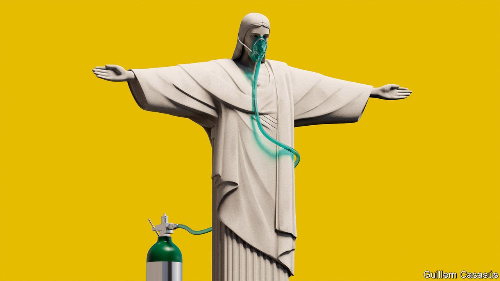

###### Brazil’s dire decade

# Jair Bolsonaro is not the only reason his country is in a ditch 

##### The political system that helped him win office needs deep reform 

 

> Jun 5th 2021 

HOSPITALS ARE full, favelas echo with gunfire and a record 14.7% of workers are unemployed. Incredibly, Brazil’s economy is smaller now than it was in 2011—and it will take a lot of strong quarters like the one reported on June 1st to repair its reputation. Brazil’s death toll from covid-19 is one of the worst in the world. The president, Jair Bolsonaro, jokes that vaccines might turn people into crocodiles.

Brazil’s decline was shockingly fast. After the military dictatorship in 1964-85, the country got a new constitution that returned the army to barracks, a new currency that ended hyperinflation and social programmes that, with a commodity boom, began to ease poverty and inequality. A decade ago the country was flush with oil money and had been awarded the 2014 World Cup and the 2016 Olympics. It seemed destined to flourish.


Brazil failed to seize the opportunity. As our  this week argues, consecutive governments made three mistakes. First, they gave in to short-termism and put off liberal economic reforms. Blame for this belongs chiefly with the left-wing Workers’ Party, in office in 2003-16. It oversaw growth of 4% a year but did not invest to raise productivity. When commodity prices fell, Brazil faced one of its worst-ever recessions. The governments of Michel Temer and Mr Bolsonaro made some progress on reform, but stopped far short of what is needed.

Second, in their efforts to shield themselves from the fallout of Lava Jato, a huge anti-corruption probe, politicians have resisted reforms that would curb graft. The prosecutors and judges behind Lava Jato are partly to blame. After some were shown to have had a political agenda, their probe became bogged down in Congress and the courts.

Finally, Brazil’s political system is a millstone. State-sized districts and 30 parties in Congress make elections expensive. Even more than in other countries, politicians tend to back splashy vote-winning projects rather than worthy long-term reform. Once in office, they stick with the flawed rules that got them elected. They enjoy legal privileges that make them hard to prosecute, and a huge pot of money to help them keep power. As a result, Brazilians despise them. In 2018 only 3% said they trusted Congress “a lot”.

Disillusion paved the way for Mr Bolsonaro. A former army captain with a soft spot for the dictatorship, he persuaded voters to see his political incorrectness as a mark of authenticity. He vowed to purge corrupt politicians, crack down on crime and turbocharge the economy. He has failed on all three counts.

After passing a pensions revamp in 2019, he abandoned the agenda of his liberal economy minister, fearing that it would cost votes. Tax and public-sector reform and privatisations have stalled. Cash hand-outs helped stave off poverty early in the pandemic, but were slashed at the end of 2020 owing to rising debt. The rate of deforestation in the Amazon has soared by over 40% since he took office. He has taken a chainsaw to the environment ministry, cutting its budget and forcing out staff. His environment minister is under investigation for wood-trafficking.

On covid-19, Mr Bolsonaro has backed anti-lockdown rallies and quack cures. He sent planeloads of hydroxychloroquine to indigenous tribes. For six months he ignored offers of vaccines. One study found the delay may have cost 95,000 lives.

Rather than tackle graft, he has protected his allies. In April 2020 he fired the head of the federal police, which is investigating his sons for corruption. His justice minister quit, accusing him of obstruction of justice. Days earlier, Mr Bolsonaro had threatened the independence of the Supreme Court. In February his attorney-general shut down the Lava Jato task-force.

Brazilian democracy is more fragile than at any time since the end of the dictatorship. In March Mr Bolsonaro fired the defence minister, who reportedly refused to send the army into the streets to force businesses to reopen. If he loses re-election in 2022, some think he may not accept the result. He has cast doubt on electronic voting, passed decrees to “arm the public” and boasted that “only God” will remove him.

Actually, Brazil’s Congress could do the job without divine intervention. His conduct probably qualifies as impeachable, including “crimes of responsibility” such as urging people to defy lockdowns, ignoring vaccine offers and firing officials to shield his sons. Congress has received 118 impeachment petitions. Tens of thousands rallied on May 29th to demand his ejection.

For now, he has enough support in Congress to block impeachment. Besides, the vice-president, who would take over, is a general who is also nostalgic for military rule. The last time Congress impeached a president, Dilma Rousseff in 2016 for hiding the size of the budget deficit, it split the country. Mr Bolsonaro would cast himself as a martyr. Many of his supporters are armed.

In the long run, as well as replacing Mr Bolsonaro, Brazil must deal with the cynicism and despair that got him elected, by tackling chronic low growth and inequality. That will require dramatic reform. Yet the very resilience that has protected Brazil’s institutions from the predations of a populist also makes them resistant to beneficial change.

The actions required are daunting. Above all, the government needs to serve the public rather than itself. That means reducing the privileges of public-sector workers, which eat up an unsustainable share of government spending. Politicians must not spare themselves either. Office holders should have fewer legal protections. They should shake up the electoral and party systems to let new blood into Congress.

The next government must fight corruption without bias, restrain wasteful spending, and boost competitiveness. A crackdown in the Amazon should go hand-in-hand with economic alternatives to deforestation. Otherwise, sooner or later, new Bolsonaros will emerge.

A long journey ahead

Barring Mr Bolsonaro’s impeachment, Brazil’s fate will probably be decided by voters next year. His rivals should offer solutions rather than peddle nostalgia. His successor will inherit a damaged and divided country. Unfortunately, the rot goes much deeper than a single man. ■

