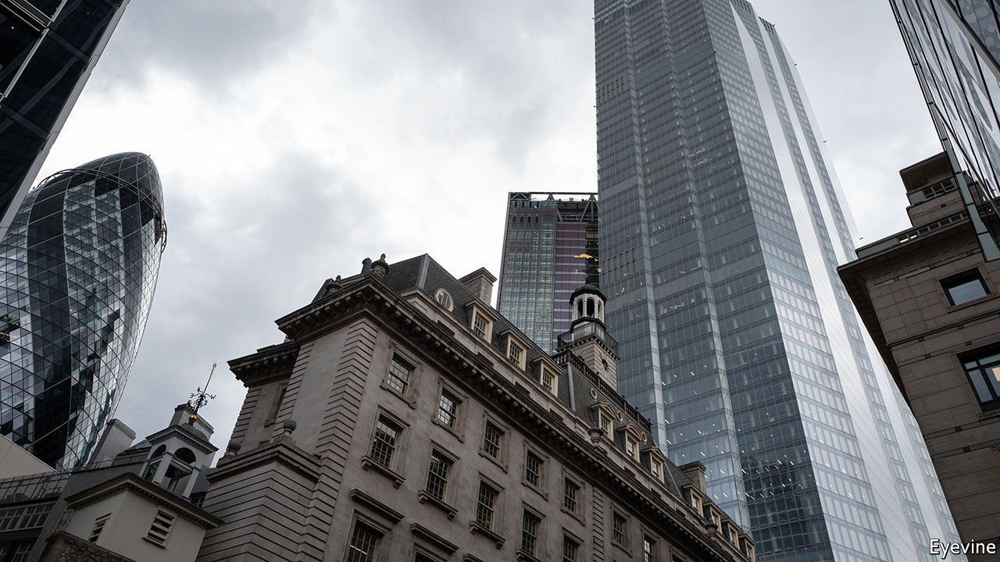

###### Commercial property

# Someone has to foot the bill for empty offices 

##### Even small drops in occupancy rates will have a big effect on rents and prices 

 

> Jun 5th 2021 

IN RECENT WEEKS diversity at work has taken on a new meaning. As vaccination progresses in the rich world and restrictions ease, some huge office tenants, such as Goldman Sachs, a bank, want staff back full-time, while others, like Citigroup, a rival, expect some employees never to set foot in a central business district again. Behind the posturing, a consensus is slowly emerging that white-collar desk-warriors should be allowed to stay at home more often post covid-19—and that many probably will. , however, and those who bankroll them, continue to pretend that no storm is coming. With billions of dollars sunk in undesirable buildings, they face a reckoning.

Office bulls rest their case on two pillars. One is to argue that recent evidence shows pandemic-induced disruptions are superficial and temporary. Offices have been spared the carnage that lockdowns have inflicted on other kinds of commercial property, such as restaurants and shops. Even as rent collections plummeted elsewhere, most corporate tenants have continued to pay on time. Debt delinquencies remain a rarity, and prices paid for floor space in global cities have held up. No matter that most open spaces remain eerily silent. Developers report rises in viewings and lettings, and investors have already pledged billions of dollars to new projects.


The other strut of the bulls’ argument involves heroic predictions about the future of work. Workers have missed water coolers so much, they say, that most are bound to flock back. Die-hard sofa-surfers can be persuaded back to the office with new rooftop pools, pet-friendly concierges and Michelin-starred canteens. Even if some skip a few days a week, the need to space out desks in an era of pandemics, and rising appetite for brainstorming pods after a year of dreary Zoom calls, should keep demand for office space constant. And even if it does not, unwanted space can always be salvaged by, for instance, converting it into industrial-chic lofts or logistics centres.

Such optimism is at best deluded, at worst dishonest. It is too early to tell if offices have avoided the pain that months of social distancing have caused in other industries. Government help, lenient banks and central-bank largesse may have postponed delinquencies and distressed sales. Corporate tenants are locked into long-term leases which have yet to expire, and may not be renewed. Transaction prices are a poor gauge of the market’s health: because buyers and sellers cannot agree on terms there have been few sales. In some countries new covid-19 variants may prompt restrictions, delaying a full reopening.

Even small drops in long-run occupancy rates will have a big effect on rents and prices. The IMF reckons a rise in vacancy rates of five percentage points in all commercial property would cause valuations to fall by 15% over five years. Fitch, a rating agency, says that if workers in America do not commute at least three days a week, valuations could tumble by over half.

Given that Moody’s, a rival, predicts a fifth of the country’s offices will be empty by 2022, landlords may have to brace themselves for worse. Uncertainty is compounded by the indecision of many firms. Many still have to make their mind up about hybrid working, which may yet become a new norm.

Abstract debates about aggregate demand hide the fact that property pain will not be evenly shared. As firms seek to lure talent and foster teamwork by revamping their HQs, snazzy offices in city centres will remain in demand (though making them fancier, healthier and greener will cost the landlords dearly).

Yet they are outnumbered by old and poorly ventilated blocks which will struggle to lure staff and therefore tenants. Upgrading or converting them will often cost a fortune. At best, their owners face falling rents or sales at marked-down prices. At worst, they risk having capital tied up in stranded assets.

Cheaper office rents will help some firms. But the financial costs are immediate. Banks have lent $2.4trn to commercial property in America alone. But they have brought loan-to-value ratios down from the dizzying heights of the financial crisis. A market correction would probably slap them in the face without knocking them out. Instead, more of the bill will fall on equity holders, not least pension funds and insurers which, in their hunt for returns in an era of low interest rates, have been loading up on property for years. The sooner they admit that losses are coming, the sooner they can try to limit the damage. ■

