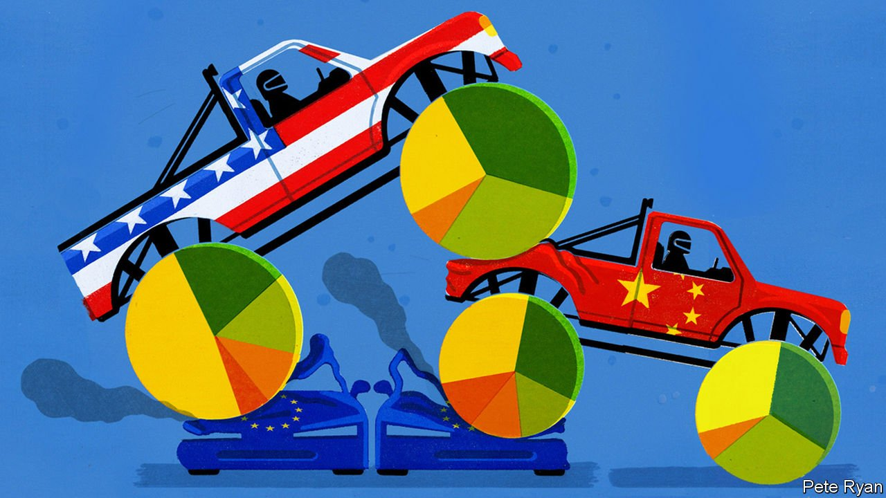

###### The world economy

# The new geopolitics of global business 

##### China and America dominate like never before 

 

> Jun 5th 2021 

TWENTY YEARS ago this week the share price of a startup run by an obsessive called Jeff Bezos had slumped by 71% over 12 months. Amazon’s near-death experience was part of the dotcom crash that exposed Silicon Valley’s hubris and, along with the $14bn fraud at Enron, shattered confidence in American business. China, meanwhile, was struggling to privatise its creaking state-owned firms, and there was little sign that it could create a culture of entrepreneurship. Instead the bright hope was in Europe, where a new single currency promised to catalyse a giant business-friendly integrated market.

Creative destruction often makes predictions look silly, but even by these standards the post-pandemic business world is dramatically different from what you might have expected two decades ago. Tech firms comprise a quarter of the  and the geographic mix has become strikingly lopsided. America and, increasingly, China are ascendant, accounting for 76 of the world’s 100 most valuable firms. Europe’s tally has fallen from 41 in 2000 to 15 today.


This imbalance in large part reflects American and Chinese skill, and complacency in Europe and elsewhere. It raises two giant questions: why has it come about? And can it last?

In themselves, big companies are no better than small ones. Japan Inc’s status soared in the 1980s only to collapse. Big firms can be a sign of success but also of sloth. Saudi Aramco, the world’s second-most-valuable firm, is not so much a $2trn symbol of vigour as of a desert kingdom’s dangerous dependency on fossil fuels. Even so, the right sort of giant company is a sign of a healthy business ecology in which big, efficient firms are created and constantly swept away by competition. It is the secret to raising long-run living standards.

One way of capturing the dominance of America and China is to compare their share of world output with their share of business activity (defined as the average of their share of global stockmarket capitalisation, public-offering proceeds, venture-capital funding, “unicorns”—or larger private startups, and the world’s biggest 100 firms). By this yardstick America accounts for 24% of global GDP, but 48% of business activity. China accounts for 18% of GDP, and 20% of business. Other countries, with 77% of the world’s people, punch well below their weight.

Part of the explanation is Europe’s squandered opportunity. Political meddling and the debt crisis in 2010-12 have stalled the continent’s economic integration. Firms there largely failed to anticipate the shift towards the intangible economy. Europe has no startups to rival Amazon or Google. But other countries have struggled, too. A decade ago Brazil, Mexico and India were poised to create a large cohort of global firms. Few have emerged.

Instead, only America and China have been able to marshal the process of creative destruction. Of the 19 firms created in the past 25 years that are now worth over $100bn, nine are in America and eight in China. Europe has none. Even as mature tech giants like Apple and Alibaba try to entrench their dominance, a new set of tech firms including Snap, PayPal, Meituan and Pinduoduo are reaching critical mass. The pandemic has seen a burst of energy in America and China and a boom in fundraising. Firms from the two countries dominate the frontier of new technologies such as fintech and .

The magic formula has many ingredients. A vast home market helps firms achieve scale quickly. Deep capital markets, networks of venture capitalists and top universities keep the startup pipeline full. There is a culture that exalts entrepreneurs. China’s tycoons boast of their “996” work ethic: 9am to 9pm, six days a week. Elon Musk sleeps on Tesla’s factory floor. Above all politics supports creative destruction. America has long tolerated more disruption than cosy Europe. After 2000, China’s rulers let entrepreneurs run riot and laid off 8m workers at state firms.

The recent erosion of this political consensus in both countries is one reason this dominance could prove unsustainable. Americans are worried about national decline, as well as low wages and monopolies (roughly a quarter of the S&amp;P 500 index merits antitrust scrutiny, we estimated in 2018). The Economist supports the Biden administration’s aim to promote competition and expand the social safety-net to protect workers hurt by disruption. But the danger is that America continues to drift towards protectionism, industrial policy and, on the left, punitive taxes on capital, that dampen its business vim.

In China President Xi Jinping sees big private firms as a threat to the Communist Party’s power and social stability. The cowing of tycoons began last year with Jack Ma, the co-founder of Alibaba, and has since spread to the bosses of three other big tech firms. As party officials seek to “guide” incumbent private firms in order to achieve policy goals, such as national self-sufficiency in some technologies, they are also more likely to protect them from freewheeling competitors.

The more America and China intervene, the more the rest of the world should worry about the lopsided geography of global business. In theory the nationality of profit-seeking firms does not matter: as long as they sell competitive products and create jobs, who cares? But if firms are swayed by governments at home, the calculus changes.

As globalisation unwinds, rows are already erupting over where multinational firms produce vaccines, set digital rules and . European hopes of being a regulatory superpower may become a figleaf for protectionism. Others with less clout may erect barriers. To assert its sovereignty, India has banned Chinese social media and hobbled American e-commerce firms. That is the worst of both worlds, depriving local consumers of global innovations and creating barriers that make it even harder for local firms to achieve scale.

It’s the acorns, not the oaks

It would be a tragedy if only two countries in the world proved capable of sustaining a process of creative destruction at scale. But it would be even worse if they turned away from it, and other places admitted defeat and put up barricades. The best gauge of success will be if in 20 years’ time the list of the world’s biggest companies looks absolutely nothing like today’s. ■

