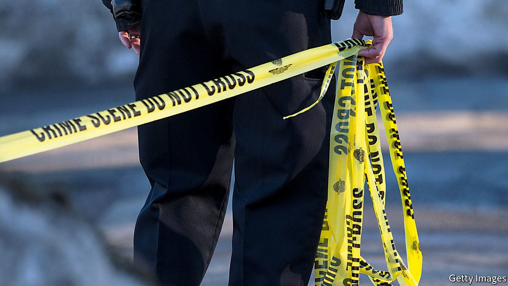

###### Killing reform

# Violent crime is rising in American cities, putting criminal-justice reform at risk? 

##### What should be done about it? 

 

> Jun 5th 2021 

AFTER GEORGE FLOYD’S murder a year ago, Atlanta’s mayor scolded the rioters who were smashing up parts of her city. “This is not a protest…This is chaos,” Keisha Lance Bottoms said. “If you care about this city, then go home.” The speech was so well pitched that some overexcited pundits wondered whether she might one day run for president. One year on, Ms Lance Bottoms has declined even to run for re-election as mayor, in part because Atlanta is suffering from a violent-crime wave which she has been unable to calm. One affluent neighbourhood is keen to secede from the city altogether.

What is true in Atlanta is also true in other American cities. Property crimes are down, but . Murders increased by about 30% between 2019 and 2020, a rise that shows little sign of slowing. This change puts at risk what has been perhaps the most benign social trend in America so far this century: the great crime decline. It also threatens liberal reforms, designed to reduce the prison population and to rethink policing, which have spread across much of the United States in the past decade.


Arguments for criminal-justice and police reform are easier to make when crime is falling, as it had been for 25 years. When voters are fearful, they become more receptive to punitive policies. The origins of America’s high incarceration rate, which stands at 700 inmates per 100,000, compared with 140 in Britain and 78 in Germany, lie in the crime wave that lasted from the 1960s to the 1990s. A new crime wave could result in a repeat.

Meanwhile, reformers will discover that, if they have nothing to say about how to tackle rising crime, they will not be trusted to run the city and county offices that control America’s decentralised justice system. Ms Lance Bottoms is not alone. In other cities mayors and prosecutors who thought they would be rewarded for championing reform in the name of racial justice are finding out that voters prize safety more.

What, then, should be done? The causes of today’s spike in murders are unclear, but probably stem from a mixture of pandemic-related stresses to both civilians and police, rising gun sales and reticence among police after the protests inspired by Mr Floyd’s death. Police forces say they have not pulled back from violent neighbourhoods for fear of inflaming tensions. But a similar murder spike in Baltimore after protests against a high-profile police killing in 2015 suggests otherwise. Mistrust between the police and those they are policing is bad for crime statistics. Without co-operation, murders become hard to solve, and unsolved murders lead to retaliatory killings.

Part of the answer lies in restoring that trust by promoting community policing and hiring more officers. “Defund the police” is one of the most counterproductive political slogans of recent times and should be cast aside. People in high-crime neighbourhoods want accountable, effective policing, not the abolition of police forces. Reforming police practices, which should remain a priority, will be more palatable if budgets are not being slashed at the same time.

If locking people up eliminated crime, America would already have eradicated it. The link between crime and incarceration is weak. But more imprisonment may be coming unless mayors, prosecutors and the police bring the killing spree under control. If Mr Floyd’s legacy was a return to mass incarceration and more thuggish policing, it would be to pile one tragedy on another. ■

