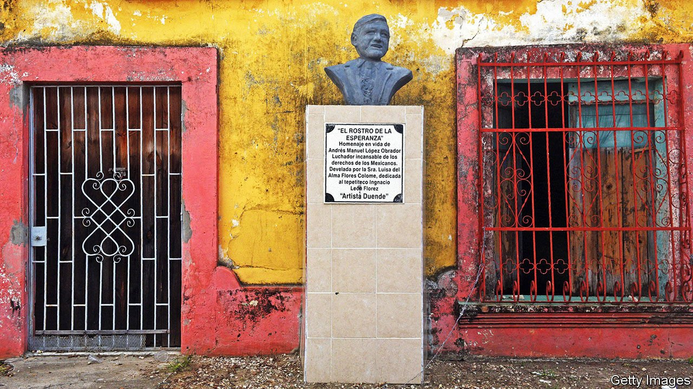
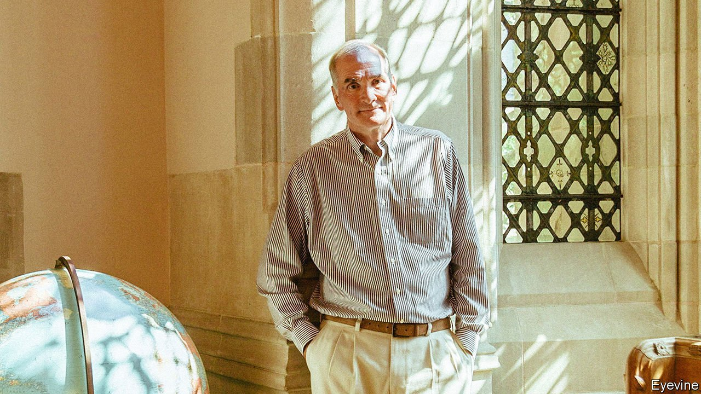

###### On Mexico, covid-19 vaccines, green investing, endowments, Charles Dickens

# Letters to the editor 

##### A selection of correspondence 

 

> Jun 5th 2021 

Letters are welcome via e-mail to 

Mexico responds

You urge Mexicans to vote against the president and his party in elections to Congress (“, May 29th). Your message is surprising, not because of The Economist’s ideological position, but because of the virulence of your writing and the fragility of your reasoning. You seem to believe that the majority of Mexicans, especially the poorest, are wrong and are backing the wrong person.


When Mexico elected Andrés Manuel López Obrador as president it was predicted that he would lead the country to economic ruin through devaluations, hyperinflation, indebtedness and a direct clash with the United States. None of this has happened. On the contrary, the administration of President López Obrador has fulfilled its promise to prioritise spending on our poorest citizens. At the same time, it has maintained fiscal discipline and sound public finances. For example, it has achieved historic increases in the minimum wage, while keeping inflation at bay and the currency stable. It has also quickly succeeded in building a relationship of respect and collaboration with the administration of President Joe Biden.

The failure of the elites to understand the president is reflected in your pages; they paint a bleak picture of Mexico, losing sight of the fact that, although the Mexican economy suffered the ravages of the pandemic, it will grow by around 6% this year, without having piled on debt, with healthy finances and significant levels of foreign direct investment. You also question the government's response to covid-19, but overlook how Mexico managed, in a matter of months, to double its hospital capacity and ensure universal access to the vaccine.

But the assertion that stands out the most for its absurdity is the suggestion that President López Obrador has somehow undermined Mexican democracy, when he has done precisely the opposite. His decades-long struggle against a closed system has given rise to a strong, plural and diverse democracy, in which the people are consulted directly on substantive issues as never before. There is now full freedom of the press and of thought in Mexico. President López Obrador is accountable to the public and engages in a dialogue with the press, which feels free to criticise him at a level incomparable with his predecessors (just open any Mexican newspaper).

The elitist view, defended ad nauseam, is that the majority is wrong and doesn't know what is good for it. Isn't it time to ask if it is the elite—angry and exasperated with President López Obrador—and not the people that is wrong?

MARCELO EBRARD

Secretary of foreign affairs

Mexico City

 


Supporting the patent waiver

Your work showing that the death toll from covid-19 is almost certainly far higher than we think, especially in developing countries, is exemplary. A year ago the barrier to battling this cruel disease was science. Today it is inequality. Contrary to what you submit, price is still an obstacle (“” May 15th). The MRNA jabs from Pfizer/BioNTech and Moderna are among the most expensive of the vaccines on offer, averaging $18 a dose.

Shareholders are becoming billionaires, while we fail to vaccinate the billions who need help. These high prices are beyond the reach of most countries and dramatically reduce the number of doses that COVAX can afford. This is despite up to $100bn in public subsidy and studies showing production costs of as little as 60 cents a dose for MRNA vaccines. A key way to drive down prices and drive up supply is to waive the patents, end these artificial monopolies and transfer technology as rapidly as possible to create greater competition.

This is what we learned in the struggle against HIV/AIDS. It is the quickest way to end the pandemic, and safeguards the populations of rich countries from new variants. Given your strong commitment to the power of the free market it is surprising that you do not join Joe Biden and support the patent waiver in the face of this health emergency.

WINNIE BYANYIMA

Executive director

UNAIDS

Geneva

 


The olive revolution

Green investing is questionable because of the difficulty of filtering out the noise from the signal (“”, May 22nd). I suggest that some form of scale be devised so that companies can be categorised as, say, green, olive, brown and charcoal. Those that have no chance of ever being green can at least be encouraged to strive for olive.

RICH HASMONEK

Chicago

 


Equities as alternatives

Your tribute to the late David Swensen, who mastered Yale’s endowment fund, noted that the shift toward “alternative” investments of college and university endowments began in the 1980s (“”, May 15th). Yale clearly benefited from Swensen staying at the forefront of this transformation. An earlier shift in endowment management began in the 1970s. McGeorge Bundy, president of the Ford Foundation, wrote a report in the late 1960s that compared the ten-year performance of endowments among 15 “important educational institutions’’. Bundy called for a move to a modern, professional form of investment management that was later embraced by Swensen.

Bundy’s report also laid the blame for the poor performance of endowments on their management by trustee committees, stating that their focus on maximising income led to bond allocations at the expense of better-performing equities. The report cited the University of Rochester’s professional investment office, the first in the United States, for achieving an annual return of 6% a year above the other 14 endowments. Without Bundy’s report supporting investment in equities Yale’s shift to alternatives might never have happened.

DOUGLAS PHILLIPS

Chief investment officer

University of Rochester

Rochester, New York

A Dickens of a twist

A letter () wondered where Charles Dickens found the inspiration to weave fraudulent pyramid schemes into two of his novels. The model for the scheme in “Martin Chuzzlewit” was the Independent West Middlesex Fire and Life Insurance Company. The company had its own fire engines that dashed round putting out fires for a couple of years; and life insurance was good for profit until too many people started dying. When the money ran out in 1840 the directors divided up the wine in the cellar under their head office and left for France.

DAVID PUGSLEY

Cullompton, Devon

The infamous Bank of Tipperary was the inspiration for the scheme in “Little Dorrit”. John Sadleir, a member of Parliament, was the key figure in the fraud. His was a standard pyramid scheme where depositors were attracted by high interest rates and new deposits were constantly required to pay out redemptions. When his swindling was about to be discovered, Sadleir took himself off for a drink at Jack Straw’s tavern and followed this up with a draught of acid. His body was found on Hampstead Heath.

ALI MIREMADI

Leamington Spa, Warwickshire

