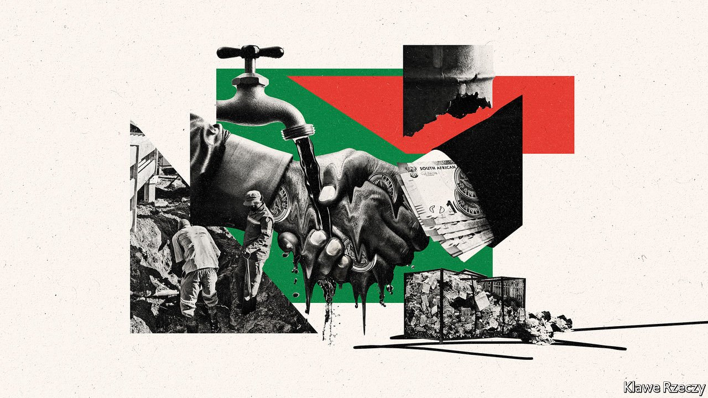
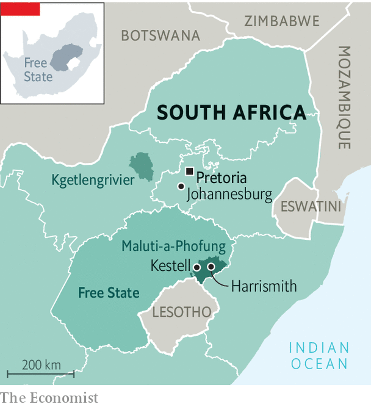

###### The stench of misrule

# An ex-president is on trial, but graft still blights South Africa 

##### Jacob Zuma is being held to account, but thousands of others are not 

 

> Jun 3rd 2021 

AT TIMES IT can be hard to find the right metaphor for the dysfunction of the South African state. But then, on a recent morning, your correspondent found himself in the middle of a broken sewage works, knee-deep in excrement. Like the other six plants in the municipality of Maluti-a-Phofung, the one in the town of Harrismith is knackered. And it is not the only sign of collapse. The 350,000 people in the municipality are regularly without clean tap water. Rubbish is rarely collected. Power is sporadic. “I feel like crying,” says Sam Twala, a local activist. “Is there any legacy we’re leaving for our kids?”

Under Jacob Zuma, South Africa’s former president, state-owned enterprises were . An estimated 1trn rand ($70bn)—equivalent to nearly 20% of GDP—was siphoned out of state coffers. Creaking ports and regular power cuts are thought to lower annual growth in sub-Saharan Africa’s second-largest economy by one percentage point a year.


Since Cyril Ramaphosa took over as president in 2018 he has tried to . In his latest move, on May 5th, he secured the suspension of his nemesis, Ace Magashule, as secretary-general of the ruling African National Congress (ANC), after his arrest last year on charges of fraud, corruption and money-laundering. On May 26th Mr Zuma pleaded not guilty to charges of fraud, racketeering and money-laundering related to an arms deal struck in the late 1990s. His trial is now under way, after many long delays.


Malfeasance neither started nor ended with the Zuma era. And it goes much deeper than national institutions. The starkest effects of corruption and “cadre deployment”, where cronies are given jobs on the basis of loyalty rather than merit, are found in local government—in places like Maluti-a-Phofung.

After apartheid ended in 1994, three areas merged to form Maluti-a-Phofung. The first, Harrismith, was a genteel town visited by Princess (now Queen) Elizabeth in 1947. The second was the farming area around the town of Kestell, named after a man who helped translate the Bible into Afrikaans. The third, and most populous, was the Sotho-speaking area of QwaQwa, one of ten ethnic “homelands” set up to divide and rule the black population.

 


Running such a diverse area would be a challenge for any party. But the ANC, which has been in charge since the first local election in 2000, has barely tried. In March 2018, shortly after Mr Ramaphosa became president, the municipality was placed under administration, as per an emergency provision in the constitution. Because of fierce opposition led by allies of the then mayor, Vusimusi Tshabalala, who says that the administrators were appointed because of machinations within the ANC, it took another year before the outside team actually got to work.

When it did, it found a catastrophe. The municipality is insolvent. It hardly bothers to collect utility bills; revenues cover just 30% of expenditure. It keeps itself afloat with central-government grants and by not paying creditors. It owes around 7bn rand, mostly to Eskom, the state-run power utility. In 2018 it granted Eskom the power to take money directly from the council’s bank account, but an appeal is dragging on, so the utility cannot implement the order.

Even while they were under supervision, local ANC panjandrums tried to authorise payments to entities without any contracts, according to a report by the administrators. Spending was “unauthorised, irregular, fruitless and wasteful”. Bigwigs allegedly complained when they were denied flashy cars more expensive than rules allowed. In August 2020 the Special Investigating Unit, a national anti-corruption body, said it was looking into municipal activities since 2012, the year before Mr Tshabalala became mayor. He argues that the problems in the municipality predated his mayoralty, and have continued since he left. “I am prepared to go to any court of law to prove my innocence,” he says. (In 2019 the ANC gave this ally of Mr Magashule a new plum job: chief whip in the provincial parliament.)

As yet no one has been brought to book. In a sign of how the ANC’s internal battles at the national level play out as local skirmishes, the government of the Free State (the province of which Maluti-a-Phofung is part and which is influenced by its ex-premier, Mr Magashule) dismissed the administrators in March 2020. It said their job was done. Leona Kleynhans of the opposition Democratic Alliance (DA) predicts a return to “industrial-scale looting”.

And so life goes on as normal for locals such as Thabiso Mofokeng. In the former QwaQwa he walks down the hill from his shack, cowbells clanking in the distance. He arrives at a pile of rocks. Mr Mofokeng lifts the stones and points to a dirty trickle from an underground stream. Because pipes are broken, it is his village’s only source of water. Residents queue with buckets from 3am. Though there are water-storage tanks, the municipality rarely fills them. There is supposed to be a call centre he can ring to report water problems, but despite a contractor having been paid, the facility was never built.

Maluti-a-Phofung is far from unique. The Auditor-General, a watchdog, last year gave just 8% of municipalities clean audits, most of them run by the DA. In 67% of cases accounts were “not credible enough” to use. “Irregular” expenditure reached 32bn rand in 2018/19, up from 25bn in the previous financial year.

Ahead of local elections in October South Africans are fed up. Public satisfaction with big municipalities is at its lowest level since Consulta, a research firm, began polling in 2014. Though protests over poor services decreased in 2020 because of the pandemic, the numbers in 2018 and 2019 were the highest since 2004, when Municipal IQ, a data provider, started counting.

Some South Africans are taking action. In January 2019 Mr Twala and another township leader, Willy Tshabalala, visited a faulty pump station. There they met Petrus van Eeden, a burly white farmer. The trio decided to fix Harrismith. They set up Water Heroes, a grassroots outfit that repaired hundreds of pipes and collected rubbish. “We ran the town for a year and it was clean,” says Mr van Eeden.

Other forms of citizen activism are visible as well. In December a court gave temporary control over sewage works in the Kgetlengrivier municipality to a residents’ association—a move that has inspired a similar group in Harrismith to try to take its municipality to court. Many ratepayers’ associations are withholding taxes in protest. “A sea change is under way at local government level,” argues David Everatt of the University of the Witwatersrand.

Such local groups are often led by whites. Afriforum, a pressure group for Afrikaners (South Africans of mostly Dutch descent), is backing court cases in places like Kgetlengrivier and Harrismith. It also has a spin-off infrastructure firm, known as Pionier, which it puts forward to run services instead of municipalities. Afriforum insists its efforts will help all residents, black and white. Yet it is viewed with mistrust by many black South Africans. In 2018 its CEO said that apartheid was wrong, but not a crime against humanity. Mr van Eeden, himself of Afrikaner stock, is reluctant to join “a group of white people wanting to take ‘their’ town back”.

He prefers a model like Water Heroes, which bridged racial divisions while also fixing pipes. But the organisation was treated with scorn by the municipality, which accused it of vandalising property and forced it to stop. Services soon collapsed. The hope that gushed in 2020 has turned to effluent in 2021. “When I started I was optimistic,” reflects Mr van Eeden. “Now I’m demoralised.” ■

A version of this article was published online on May 30th 2021

