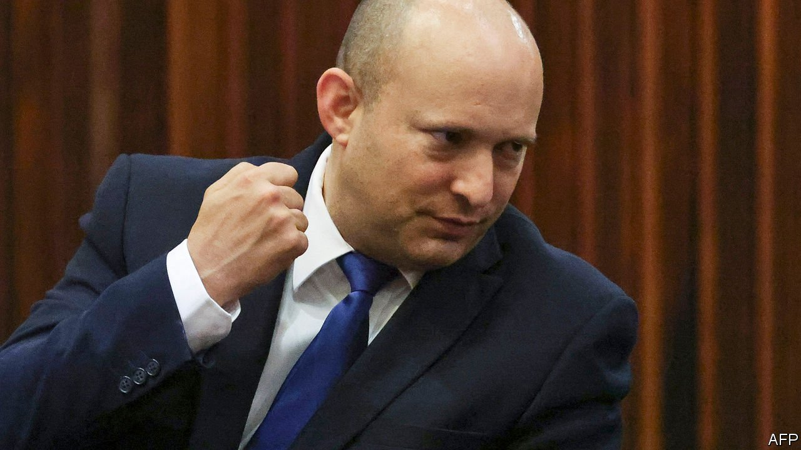

###### Almost there

# Binyamin Netanyahu’s opponents reach a deal to replace him 

##### But the prime minister won’t give up without a fight 

 

> Jun 3rd 2021 

NAFTALI BENNETT, the tech millionaire turned politician who is poised to become Israel’s next prime minister, began his political career in 2006 as chief of staff to Binyamin Netanyahu, then the leader of the opposition. Mr Bennett (pictured) admired Mr Netanyahu for years and played a key role in his return to power in 2009. Mr Bennett’s memoir begins with a note of gratitude to his former boss, and ends with an adulatory chapter entitled “What I learned from Binyamin Netanyahu”.

How times have changed. Mr Bennett’s Yamina party is now part of a coalition that is on the verge of ending Mr Netanyahu’s 12-year reign as prime minister. The coalition deal, featuring eight parties holding 61 seats (see chart), was finalised just before a midnight deadline on June 2nd. But the potential new government still must win a confidence vote in the 120-seat Knesset (Israel’s parliament) in the coming days. Mr Netanyahu will undoubtedly do everything in his power to prevent that from happening.


It is no wonder that the negotiations came down to the wire. Israel is used to governments made up of disparate parties, but this one would be the most diverse in history. On the right are Mr Bennett’s Yamina, along with two other nationalist parties (Yisrael Beiteinu and New Hope) which are also led by former aides to Mr Netanyahu (Avigdor Lieberman and Gideon Sa’ar). In the centre is the coalition’s largest party, Yesh Atid, led by Yair Lapid, a secularist. He is the architect of the new government. Under the deal, he would take over from Mr Bennett as prime minister if the government lasts more than two years.

 


There are other centrist and left-wing parties in the coalition, but what makes it historic is the inclusion of Ra’am, which has four seats. It would become the first truly independent Arab party to join a government since Israel’s founding in 1948. For decades the Arab parties have been shunned and, in turn, have shown little interest in joining a coalition. Ra’am will not hold any cabinet seats. But its leader, Mansour Abbas, used the party’s leverage as a potential kingmaker to obtain greater resources for Israel’s Arab minority.

It took the parties opposed to Mr Netanyahu time to get their act together. In three of the four elections since 2019 they won a majority of seats, but they failed to join up before now. Weeks of nerve-racking negotiations over who would get which cabinet posts preceded the current agreement. At one point Mr Bennett abandoned the talks, reportedly citing the conflict in Gaza and Arab-Jewish clashes on the streets of Israeli cities last month. But his negotiations with the prime minister bore no fruit. “The elections have proven there is no right-wing government under Netanyahu,” said Mr Bennett on May 30th. “There’s unity or fifth elections.”

In order to lead the new government effectively Mr Bennett will have to suppress some of his more right-wing views. In the past he has opposed the creation of a Palestinian state and favoured annexing much of the occupied West Bank. He is an ardent supporter of settlers, once leading the council representing them (though he is not a settler himself). Some regard him as more right-wing than Mr Netanyahu, though not nearly as ruthless. He is also an observant Jew: if sworn in, he would be the first prime minister to wear a yarmulke, or Jewish skullcap, for everyday affairs.

But Mr Bennett notes that he is not the only coalition member with what some consider extreme views. “For the new government to succeed, all the partners will need to exercise restraint,” he has said. “No one will be asked to give up on their ideology, but everyone will have to postpone the realisation of some of their dreams. We will focus on what can be done, instead of arguing over what is impossible.”

Perhaps the coalition can take some inspiration from the Knesset’s election of a new president of Israel on June 2nd. Lawmakers voted overwhelmingly for Isaac Herzog, a former leader of the Labour party and government minister. The president’s role is mostly symbolic. Still, it was a rare display of consensus for the divided body.

Bibi’s last stand

Mustering a majority is a big achievement for the opposition. But it is not over the finish line yet. The parties reportedly discussed a range of issues during their negotiations, from committee posts to legalising cannabis. Some reports suggested that there were still details to be hashed out. Then there is the confidence vote, which could take place as early as June 7th—or the speaker of the Knesset, a Netanyahu loyalist, could try to delay it by an extra week.

In that time Mr Netanyahu will try to pick off wavering members of the coalition in order to deny it a majority. They are already coming under pressure. Members of Mr Bennett’s party have been called “traitors” by the prime minister’s allies. Protests have been held outside their homes. Senior rabbis have phoned them to warn of the spiritual dangers that the new government poses to the Jewish people.

Mr Netanyahu is also doing his part. In a televised tantrum on May 30th, he accused Mr Bennett of carrying out “the fraud of the century” and compared the new coalition to Bashar Assad’s regime in Syria and to the rulers of Iran. “Don't form a left-wing government—such a government is a danger to Israel's security and future,” said Mr Netanyahu.

Such intimidation has worked in the past, and one member of Mr Bennett’s party has already defected to the prime minister’s side. But Mr Netanyahu’s act is getting old. Mr Bennett has accused him of “trying to take the entire state of Israel with him to his personal Masada”—a reference to the hilltop fortress where Jewish rebels committed mass suicide 1,900 years ago, rather than be captured by Roman soldiers. He and others on the right turned on Mr Netanyahu not because they disagree with his hardline policies, but, as Mr Bennett explained, “because no one believed [his] promises would be kept”. ■

