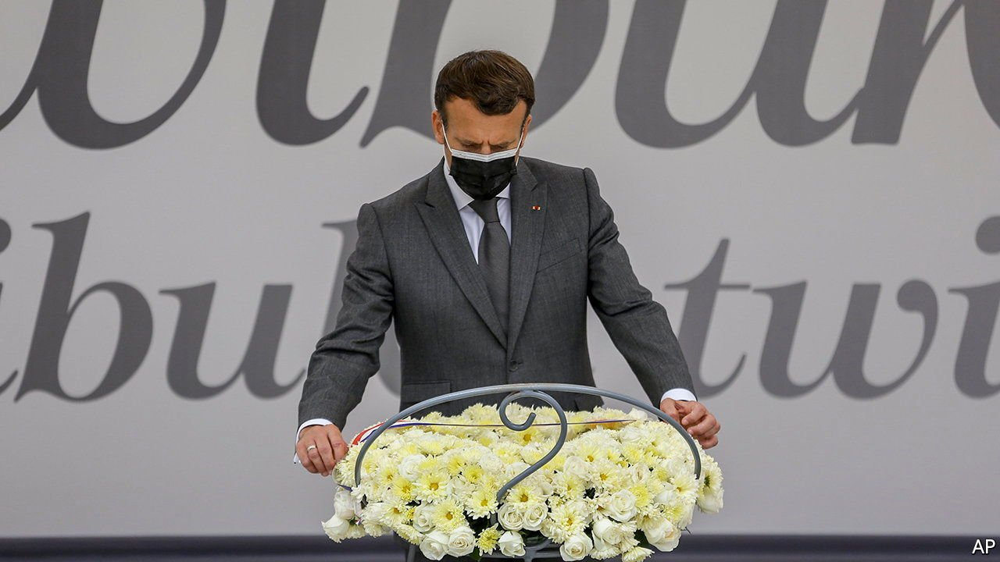

###### Atonement

# France tries to reset policy in Africa 

##### It is asking forgiveness for its past and rethinking its future 

 

> Jun 5th 2021 

F RANCE “MUST look history in the face and recognise the share of suffering that it inflicted on the Rwandan people”. So declared President Emmanuel Macron at the genocide memorial in Kigali, Rwanda’s capital, on May 27th (pictured). “In ignoring the warnings of the most clear-sighted observers,” he said, “France bore damning responsibility in a chain of events that led to the worst.” He hoped survivors of the genocide might “perhaps forgive” France.

Mr Macron is the first French president to recognise his country’s responsibility in the slaughter of hundreds of thousands of Rwandans, mostly Tutsis, in 1994. France backed and armed the Hutu regime that planned and carried out the massacres. French leaders long claimed their country had “misunderstood” what was going on. Rwanda, under Tutsi leadership, cut diplomatic ties with France in 2006. In his speech, Mr Macron disappointed some survivors of the genocide by not explicitly apologising. But Rwanda’s president, Paul Kagame, said his words were “more powerful than an apology”.


In Paris Mr Macron’s acknowledgment is considered part of an effort to reset policy in Africa, using history to reshape current ties. Last year France returned 27 works of art to Benin and Senegal, after Mr Macron promised to start handing back artefacts taken under colonial rule. He also agreed to end the French treasury-backed CFA franc, a west African currency some regard as a colonial relic (and which is still used). This year historians have published two official reports: one, by Benjamin Stora, on France’s role in Algeria, the other, by Vincent Duclert, on its actions during the Rwandan genocide. “History weighs heavily on our relationship with Africa,” says Hervé Berville, a Rwandan-born deputy from Mr Macron’s party: “Treating questions of history and memory is indispensable, especially for younger people, if we want to build healthier ties.”

The 992-page Duclert report is damning. It concludes that France bore “overwhelming responsibility” for not doing more to stop the slaughter. Officials, aid workers or reporters who queried French policy at the time “were met with indifference, rejection or bad faith”. Decision-making on Rwanda was centralised at the presidency, under François Mitterrand. Officials dismissed the massacres as a merely “tribal” conflict. Behind France’s policy was a primordial worry: the “threat of an Anglo-Saxon world”, represented by Mr Kagame’s English-speaking Rwandan Patriotic Front, which was leading an insurgency against (and ultimately overthrew) the French-speaking Hutu regime.

Mr Macron’s Africa reset is based on a fresh geostrategic calculation. France has in the past sought to perpetuate “Françafrique”, a cosy web of ties with its ex-colonies. Mr Macron, by contrast, declared in 2017 that he was from a “generation that does not come and tell Africa what to do”. Keen to promote broader French economic interests, and wary of competition from China and Turkey, he has courted non-French-speaking leaders. After Rwanda, he headed to South Africa to discuss getting covid-19 vaccines to the continent, as well as more French business.

There is a tension in this strategy. Engaging with Mr Kagame’s authoritarian regime, increasingly friendless in the English-speaking world, is controversial. History still underpins the old network, if not the new. France keeps 5,100 soldiers in the (heavily French-speaking) Sahel as part of Operation Barkhane, a counter-insurgency operation. In April it looked like business as usual when Mr Macron flew to Chad for the funeral of Idriss Déby, the country’s strongman ruler for three decades, calling him a “loyal friend”. Chad is France’s main military partner in Operation Barkhane.

France’s Sahel policy is under particular strain after the recent ousting of Mali’s president and prime minister by Assimi Goita, who led a military coup last year as well. On June 2nd the African Union suspended Mali’s membership and threatened sanctions if a civilian-led government is not restored. Mr Macron, who is due to review troop levels in the region, has declared, “We can’t stay there for ever.” But history suggests that such threats are easier to issue than to carry out. ■

