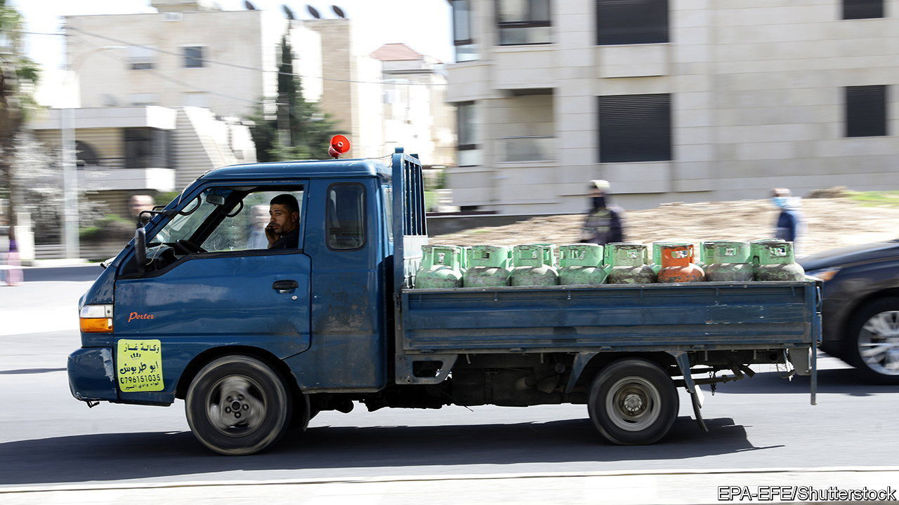

###### Beethoven at dawn

# Jordanians wake to an irritating tune blared from gas trucks 

##### A nation debates whether the trucks should shut up 

 

> Jun 5th 2021 

EVERY DAY many groggy Jordanians are woken by the sound of Beethoven blasted down the street. Trucks selling gas cylinders drive around playing a tinny electronic version of “Für Elise” in the early hours of the morning, alerting customers in the style of an ice-cream van. Residents in need of gas flag down the van when they hear the sound. Some consider the gas-truck music a part of Jordanian life’s rich soundtrack. Others think it is noise pollution.

Until the late 1990s gas-truck drivers alerted their customers by loudly honking or clanging keys against the cylinders. After complaints about the noise, the government and the fuel syndicate agreed to replace the honking with “a relaxing kind of music”, says Hussein Allaboun, head of the Energy and Minerals Regulatory Commission.


In April the commission asked Jordanians how they felt about it. Out of some 10,000 respondents, 27% said they would prefer to phone the gas company and arrange a delivery; 53% said they would like to order through a smartphone app (though one doesn’t yet exist); only 20% liked the current system.

The gas-truck music is “the second biggest melody after the call to prayer”, says Johnny Amore, an artist who got the tune changed temporarily (to something more Jordanian-sounding) in 2009 under an EU-funded project. The sound sometimes irritates Ali Hassan al-Beer, a bookseller. Still, he believes it is a beautiful symbol, now part of tradition. When the music plays, “the kids come out onto the streets and yell ‘Gas! Gas!’,” he says. “It became part of our daily routine.”

Others disagree. “It’s not a symbol. It’s not a flag,” says Muhammad Habib, who sells nuts. “It’s just a work mechanism.” Waleed Sharqawi, a menswear salesman, thinks it “so annoying”. Musical trucks cannot be deemed traditional, he says, since the practice is only a couple of decades old. He knows people who hate it so much they get “tensed up and pretty aggressive” when they hear it. Besides, the trucks are an unwelcome alarm clock for children and the sick, who would rather not be woken at 6am when the trucks start running.

Mr Allaboun says the music is not the only complaint about the current system. Customers have no recourse if given a faulty cylinder because they usually cannot remember who sold it to them. Some people are not fast enough to flag down the trucks before they drive away. “If you’re like me, an old man, it will take you a century to get there,” says Mr Allaboun. Luckily for him, his trusted doorman takes care of it.

