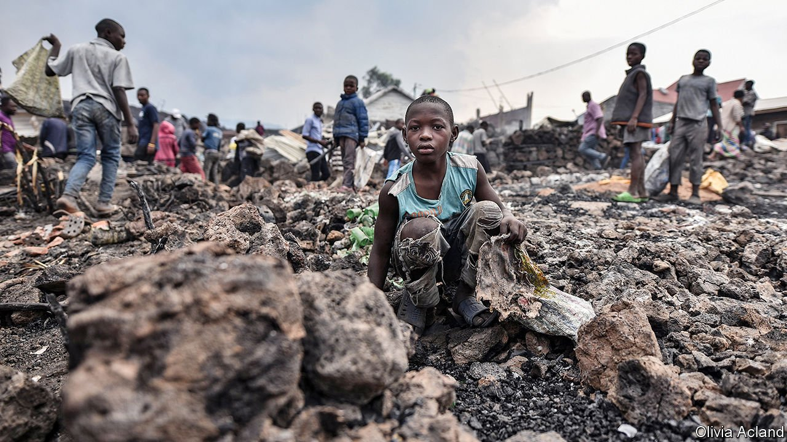
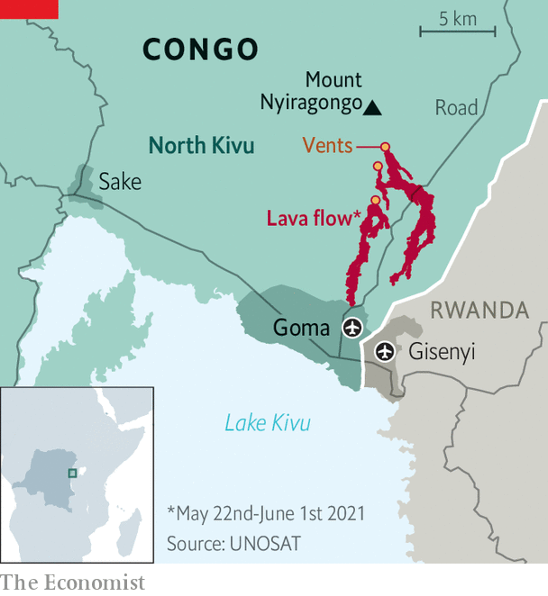

###### Mount Nyiragongo’s fury

# Thousands of Congolese have fled Goma, fearing lava and deadly gas 

##### Wherever they end up, horrors await 

 

> Jun 5th 2021 

THEY GRABBED blankets, clothes and mattresses and rushed out of their houses at dawn on May 27th. In their tens of thousands, they streamed out of the city of Goma, in eastern Congo, terrified of what its volcano might do next. Some fled east towards the border with Rwanda (see map). Others hurried west to the Congolese town of Sake, around 20km away, clogging the dirt road from Goma with motorbikes, cars and pedestrians. Hundreds of people rushed down to Goma’s port to pile onto boats heading to Bukavu, a city at the southern end of Lake Kivu.

It was the second mass flight since molten lava began spilling out of a fissure in the side of Mount Nyiragongo on May 22nd. Hundreds of thousands of people have fled Goma, where lava flattened districts in the northern outskirts but stopped short of the centre (and just spared the airport). Some 32 people have been killed and around 3,500 houses destroyed. Yet things could get much worse.


On May 27th the acting governor of North Kivu, the province that includes Goma, ordered the immediate evacuation of about 600,000 residents in the centre of the city (perhaps another 1.5m live in other parts of Goma and many of them did not wait to be told to leave). Magma had been detected underneath the city centre and under the vast, deep Lake Kivu. “An eruption on land or under the lake cannot be ruled out, and it could happen very quickly and without warning,” said the governor, Constant Ndima.

 


Goma has experienced more than 400 earthquakes since the eruption on May 22nd. One was big enough to knock down a two-storey building. A deep crack has opened up in the road next to Goma’s main hospital. Residents fear that, if there is another blast, lava could spurt out of this crack, engulfing the city centre. An even deadlier risk is the prospect of a limnic eruption, triggered by earthquakes and volcanic activity. Dissolved carbon dioxide would explode from the lake’s deep waters, possibly sending a tsunami-like wave over the city. Worse, it could form a deadly cloud of gas. A vast volume of carbon dioxide could asphyxiate everyone in Goma and Gisenyi, a lakeside town in Rwanda, just over the border.

Limnic eruptions are rare but tend to be deadly. The last one, in Cameroon in 1986, killed more than 1,700 people, some as far away as 25km from the lake. If the lava believed to be bubbling beneath Lake Kivu raised its temperature by more than one degree Celsius, there could be an “overturn”, or limnic eruption. The number of earthquakes in the area has been decreasing, but large ones still shake the city. “Pressure is still building, there is potential for a magma intrusion into the lake,” says Adalbert Muhindo, a volcanologist. “This could cause a limnic eruption, but it could be on a smaller scale.” Dario Tedesco, a volcanologist monitoring Nyiragongo, has told people in the area to report anything strange, such as “a discolouration of the lake, increasing temperature of the lake or bubbling inside the lake”. These, along with the smell of rotten eggs given off by sulphur dioxide, are warning signs.

The eruption on May 22nd took the residents of Goma by surprise. This might, in part, have had something to do with the fact that the city’s volcano observatory has barely received any money since October 2020, when the World Bank’s funding cycle ended. The bank decided not to cough up again when it emerged that many of the employees on the observatory’s payroll were not actually working there. Since the funding stopped, lots of the staff who really do monitor the volcano have also not been paid; some have stopped turning up.

Magma or militants

For some who have fled Goma, it was not the first time. Clashing rebel groups have terrorised eastern Congo for over 25 years. In total, around 5m Congolese are displaced, mostly because of conflict. Many of Goma’s residents escaped from nearby villages that are preyed on by men with guns. They are used to grabbing a handful of possessions and rushing out into the night.

In Sake food is scarce and life is grim. “Conditions here are terrible but I am frightened to go back,” says Ange Rusangiza, whose house was destroyed. She has been sleeping on the floor of an unfinished building. According to UNICEF, ten suspected cases of cholera have been recorded in Sake, prompting fears of an outbreak.

Many of Goma’s residents have stayed put, hoping for the best. “Yes, if the lake explodes, I will die, but I don’t think it will,” says Eddygar Shombo. He lived through an eruption of Mount Nyiragongo in 2002, when lava engulfed swathes of the city. Scores of people were killed and more than 120,000 were left homeless. But, like many others, Mr Shombo fears that if he flees, his home will be looted. “I have everything here, I cannot leave,” he says. ■

