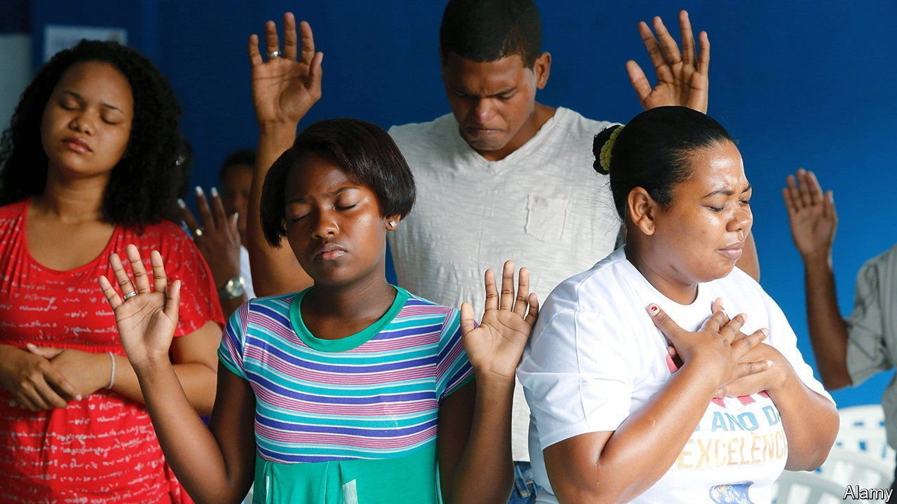

###### Evangelicals

# Of Bibles and ballots 

##### Evangelical churches are political players in Brazil 

 

> Jun 3rd 2021 

A T 4PM EVERY Sunday in Barra de Pojuca, a poor town in Bahia, the streets suddenly empty. You may think people are taking a siesta, until you spot the crowded churches. “For every sister in church there’s a brother in the bar,” jokes Cremilda, a member of the Assemblies of God, as she climbs to the cinderblock chapel. But in the 20 years since she helped build the church, more men are choosing Bibles over beers.

In 1970 only 5% of Brazilians were evangelical. Now a third are. The movement owes its growth to rapid urbanisation. Pastors arrived with little more than a Bible and preached in words people understood. Pentecostalism offered lively worship and solutions to earthly problems like poverty, alcohol abuse or domestic violence. A study of Brazilian men in 2014 found that Protestant faith was linked to a rise in earnings, especially among less educated black men. “Becoming evangelical isn’t only a bet on the supernatural, but a choice” for a better life, writes Juliano Spyer, an anthropologist, in a new book.


The largest subset of evangelicals are poor black women, a group Mr Bolsonaro has derided. Yet two-thirds of evangelicals voted for him, many on advice from their pastors. Evangelical churches once shied away from politics. Their representatives at Brazil’s constitutional convention in 1988 urged Catholics to keep the state secular. But they realised politics could promote goals such as opposing gay rights and abortion, or remaining tax-exempt. Politics also became a way to deal with religious competition, says Amy Erica Smith, a political scientist at Iowa State University. The evangelical lobby in Congress includes 195 of 513 federal deputies.

Among Brazil’s 40-odd denominations, the most partisan is the Universal Church of the Kingdom of God ( UCKG), which has 2m members and 8,000 churches. It was founded in 1977 by Edir Macedo, an ex-lottery official who owns a TV network. He once backed the PT but in 2018 declared for Mr Bolsonaro (who is Catholic but was rebaptised in the Jordan river by a Pentecostal pastor). Members were bombarded with anti- PT propaganda. Some wavered, says Jacqueline Teixeira, an anthropologist at the University of São Paulo. But after Mr Haddad called Mr Macedo a “fundamentalist charlatan”, they felt that if they did not vote for Mr Bolsonaro, “they’d be denying their religious identity,” she says.

Evangelical support for Mr Bolsonaro reflects dissatisfaction with the PT’s progressive policies and its role in Lava Jato. “When the church enters politics, it brings morals,” says Antônio Falcão, a Baptist former city councillor from Barra de Pojuca. Mr Bolsonaro has not legalised state religious education or outlawed gay marriage, but he has increased punishment for people convicted of domestic violence and slashed public funding for Brazilian cinema, calling it “pornographic”.

In April his nominee to the supreme court decreed that churches could open on Easter Sunday, despite covid-19. Some 500 people crowded into a UCKG temple in Porto Velho. The pastor chided the congregation for skipping services. “You have faith in doctors, you have faith in vaccines but you don’t have faith in God?” he cried. Church workers promptly appeared with velvet bags; the UCKG instructs its members to donate 10% of their income to the church. “All that matters is that you are good with God,” said the pastor.

Only 35% of evangelicals disapprove of Mr Bolsonaro, against 44% of all Brazilians. Still, some may break with him in 2022. Marina Silva, an evangelical former senator, says that politicians should be judged for their credentials, not their creed. Assemblies of God is less hierarchical than the UCKG. It has megachurches with bolsonarista pastors but most of its 12m members belong to hole-in-the-wall congregations like Cremilda’s. Pastor Josemar says he is sick of “representatives who don’t represent us”.

In 2018 evangelicals were “like chicken with our heads cut off”, one of Cremilda’s friends comments. Now she thinks that the president is “not a man of God”. But Cremilda is undecided. She is waiting to see whether other candidates share her Christian values. “Bolsonaro has lost his way,” she says, but she believes in the power of redemption.

Full contents of this special report


* Evangelicals: Of Bibles and ballots


