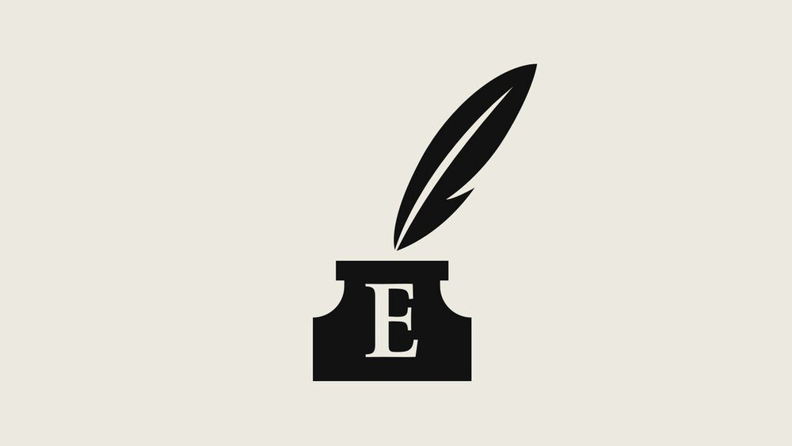

###### 

# Sources and acknowledgments 

#####  

 

> Jun 3rd 2021 

Acknowledgments

In addition to those quoted in the report, the author would like to thank 


Pedro Abramovay

Bruno Carazza

Sylvio Costa

Eduardo Giannetti

Ruan Martins

Chico Otavio

Felipe Recondo

Nathália Sardelli

Rafael Soares

Matias Spektor

Gabriel Uchida

Carolina Unzelte

Gabriel Vasconcelos

Oscar Vilhena


Those interested in further reading on the issues raised in this report may like to investigate the sources below:


Books

 by Matthew Taylor, 2020

, by Malu Gaspar, 2020

 by Juliano Spyer, 2020

 by Bruno Paes Manso, 2020

, by Amy Erica Smith, 2019

, by Marcos Lisboa and Samuel Pessôa, 2019

, by Ricardo Abramovay, 2019

Studies, reports ands films, 1970-2000, Joseph E. Potter, Ernesto F.L. Amaral and Robert D. Woodberry, 2014

Environmental services as a strategy for sustainable development in rural Amazonia by Philip Fearnside, 1997

 by Philip Fearnside, 2018 

, report by Instituto Escolhas, 2021 

, an investigative magazine, 2020-2021

, a now-defunct magazine, devoted to the Amazon

The Last Forest by Luiz Bolognesi, 2020, documentary about the Yanomami tribe

