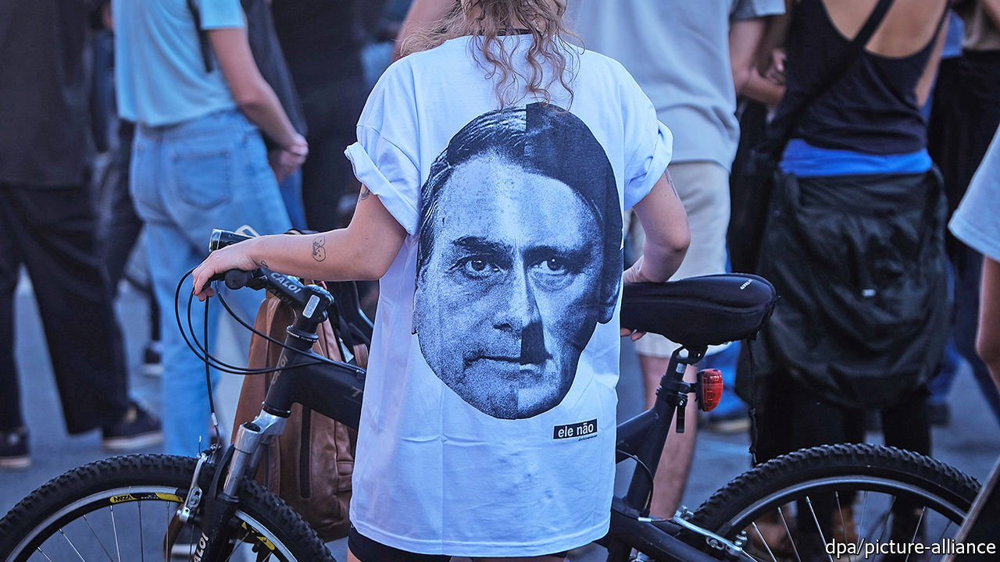

###### The prospects

# Time to go 

##### Brazil’s future depends on the outcome of the 2022 election 

 

> Jun 3rd 2021 

THREE MONTHS after Mr Bolsonaro became president, he ordered the army to mark the 55th anniversary of the coup. His press office distributed a video in which a man explains that the 1960s were a “time of fear”. Communists were “killing their compatriots” in the name of a leftist ideology. The public took to the streets, begging for intervention. Then “Brazil remembered that it had an army.” Black and white shifts to colour as the music picks up and Brazil’s flag appears. “The army saved us,” the man says.

Brazil’s military dictatorship killed 434 people, far fewer than regimes in Argentina and Chile did. That partly explains how, after handing power back to a civilian government in 1985, the army became the institution Brazilians trust most. It is also why Mr Bolsonaro was able to exploit his military past to be elected.


The generals who joined his government hoped to advance the army’s agenda. Instead they hurt its reputation. They were complicit in Mr Bolsonaro’s mishandling of the pandemic, which led to tens of thousands of unnecessary deaths. They failed to get him to sign vaccine contracts or to stop him greeting supporters when he caught covid-19. Under Mr Pazuello, the health ministry resembled a boca de fumo (drug den) for hydroxychloroquine. At one point it launched an app for doctors that recommended the drug to nearly everyone, including infants and people with hangovers.

Yet the army has so far held Mr Bolsonaro back from an anti-democratic “adventure”, in the words of Mr Santos Cruz. How long it can do this is less clear. Mr Bolsonaro may try to cling to power if he loses next year by claiming he has won and inciting protests. “Only God will remove me,” he has said. He says electronic voting is subject to fraud and he has eased gun laws to “arm the people” against “dictators”. His fans include police and thugs. The army may find it has to choose between democracy and Mr Bolsonaro.

Other Brazilian institutions have survived his assaults, though their resistance can resemble a game of whack-a-mole. In May, after police began a defamation investigation into a YouTuber who had called Mr Bolsonaro a “genocidaire,” a judge threw out the case. Another judge quashed a probe into Almir Suruí and other indigenous leaders accused of “lies” about government failings in the pandemic. Folha de S. Paulo, a newspaper, denounced censorship by printing an op-ed of 185 insulting names for the president, including “tyrant”, “butcher” and “donkey”.

But while the courts have rebuffed Mr Bolsonaro’s authoritarianism, other institutions have suffered at the hands of his loyalists. After Congress blocked two decrees to give the agriculture ministry control over indigenous land claims, Funai changed its policy to allow farmers to claim ownership of tribal lands not yet officially demarcated. Police and prosecutors are investigating allies and sons of the president, but that has cost some their jobs. Mr Bolsonaro has named one pliant supreme-court justice and will be able to pick another this year.

If he manages to win re-election (by fair means or foul) he could nominate two more. His attacks on democracy would then become more brazen. His more radical fans shun institutions and see him as their saviour. The bolsonarista who said she wants civil war once camped outside Mr Moro’s court. When he quit and accused the president of obstructing justice, she replaced her pro-Moro T-shirt with one saying, “I would go to war for Bolsonaro”.

Four more years of him in charge could devastate the Amazon, where much of the rainforest could turn into dry savannah. Mr Bolsonaro prefers losing a trade deal with the EU to changing his environmental policy. That would be bad for the whole country, which has been going in the wrong direction for a decade. Growth is stuck, jobs are scarce, millions of people are hungry and politicians think only of themselves. For a country that likes to party, there is little to celebrate.

In 2018 only 14% of Brazilians said they trusted the supreme court “a lot” and 3% trusted Congress. Mr Bolsonaro exploited such disillusion to win election. His rivals in 2022 must turn it against him. Polls suggest Lula would win a runoff. But as vaccination and the economy pick up, the president may regain ground. Lula must show how his handling of the pandemic has cost lives and livelihoods, and how he has ruled for his family not for Brazil. The ex-president should offer solutions, not saudades (nostalgia).

On March 31st, the anniversary of the coup, six potential challengers to Mr Bolsonaro signed a manifesto saying democracy was “under threat.” Saving it will take more than manifestos. Politicians need to tackle overdue economic reforms. Courts must crack down on corruption. And businesses, NGOs and ordinary Brazilians must protest in favour of the Amazon and the constitution. But it will be hard to change Brazil’s course so long as Mr Bolsonaro is president. The most urgent priority is to vote him out.■

Full contents of this special report


* The prospects: Time to go

