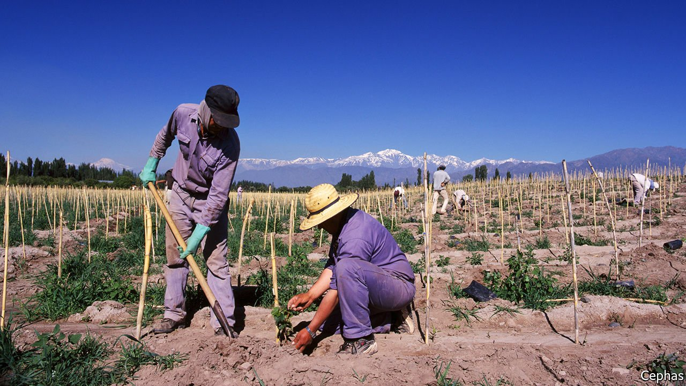

###### Rushing for the exit

# Covid-19 is inspiring separatism in Argentina’s winelands 

##### Independence is a sozzled fantasy, but calls for autonomy will grow 

 

> Jun 5th 2021 

ON A RECENT Friday evening in Mendoza, the capital of Argentina’s wine country, a group of well-to-do Mendocinos held a Zoom session with Luciana Sabina, a historian. “Self-rule, it’s a big part of our DNA,” she declared, as she took her viewers through earthquakes and economic crises, singing the praises of Italian immigrants who planted fructuous vineyards in the Andes. In her telling, an epidemic was a turning-point in the province’s history. During a cholera outbreak in the 1880s Mendoza wanted to close itself off from the rest of the country. Argentina’s then dictator, General Julio Argentino Roca, forced the province to open. “We lost the battle for self-rule, thousands of lives too,” Ms Sabina concluded.

Once again, a pandemic is driving a wedge between Mendoza and Buenos Aires. Covid-19 is surging in Argentina; the country is recording 35,000 new cases a day. The provincial government has defied President Alberto Fernández by keeping its schools open. It has imposed a looser curfew and was against extending Argentina’s lockdown beyond May 30th. The tension is inspiring demands for autonomy more generally. Some political activists even talk of independence from Argentina. They call it “MendoExit”.


“The government just takes from us, it’s a disgrace,” says Luciano, a farmhand on a small vineyard in the province’s Uco valley, where Malbec, the soft red wine that helped make Mendoza famous, is produced. “We live by our work, we Mendocinos provide for ourselves,” remarks Cristina, a young mother checking French oak barrels in a nearby winery. Taxes on exports in particular are disliked. “That money, from our labour, should stay in Mendoza,” says Juan, a winemaker.

Per person, Mendoza gets the least funding from the central government of all of Argentina’s 23 provinces. Last spring José Manuel Ortega, a former investment banker and winemaker, paid for an opinion poll of Mendoza, Córdoba and Santa Fe, the country’s richest provinces, which are all home to opposition leaders. Two-fifths of respondents in Córdoba and a third in Mendoza said they would back seceding from Argentina. Another poll in April showed support rising. “I hate saying it, but this is a failing state,” says Mr Ortega.

One Mendocino legislator, José Luis Ramón, has proposed a plebiscite on independence when the province votes in mid-term elections later this year. A MendoExit movement, run by Hugo Laricchia, a pugnacious acupuncturist, has joined forces with the established regional Democratic party to present a new force in regional politics, called Éxito. Alfredo Cornejo, a former governor of Mendoza and the leader of Argentina’s Radical party, says that “Mendoza has what it needs to live independently.” Mr Cornejo, who has presidential aspirations, is not calling for independence himself, but he plays up to it. “People want out of this Argentina and the way it’s run, not the country itself,” he says.

Whether all this will come to much is unclear. The constitution does not allow for secession, notes Anabel Sagasti, a senator of the ruling Peronist party. But in the Uco valley Raúl, a worker loading cases of Malbec for export, says he would vote for Éxito. “We can’t go it alone, but with others like Córdoba, we could.” His boss laughs at the idea. Not everybody will.■

Dig deeper

All our stories relating to the pandemic and the vaccines can be found on our . You can also listen to , our podcast on the race between injections and infections, and find trackers showing ,  and the virus’s spread across  and .

