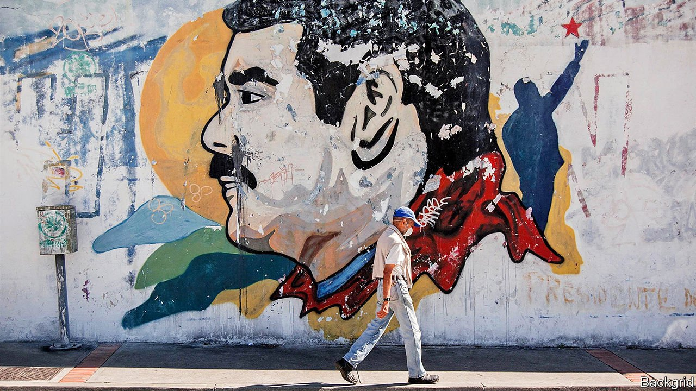
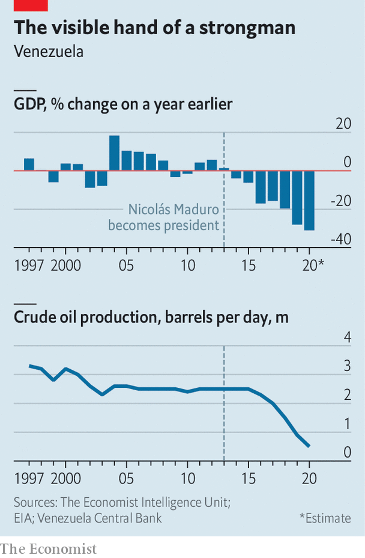

###### A scofflaw’s offer

# Venezuela’s strongman wants better relations with the United States 

##### Nicolás Maduro might even go easier on the opposition in exchange 

 

> Jun 3rd 2021 

“HERE WE ARE. Thewinners!” boomed Nicolás Maduro at a televised ceremony on May 20th. It was the third anniversary of what the Venezuelan president describes as his “popular victory”: an election in 2018 which secured him a second presidential term. “The election had such an important impact for us,” agreed his wife, Cilia Flores. She was more right than she perhaps intended to be.

For it was that vote, a fraud managed by a biased electoral authority, that led dozens of Western countries to brand Mr Maduro a dictator and isolate his regime. The United States has imposed  on him and most of his political allies, including Ms Flores. American companies, once the main buyers of Venezuela’s crude oil, are prohibited from all dealings with the regime. The American government has offered a $15m award for information leading to the arrest of Mr Maduro. Dozens of democracies have, to varying degrees, formally declared the head of the National Assembly, Juan Guaidó, to be the rightful leader of the country. The Venezuelan economy has continued its relentless collapse, shrinking by more than 70% since Mr Maduro took office in 2013. Oil production has fallen to levels last seen in the 1940s. One-third of the population do not have reliable access to sufficient food.


Yet if it was not a “popular victory”, it was one for Mr Maduro. He has neutralised the opposition, making a mockery of the internationally supported plan to replace him with Mr Guaidó. The latter’s hope—that an underpaid and demoralised army would switch sides and put him into power—now seems a fantasy. Of the almost 60 countries which at one stage accepted Mr Guaidó as president, all but eight have quietly dropped the designation from their communiqués this year.

 


Mr Maduro, a former bus driver snobbishly dismissed as a “donkey” by his enemies, has proved far wilier than they had imagined. “He has uncanny situational intelligence,” says a former official in his government. “If there are three people in a room and one must die, it won’t be him.” The key to his survival has been patronage. “The government is more like a clan now,” says the ex-official. Generals, governors and gang leaders rule parts of the country like mini-fiefs. With oil money running short, the state hands out land and development rights to buy loyalty instead. In Los Roques, a Caribbean archipelago, mansions are being built in a national park. In the south, a chaotic gold rush has felled forests and poisoned rivers.

Mr Maduro now wants to reduce international pressure on his regime. His officials speak of a plan to “turn the page”. The idea is that by holding slightly less rigged regional elections and sending a team to negotiate with the opposition, Mr Maduro may persuade President Joe Biden’s administration to pare back sanctions imposed by Donald Trump. Mr Maduro “wants to figure out a way to give up as little as possible but get some legitimacy”, says an official in the US State Department. A significant easing of sanctions is unlikely. But threats from the United States have grown quieter. (Mr Trump publicly mused about ousting Mr Maduro by any means necessary, including an invasion.) Europe has also changed its tune. “The talk these days is of regime improvement, not regime change,” says a diplomat.

After denying for years that Venezuela faces a humanitarian crisis, Mr Maduro agreed in April to allow the UN’s World Food Programme into the country to feed children. He hosted the WFP’s boss, David Beasley (an American) in Caracas, the capital. Eleven days later the government transferred six former executives of Citgo, an oil-refining firm based in America, from prison, where they had been since 2017, to house arrest. The attorney-general vowed to investigate the security services’ role in three controversial killings.

In preparation for regional elections, the government and some elements of the opposition have agreed to empanel a new electoral council (CNE). It is still skewed in the regime’s favour, but two of its five members are friendly to the opposition (previously only one was).

The announcement has, as intended, divided the opposition. Mr Guaidó initially rejected it as an “imposition of the regime”, but others seem keen to take part. Henrique Capriles, a former presidential candidate who helped negotiate the deal, described it as the “least bad” CNE since Mr Maduro’s predecessor and mentor, Hugo Chávez, won elections in 1998. The Norwegian government is sponsoring a parallel effort, which may take place in , to get both sides negotiating.

Public support for Mr Guaidó has fallen from over 60% in 2019 to around 15%, according to Datanalisis, a polling firm. His “mandate” derives from his leadership of the National Assembly elected in 2015. Its term expired in January. The assembly has granted itself a one-year extension, saying that no credible elections could be held under Mr Maduro. But many of the governments that publicly support him, and even some allies in the assembly, think it would be wrong to extend again.

If talks go ahead, the opposition’s demands would include the release of political prisoners, perhaps a further overhaul of the CNE, an early presidential election (the next is scheduled for 2024) and the admission of foreign observers for all future polls. In return the regime wants the removal of all sanctions, the release of funds frozen by the United States and other countries, and the acceptance of a rival National Assembly created by Mr Maduro.

The United States has indicated that it would contemplate modifications, at least, to the sanctions. Mr Guaidó has moderated his earlier all-or-nothing approach to talks, with Mr Maduro stepping down as a precondition. Sceptics argue it is all a waste of time, and that Mr Maduro, who has held four rounds of negotiations with the opposition since 2013, has no intention of agreeing to anything that might lead to his losing power.

But there exists another view: that the president and his wife have their eyes on retirement, and would like to hand over to a palatable successor before new presidential elections in 2024. Mr Maduro, says the former government official, “wants to be remembered as the man who took on the United States and won”. ■

A version of this article was published online on May 31st 2021

