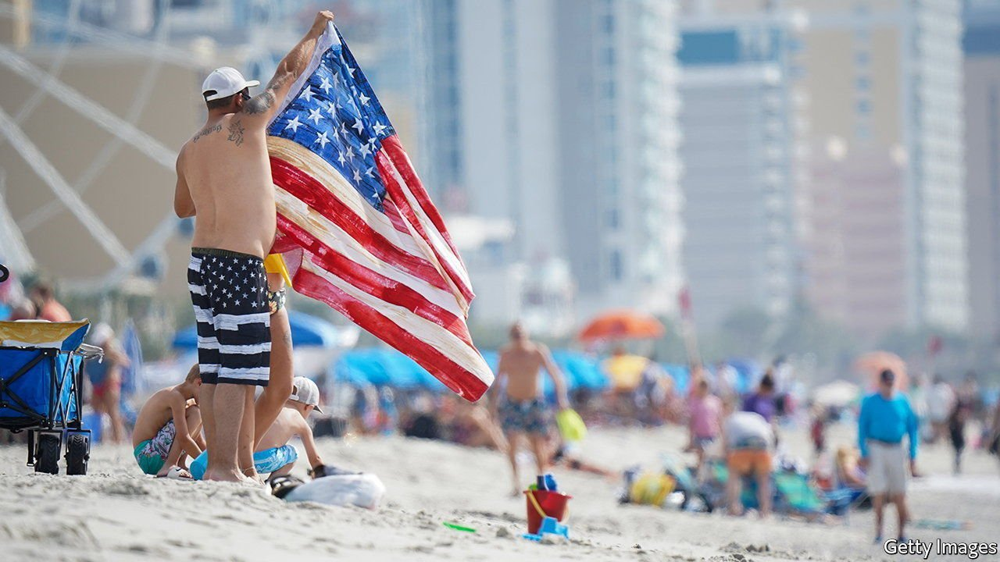

###### 

# Business this week 

#####  

 

> Jun 5th 2021 

In its latest outlook  that the world economy will grow by 5.8% this year, a sharp upward revision from its previous estimate. The success of vaccine roll-outs in much of the rich world and the huge stimulus programme in the United States have helped improve global prospects. GDP per person has already returned to pre-pandemic levels in some countries, such as America and South Korea, but the OECD thinks that it will take another year for much of Europe to make up the difference, and another two to five years in Argentina, Mexico and South Africa. Real global output will still be $3trn less by the end of 2022 than it would have been without the crisis.

Brazil’s official statistics office said that the country’s economy returned to pre-pandemic size in the first quarter, when GDP grew by 1.2% over the previous quarter, a faster pace than many economists were expecting. India’s economy was also on the road to recovery in the first quarter, boosted by manufacturing and government spending, but that was before an escalation of covid-19 infections that plagued the country in April and May.


A study by the International Labour Organisation found that a further 108m workers and their families around the world are living on $3.20 or less a day relative to 2019, in purchasing power parity terms, returning working-poverty rates to those of 2015. The recovery will create a net 100m jobs this year, though total employment will still fall short of its pre-crisis level.

The euro zone’s annual rate of inflation leapt to 2% in May, passing the European Central Bank’s target of “below, but close to 2%”, for the first time in more than two years. In Germany it hit 2.4% (up from 1.6% at the start of the year). The ECB, along with the Federal Reserve, insists that surging prices are temporary and will eventually ease. Rising energy costs are a big factor driving inflationary pressures. Petrol (gas) prices reached a seven-year high in America ahead of the Memorial Day holiday.

There is little sign of those prices easing in the near future. This week Brent crude closed at over $70 a barrel for the first time in two years, after  (which includes Russia) signalled that the demand for oil will increase later this year. The glut of oil that kept prices low before the pandemic has diminished enough to encourage OPEC to raise output.

Declining cases of covid-19 and the easing of restrictions made Americans more willing to travel over the Memorial Day weekend. Over 1.9m people were screened at America’s airports on both Friday and Monday, the busiest days. That was well up from more than 300,000 on each day last year, but down from 2.5m in 2019.

A cyber-attack on JBS, the world’s biggest meat-processor, halted its operations in America and Australia. It is the third big cyber-attack in recent weeks, following those on a pipeline in America and Ireland’s health-care system. Russian criminal gangs are thought to be behind all three.

A long journey ahead

 


Transport for London, the city’s public-transport authority, received its third emergency support package from the government since the start of the pandemic. The main reason for TfL’s woes is its shift away from subsidies in recent years towards a reliance on passenger income. That revenue was worth around £5bn ($7bn) before covid-19, but has since dwindled. The government’s funding conditions will lead to fare increases. But there is some light at the end of tunnel: passengers are returning, albeit hesitantly.

Britain began the long process of joining the Comprehensive and Progressive Agreement for Trans-Pacific Partnership, after the 11 countries that comprise the free-trade area agreed on its application. Japan in particular has thrown its support behind Britain’s request in order to give the pact more heft; America withdrew from a precursor agreement during the Trump administration.

A former banker with M.M. Warburg, one of Germany’s oldest private banks, was found guilty of aggravated tax evasion for his participation in the “cum-ex” scandal, where share transactions were conducted at high speed on or just before the day dividend payments were recorded, allowing the participants to claim duplicate tax rebates. The unnamed banker is in his 70s. His conviction will probably be the first of many; there are another 1,000 suspects.

Turkey’s president, Recep Tayyip Erdogan, again put the independence of the country’s central bank in doubt with a renewed call for a cut in interest rates in July or August.

Tallying the books

Lockdowns boosted sales and profit at Bloomsbury for the year ending February 28th. “The popularity of reading has been a ray of sunshine in an otherwise very dark year,” said the publisher’s chief executive, as the company again raised profit expectations for 2021.

