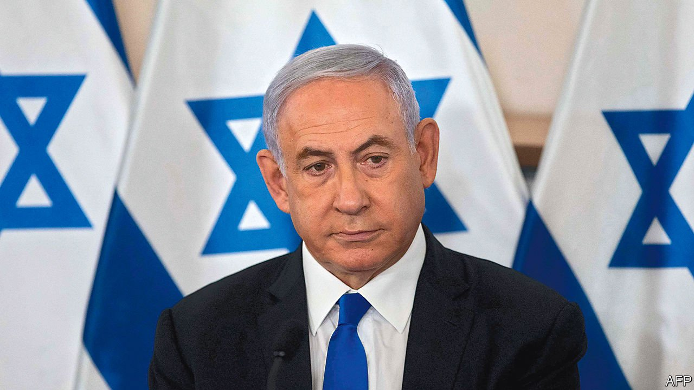
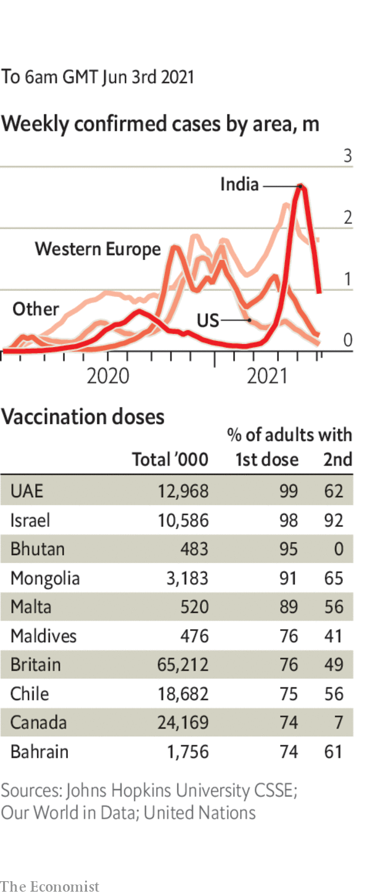

###### 

# Politics this week 

#####  

 

> Jun 5th 2021 

The  reached an agreement that would end his 12-year stretch as prime minister of Israel. Under the deal, Naftali Bennett, the leader of a nationalist party, would become prime minister, serving for two years before handing over to Yair Lapid, a centrist and secularist. The Knesset still must pass a vote of confidence in the new coalition, which includes an Arab-Israeli party. That leaves time for Mr Netanyahu to try to pick off its right-wing supporters.


The African Union suspended Mali’s membership and threatened to impose sanctions if a civilian-led government is not restored. Last month Mali’s armed forces mounted a coup, the second in less than a year.

The Democratic Republic of Congo said that 32 of its MPs had died of covid-19. The reported total for the entire country of 80m is only 786 deaths. So either MPs are very unlucky or there is massive undercounting among less prominent folk, and a far worse pandemic than official numbers admit.

Iran’s largest navy vessel (in terms of tonnage) sank after catching fire in the Gulf of Oman during a training mission. The cause of the fire was not immediately clear. The navy said it started in one of the ship’s systems.

A cargo ship carrying chemicals and plastic pellets sank off the coast of Sri Lanka, near Colombo. The X-Press Pearl had been on fire for two weeks. Its sinking will exacerbate an unfolding maritime disaster: hundreds of tonnes of fuel could escape from its tanks to add to the tonnes of plastic already finding their way onto local beaches.

China’s ruling Politburo said the country’s  to a three-child one. The government, which once tried to force people to have fewer babies, now wants them to have more, to stop the population from ageing so fast. Parents who want a third child rejoiced, but the vast majority do not. Demographers predicted that the birth rate would not rise much.

Hishammuddin Hussein, Malaysia’s foreign minister, said his country would summon China’s ambassador, after 16 Chinese air-force planes were seen approaching Malaysia’s airspace over the South China Sea, where the countries’ territorial claims overlap. The foreign ministry described the incident as a “serious threat to national sovereignty”. Chinese officials described the flights as “routine”.

A Chinese blogger, Qiu Ziming, was sentenced to eight months in prison for “picking quarrels and causing trouble”. His offence related to his posts suggesting that China had under-reported the number of its soldiers killed in border clashes with India last year.

Democrats staged a walk-out in , preventing Republicans from passing a bill that would tighten the state’s voting laws. Critics say the bill, which among other things bans 24-hour polling stations, is intended to suppress black and Hispanic votes. Republicans will probably get another go at passing it in a special session of the legislature.

America’s Department of the Interior suspended licences to drill for oil in the Arctic National Wildlife Refuge in Alaska, which for decades has been a flashpoint between environmentalists and energy firms. The licences were sold during the final days of Donald Trump’s administration.

Protests in Colombia continued for a second month. Iván Duque, the besieged president, sent the army to Cali, the city worst affected by the violence. Human Rights Watch said that at least 63 people have been killed during the past month.

 to voice their disapproval of Jair Bolsonaro’s handling of the covid-19 crisis. Some waved signs demanding “Bolsonaro out”. It was the first big protest against the president since the start of the pandemic. Mr Bolsonaro’s approval ratings have plummeted; he is up for re-election next year.

Mr Bolsonaro agreed that covid-embattled Brazil could step in at the last minute and host the Copa América football tournament, which starts on June 13th. Surging infections in Argentina and protests in Colombia have caused both countries to withdraw as co-hosts. Critics fretted that cheering fans will turn the matches into superspreading events.

Russia’s upper house of parliament approved a law barring members of “terrorist” and “extremist” organisations from holding elective office. Vladimir Putin’s government routinely applies those labels to peaceful dissident groups, such as the supporters of Alexei Navalny, the main opposition leader, who is in prison on bogus charges.

America’s State Department imposed sanctions on one current and four former officials in Bulgaria, because of their involvement in “significant corruption”.

Boris Johnson married his fiancée, Carrie Symonds, at Westminster Cathedral. The twice-divorced Mr Johnson is the first British prime minister in 200 years to tie the knot while in office.

Coronavirus briefs

 


Peru raised its death toll from the disease to 180,000 (from 69,300) to keep the figure in line with international counting of excess deaths.

Britain reported zero daily deaths from covid-19 for the first time since the start of the pandemic in March last year. The country’s vaccine roll-out has been a stellar success. More than 75% of adults have received at least one jab.

The World Health Organisation ( WHO) approved the Sinovac vaccine for emergency use, the second jab made in China to receive its blessing.

The WHO reclassified variants of the disease by letters of the Greek alphabet to avoid upsetting the countries where they were first spotted. The British variant becomes Alpha, the South African variant Beta, and so on. In a somewhat less sensitive move, the WHO elected Syria, a blood-drenched dictatorship, to a seat on its executive board.

