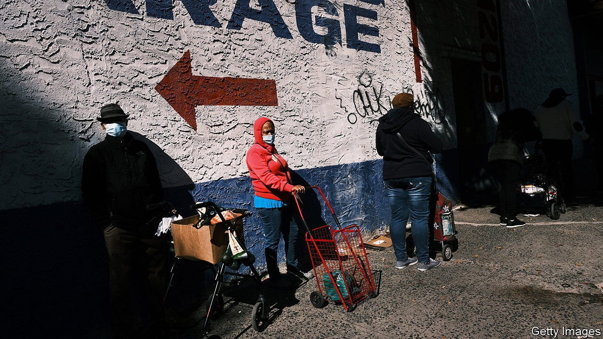
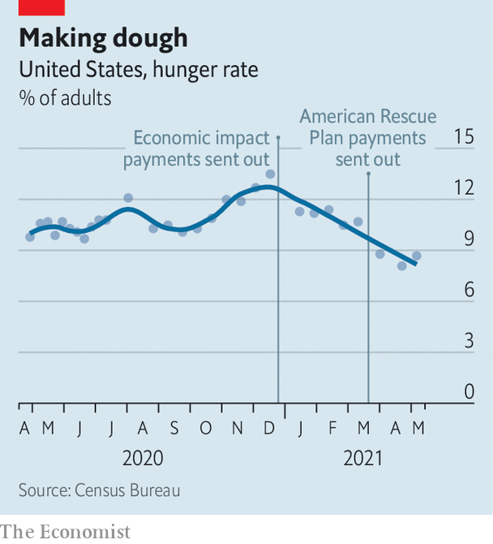

###### The hunger wanes

# Fewer Americans are going hungry 

##### What went so right? 

 

> Jun 5th 2021 

“SINCE WE TOOK office,” tweeted President Joe Biden on May 23rd, “hunger rates have dropped 43%.” That statistic, although astonishing, is broadly correct, according to data from the Census Bureau. “That’s the American Rescue Plan at work,” Mr Biden added. The claim of causality, however, is less certain.

Since April 2020 the Household Pulse Survey, carried out by the Census Bureau, has asked a representative sample of American adults whether there was enough to eat in their household over the previous week. The share who respond either that there is “sometimes” or “often” not enough food are classified as living in hunger. Over the course of the covid-19 epidemic, this proportion has hovered around 10%. It peaked just ahead of Christmas at 13.7%, equivalent to 30m people. Since then the figure has fallen steeply (see chart). The survey, carried out between April 28th and May 10th, put the figure at 8.7%, or 18.2m people.


Although Mr Biden would like to credit his American Rescue Plan for this improvement, the claim does not stand up to closer inspection. The president signed that bill on March 11th, yet by March 17th the share of people saying that they had not eaten properly had already fallen to its lowest since covid-19 was diagnosed widely in America. It took at least six days for the first Rescue Plan cheques, worth $1,400 for every adult, to be received, suggesting that the initial decline in hunger was caused by something else.

 


There are several possible reasons why hunger has fallen. First, the steadily improving economy. The unemployment rate has fallen from its peak of 14.8% in April 2020 to 6.1%. However, hunger rates did not begin to decline until the final days of 2020; they remained stubbornly high last year even as unemployment fell. On a state-by-state basis, there appears to be little relationship between the change in unemployment and the fall in hunger rates over the past year. Another possible explanation is the reopening of schools, which may have given more children access to subsidised food. But again, school reopenings did not begin until well after hunger began to trend downwards.

A third possible cause of the decline in hunger is one that Mr Biden may not wish to trumpet. An earlier round of stimulus cheques worth $600 was delivered in December 2020 to every American adult, under legislation signed by the outgoing president, Donald Trump. That bill also increased food-stamp benefits by 15%. The cheques were sent out on December 29th, precisely when hunger rates began falling.

Although the American Rescue Plan may not have started the decline in hunger, it is likely to play a role in sustaining it. Experts say that the vital signs of labour markets, such as earnings and unemployment—which is still nearly twice its pre-pandemic rate—are closely tied to levels of hunger. Therefore extraordinary benefits, such as the cheques approved by both Mr Trump and Mr Biden, have kept hunger rates lower than they otherwise would have been. The government may hand out more money later this year, while the American Rescue Plan has extended food stamps, too. Both policies are likely to help keep hunger at bay.■

