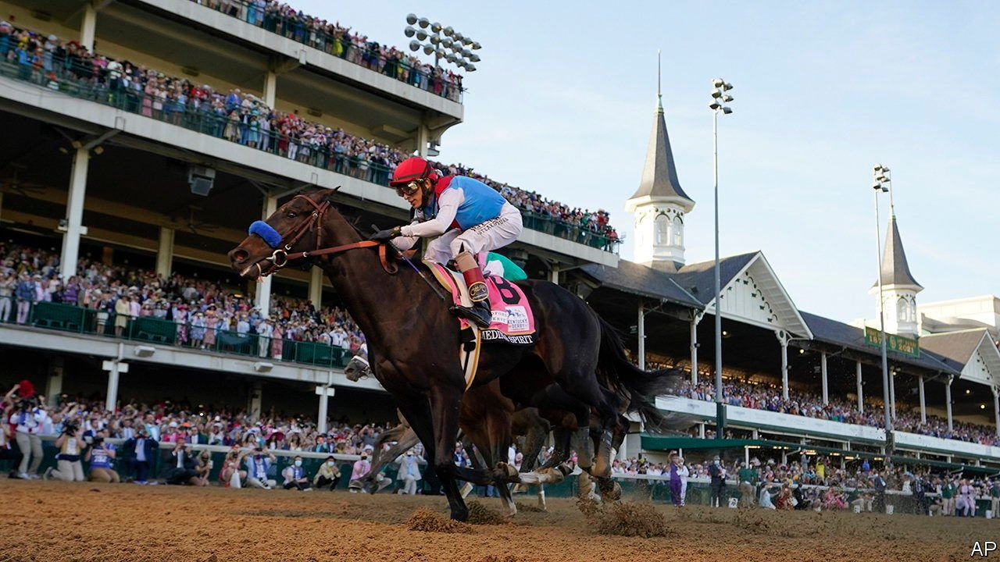

###### Off-track

# Horseracing, the sport of kings, needs more punters and fewer drugs 

##### Why America’s racetracks face long odds 

 

> Jun 5th 2021 

“IT’S A WIN-WIN,” says Zach Noren, who is visiting Belmont Park, a racetrack on the border of Long Island and New York City, with his three-year-old son Jack. “He likes the horses and I like to bet.” Mr Noren normally pays attention to the “ponies” only for Triple Crown events, like the Kentucky Derby. This is not unusual. There were few punters at Belmont on a recent Sunday afternoon. The virus may have made people wary of placing a flutter in person, but interest in racing has been dwindling for years.

The public perception that the horses are mistreated or over-medicated has contributed to that. Part of the problem, says Bennett Liebman of Albany Law School, is that there is no regular mainstream sports coverage of racing. “Any time somebody covers horse racing, outside of the Triple Crown, the news tends to be bad.” There has been no shortage of bad news lately. Medina Spirit, the winner of the Kentucky Derby, tested positive for an excessive amount of betamethasone, an anti-inflammatory drug permitted only in limited amounts. On June 2nd Churchill Downs, home of the Kentucky Derby, suspended Bob Baffert, Medina Spirit’s trainer, for two years. Last month the New York Racing Authority banned him from its tracks, including the Belmont Stakes, the third leg of the Triple Crown, taking place on June 5th.


Mr Baffert and his shock of white hair are known beyond the stables and grandstand. His horses have won 16 Triple Crown races, including six Kentucky Derbys, but he has also received many medication infractions, five in 13 months alone. He denies any wrongdoing. Kathy Guillermo of PETA, an animal-rights group, is sceptical. She recalls that in 2000, after one of his horses tested positive for morphine, Mr Baffert testified that it might have eaten a poppy-seed bagel.

Ms Guillermo says that the medicines can cause catastrophic injuries and death on the track. Some horses are on several, known as “stacking”. As long as they are within the approved limit, this is allowed. But the cumulative damage of masking an injury means that a horse is at greater risk of collapsing and needing to be put down.

Forty-nine horses died at the Santa Anita track in California during the 2018-19 fiscal year, according to a report by the Los Angeles district attorney. Many had multiple drugs in their systems on the day they died. California eliminated stacking in 2019. Some trainers complain that the different rules in each jurisdiction are confusing. That will soon change, as national oversight is coming into the home stretch. The Horseracing Integrity and Safety Act will require uniform safety standards, including anti-doping and medication control. Scott Stanley, a chemist at the Gluck Equine Centre, is helping to write the rules. He is already seeing fewer medication infractions in his service lab in Kentucky.

But racing faces other challenges. IBISWorld, a research firm, says the industry is in a state of long-term decline. Fewer punters means track closures. Arlington Racecourse outside Chicago, which has just begun its final season, will be sold for development. Some tracks have diversified into slot machines and casinos. Demand has eroded as competing entertainment and other forms of gambling siphon off potential customers. Racing’s loyal fans tend to be on the older side. The Triple Crown events still retain interest, but a few minutes of excitement once a year is not a durable business model. ■

