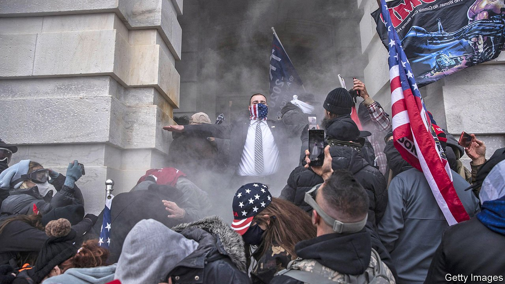

###### Sins of commission

# The January 6th commission and the two main weaknesses of America’s democracy 

##### The Senate functions intermittently. The GOP remains Trumpified 

 

> Jun 3rd 2021 

IT WAS THE distilled essence of legislative dysfunction. On May 28th the Senate rejected a painstakingly negotiated bipartisan bill that would have set up a commission to study the storming of the Capitol building by incensed Donald Trump supporters on January 6th. Though the vote was 54 in favour and 35 opposed (all of them Republicans), the measure technically failed, because a filibuster—ostensibly the threat of debating a bill to death—requires 60 votes to avoid it. This flop puts two serious problems with American democracy in relief. One is that Congress can be hamstrung by a minority. The other is that the Republican Party is unwilling to escape the shackles of Trumpism.

Start with the filibuster rule and its result. It would be hard to concoct a clearer demonstration of what is wrong with the rule as it currently functions. It did not matter that 60% of those present voted in favour of the commission, nor that the opponents of the bill really had no intention of debating it. Indeed, the blocking of the commission shows that the majority of elected Republicans wish not to discuss the attack on the Capitol, as if it could be shushed away like a child’s nightmare.


Many Democrats, who hold majorities in both chambers, hope that the death of the commission may also hasten the death of the filibuster itself, thus allowing them to legislate without needing ten Republican votes that will probably never materialise. Chuck Schumer, the Senate majority leader, plans to move forward with voting-rights legislation by the end of June. Party activists believe this bill represents the best chance of breaking the filibuster’s stranglehold over the chamber. Filibuster rules have been slowly chiselled away over the past few decades: first to allow the confirmation of executive-branch appointees by simple majority, and, later, justices to the Supreme Court. A further whittling by exempting voting-rights and civil-rights legislation could be in order.

Tweaking the rules, or dismantling them entirely, would take just a simple majority of senators, which Democrats possess by the narrowest margin possible. But two conservative Democrats—Joe Manchin of West Virginia and Kyrsten Sinema of Arizona—remain staunch opponents of filibuster reform. Both of them attempted to drum-up Republican support for the commission, without much to show for it (Ms Sinema skipped the vote altogether). Activists hope that their failure will permanently shake their confidence in the filibuster, which after all is often justified on the ground that it promotes bipartisanship. But both seem unlikely to budge,

The other upshot is that Republicans remain in no mood for introspection. After a few brief weeks of being clear-eyed about who inspired the attack and what it meant, Congressional Republicans lost their appetite for moving beyond Trumpism. True believers in Mr Trump’s conspiracy theory of electoral fraud have every incentive to continue; meanwhile those merely going along out of cravenness or opportunism have no incentive to speak up.

The party’s congressional leaders, Mitch McConnell in the Senate and Kevin McCarthy in the House of Representatives, have reverted from antipathy for the former president to accommodating him. In the immediate aftermath of the attack, Mr McCarthy said that the president was “practically and morally responsible for provoking the events of the day”. His deputies negotiated the contours of the would-be commission; then he voted against it. Mr McConnell, who denounced Mr Trump forcefully in February, whipped against the bill’s passage in the Senate (calling it a “purely political exercise” for Democrats who “would like to continue to debate things that occurred in the past”).

This is but the latest warning sign to flash. On May 30th, Republicans in Texas were only narrowly thwarted from passing some of the strictest voting rules in the country when Democrats staged a walkout, denying a quorum. States have enacted 22 restrictive new voting laws this year as a response to Mr Trump’s false allegations of fraud. More than six months after the election, conspiracists in Arizona are still counting and recounting the ballots that gave President Joe Biden a narrow win in the state, hunting for traces of bamboo fibres in the paper ballots to show that they were imported from Asia.

The party recently , a staunchly conservative Republican representative, from her leadership post for the sin of not adopting the requisite omertà towards Mr Trump’s anti-democratic tendencies. On June 1st, over 100 prominent American political scientists and scholars signed an open letter warning that some states “no longer meet the minimum conditions for free and fair elections” and that “our entire democracy is now at risk”.

The odds that concerned Republicans can reverse, or even stall, their party’s slide look remote. Mr Trump remains the party’s de facto leader, and barring a health crisis (or an indictment), plans to run for president again. Having demonstrated his version of the anti-democratic playbook—denouncing the legitimacy of lost elections and trying to break the constitutional guardrails against reversing the results—Mr Trump, or some imitator, might well try the same again. ■

A version of this article was published online on May 28th 2021

For more coverage of Joe Biden’s presidency, visit our dedicated 

