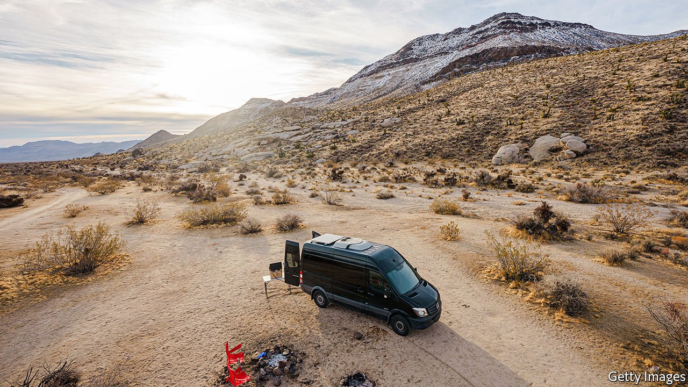

###### Nomadland IRL

# The pandemic pushed more Americans to try out van life 

##### But the viral travel fad isn’t as carefree as Instagram makes it out to be 

 

> Jun 5th 2021 

IN 2019 LUCY JACOBSON and her colleagues at Rossmönster Vans flew to San Francisco carrying “suitcases full of cash”. They were on their way to purchase five retro Volkswagen vans made in the 1980s in order to drive them back to Longmont, Colorado and turn them into custom adventure-mobiles. The road trip home took them to Las Vegas (“to let our freak flag fly”), through Utah’s canyons and over the Rockies. It was the kind of expedition increasing numbers of Americans are hankering for.

About 140,000 vans, RVs or boats were counted as housing units in 2019 according to the Census Bureau, up from about 102,000 in 2016. The circumstances of people who live in their vans can be glaringly different. On one end of the spectrum are those who, like the folks in Jessica Bruder’s book “Nomadland” have little alternative. On the other end are van lifers or “digital nomads” who covet a bohemian, go-anywhere lifestyle. Type #VanLife into Instagram and more than 10m posts appear. Most photos feature pristine Western landscapes, some kind of van or mobile home that resembles a Manhattan studio apartment on wheels, and at least one smiling 20-something. Dogs are a popular accessory.


As social-media influencers spread the van-life gospel, a lucrative industry blossomed. A custom van renovation at Rossmönster costs customers anywhere from $50,000 to $100,000—not including the cost of the van itself. Dave Walsh, the founder of Vanlife Customs in Denver, says he has seen revenues grow by at least 50% every year since his company’s founding in 2016.

When the pandemic hit, things looked bleak. National parks closed, leaving fewer picturesque places to camp. Jeff Cavins, a co-founder of Outdoorsy, an Airbnb-esque marketplace for van and camper rentals, says 95% of the firm’s bookings were cancelled. Then, business boomed. Outdoorsy’s bookings rocketed by 4,000% between April and October of 2020 as parks reopened and Americans fled city centres for greener places. Dave &amp; Matt Vans in Gypsum, Colorado went from five employees in early 2020 to nearly 30 today. Rossmönster can take no new customers until September 2022. The trend looks likely to continue. Surging house prices and the normalisation of remote work may push more wannabe nomads out on the road.

Ask any van lifer why they decided to trade their roof for wheels and the word “freedom” will inevitably come up. “I wanted to travel, was single and free and thought ‘Why not try this?’” says Mr Walsh. But the lifestyle that has gone viral on Instagram is a shiny version of what can be a dusty existence. “There’s a lot of butts and thongs with beautiful views behind them”, Mr Walsh adds, “but it’s not always a real portrayal of van life.” The endless search for parking, toilets and wifi might not be so alluring.

Dig deeper

All our stories relating to the pandemic and the vaccines can be found on our . You can also listen to , our podcast on the race between injections and infections, and find trackers showing ,  and the virus’s spread across  and .

