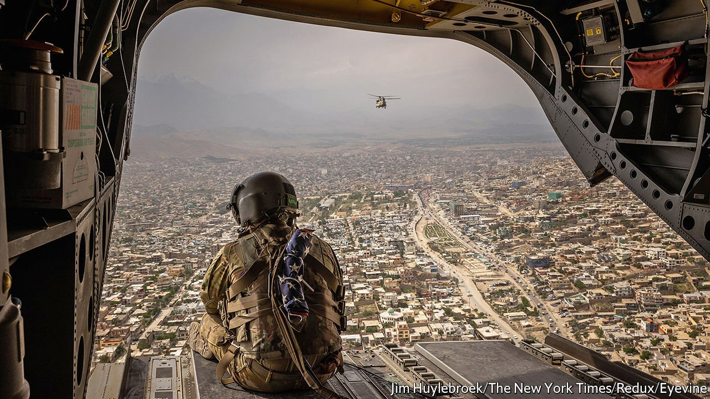

###### Over and out

# Can Afghan forces hold off the Taliban after American troops leave? 

##### The army is weaker than the one left behind by the Soviet Union, but so are the militants opposing them 

 

> Jun 10th 2021 

ON APRIL 14TH President Joe Biden declared that all American troops will be out of Afghanistan by September. Now it seems possible that they will be gone as soon as July. The generals reckon that the packing up and handing over is nearly half-finished.

Violence from the Taliban-led insurgency is swelling, but Mr Biden is in no mood to tarry. He has long been a critic of America’s involvement in Afghanistan, and the faster the troops go, the fewer casualties America will suffer (though, in truth, they are already very low). The vast air base in Kandahar, once home to scores of jets, helicopters and drones, is deserted. The equally enormous air base in Bagram, near Kabul, is next in line to be handed over to the Afghan government. Other NATO forces are racing the Americans to the exit. The Afghan army will have to face the Taliban on its own.


For Atiqullah Amarkhel, it is a familiar sensation. The former general was a commander in Afghanistan’s air force when Soviet troops departed in 1989. The government they left behind, headed by a strongman president, Muhammad Najibullah, was expected to collapse within weeks under assault from the mujahideen, Islamist guerrillas backed by America and Pakistan. In fact Mr Amarkhel and his comrades held off the militants for three years, even as the mujahideen launched a series of costly and unsuccessful offensives on cities such as Jalalabad, near the border with Pakistan. It was only later, when Russia stopped paying the bills, that Najibullah fell and the country descended into anarchy.

In a place weighed down by the horrors of the past four decades, history’s echoes have a way of being heard. Afghans are debating what the parallels might be for the government of President Ashraf Ghani as it faces a resurgent and .


Mr Amarkhel believes the departing Russians left him and his comrades better equipped to hold off the militants than the Americans are leaving his present-day counterparts. “I never for a moment thought we couldn’t succeed,” he says. “The army we had built then was very much stronger than the one the Americans have left behind.” In particular, he says, the fleet of aircraft he commanded was bigger and better provided-for than the air force bequeathed by the Americans.

One of his enemies from that time concurs. As leader of the faction of the mujahideen called Hezb-e-Islami, Gulbuddin Hikmatyar received the lion’s share of the aid the CIA and Saudi Arabia funnelled via Pakistan in the 1980s. Sitting in his office close to the parliament building, he says that the army the Soviet Union left behind to fight him was “no doubt” stronger than the one NATO has laboured to raise. It boasted tanks, heavy armour, artillery and an air force. By contrast, in the past two decades, America and its allies in NATO have assembled only a lightly armed internal-security force that is designed to quell an insurgency.

Yet comparing the relative strengths of the Afghan forces then and now is only one element in predicting what comes next, says Jonathan Schroden of CNA, a military think-tank. The guerrillas of the 1980s received lavish cold-war support which extended even to anti-aircraft missiles. The Taliban may still have havens in Pakistan, and at least appear more united than the fractious mujahideen, but they are also a lesser fighting force. “Militarily, I think Ghani is in a somewhat better position than Najibullah,” says Mr Schroden.

The pace of the American withdrawal nonetheless appears to have encouraged the Taliban’s leaders, who believe that they have a chance of a military victory. America’s attempts to get the two sides to sit down and negotiate a settlement have stalled. The military balance between the adversaries now looks set to be determined in a summer of fighting, with the Taliban trying to put pressure on the government by capturing territory and towns. Somewhere between half and 70% of the countryside is either contested or under Taliban control, according to a UN assessment published on June 1st.

The rank-and-file police and soldiers who make up the bulk of the government forces have repeatedly melted away when attacked in recent months. Even the better-equipped NATO forces struggled against the Taliban’s guerrilla tactics, including ambushes and homemade mines. But Afghan police manning outposts also often go unpaid, and lack food and ammunition, say tribal elders in the districts outside Kandahar.

When the Taliban masses against them, they have little stomach to fight. Their surrender is sometimes quick and negotiated via the locals. Sher Mohammad, a farmer in Panjwai district, recalls being pressed into service by a local Taliban commander during an offensive late last year. He was ordered to knock on the door of a local base and give the troops an ultimatum to leave. “I shouted and there was no answer. I made my way in and found it deserted. The soldiers had already gone,” he says. That was before the Americans left.

Dozens of small outposts and bases have changed hands like this in recent months. With the police and regular soldiers struggling, the government increasingly relies on its well-trained special forces. These commandos have often worked closely with NATO troops and, although thinly stretched, they have repeatedly proved able to beat the insurgents. They are rotated from hotspot to hotspot, pushing back guerrilla offensives and retaking districts. Death tolls on both sides and among civilians are high.

The Taliban are also pressing up against large cities, but have so far been unable to capture them, or to hold territory against concerted counter-attacks by special forces. Most analysts expect that to continue, because the Taliban do not have the numbers or equipment to prevail.

American generals say they are keen not to repeat Russia’s mistake by cutting funding prematurely. Yet exactly what support they will provide once they have left is unclear. The Pentagon said on June 2nd only that its backing would be largely financial—to help pay the salaries of security forces—with some aircraft maintenance thrown in.

After the Soviet Union departed, Najibullah’s unexpected longevity was not only thanks to his army and Russian money. He also proved a surprisingly flexible and astute politician, who was given a largely free hand by Russia to do what was necessary to survive, says Mr Schroden.

Here Mr Ghani may be in a more precarious position. He must unite the opportunistic and bickering factions of the Afghan state, all the while under pressure from the Americans to cut a deal with the Taliban. His chief task in the next few months will be to keep Afghanistan whole and prevent it from fracturing into competing fiefs.

With the Taliban buoyant and forecasts from Washington looking sombre, military morale may be the key. “It is mainly psychological now. If we can get through the pressure of this summer, then we will be fine,” reckons one Afghan diplomat. Mr Amarkhel agrees: “If our forces can last for two months, they can survive.”■

A version of this article was published online on June 6th 2021

