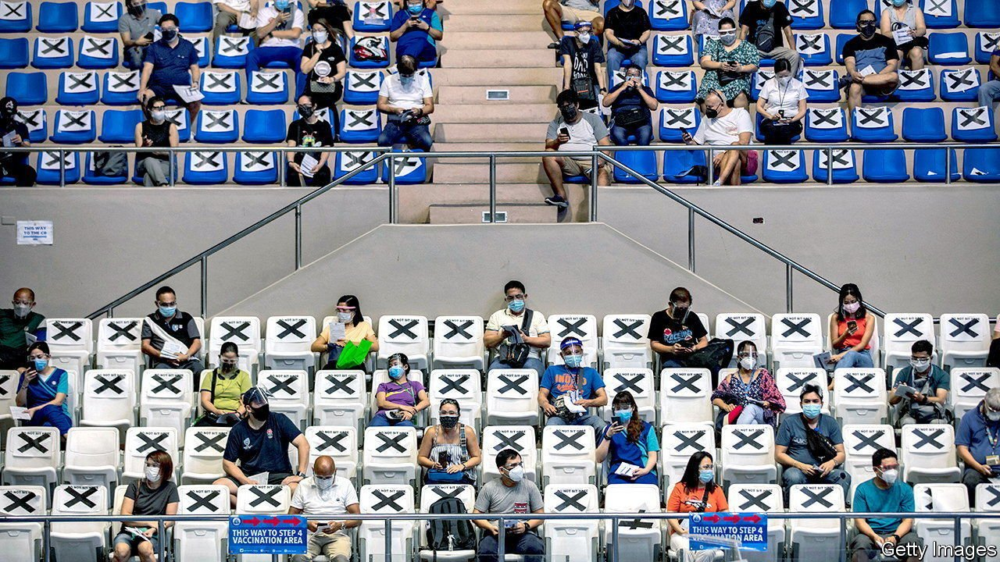

###### Have a cow, man

# Politicians in the Philippines are holding raffles to boost vaccination 

##### But most Filipinos would prefer Pfizer to prizes 

 

> Jun 12th 2021 

IN SAN LUIS, in Pampanga province, it is a cow. In Sucat, a district of Manila, it is 25kg of rice. And in Las Pinas, nearby, it is two motorcycles and a brand new house. These are some of the prizes politicians in the Philippines have in store for winners of local raffles. The entry criterion is simple: get vaccinated.

Filipino society is divided on the subject of vaccination against covid-19. In a recent survey by Social Weather Stations (SWS), a pollster, a third of respondents were keen to get a jab, another third were not and a final third remained unsure. Politicians are betting that the last group, at least, can be persuaded to risk it. “For us to attain our goal, we have to think of a strategy,” Jayson Sagum, the mayor of San Luis, told a Manila newspaper. “And we know Filipinos like a game of chance.”


They are not the only ones. Inducements have been attempted elsewhere, including in several American states, where they seem to be working. But officials in the Philippines have a problem their Western counterparts do not: Chinese vaccines. In the same survey SWS found that, given a choice, 63% of respondents would prefer an American brand of vaccine, doses of which are in short supply in the Philippines. Only 19% wanted a Chinese brand, supplies of which are relatively abundant.

The government reckons that it must administer vaccines at the rate of 500,000 doses a day if it is to achieve herd immunity by November. But in the first week of June it managed an average rate of only around 110,000 a day. Just 4.6m first doses and 1.7m second doses have been administered, in a country of 110m, since the drive began on March 1st. A government survey found that the main reasons for hesitancy to submit to inoculation were fears of side-effects, negative posts on social media and doubts about efficacy. Filipinos have reason to be cautious: a botched rollout of a vaccine for dengue fever in 2016 damaged public confidence in inoculations.

There was little sign of such misgivings in a shopping mall in Manila in mid-May, when hundreds of elderly people crowded a vaccination post, having been told that they would receive the Pfizer vaccine, the only American brand available in the Philippines. The authorities grew alarmed, fearing that mobs of senior citizens might run wild, ignore social-distancing rules and spawn a superspreader event.

So the government changed its approach, announcing that people would be told what brand they were getting only just before the needle went in. If anybody objected, they would be sent to the back of the queue. As Rodrigo Duterte, the president, put it, “Whether you are a millionaire or a pauper, you get what is given to you. You can’t choose.” His words might have carried more weight if he had been less choosy himself. Mr Duterte had shunned the widely available vaccine made by Sinovac of China and opted to receive another Chinese vaccine, made by Sinopharm, which was available only to himself and his bodyguards. For everyone else, getting jabbed remains a game of chance. ■

Dig deeper

All our stories relating to the pandemic and the vaccines can be found on our . You can also listen to , our podcast on the race between injections and infections, and find trackers showing ,  and the virus’s spread across  and .

