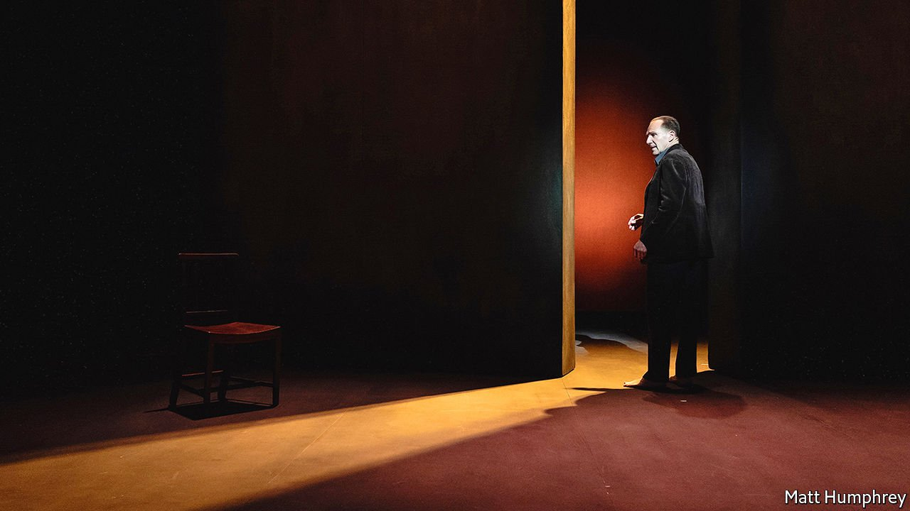

###### The arts after the pandemic

# As curtains rise again, the theatre is set to look very different 

##### Ralph Fiennes’s one-man show is an apt beginning for drama’s post-covid journey 

 

> Jun 12th 2021 

“FOR LAST year’s words belong to last year’s language”, T.S. Eliot wrote in “Four Quartets”. “And next year’s words await another voice.” Ralph Fiennes speaks these lines on a stage furnished with only a table and two chairs; lighting effects, from sunsets to the fiery red of a bombing raid, gleam behind him. At the Theatre Royal in Bath, a 200-year-old playhouse that Jane Austen knew, Mr Fiennes was marking theatre’s emergence from pandemic hibernation with a 75-minute solo performance of Eliot’s long poem, a four-part meditation on time, change, fate and faith.

It is an apt starting-point for theatre’s post-covid journey. “Four Quartets” wrestles not only with Eliot’s personal crises of faith and identity but the public emergency of the second world war; he composed three of the four pieces between 1939 and 1942. Mr Fiennes has known the poem since childhood but revisited it in lockdown, finding that it chimed with the disrupted times, in which “all the normal infrastructure and expectancies are taken away”. Colleagues who helped put the show on the road “volunteered how contemporary it felt—the sense of reckoning with oneself and with life and soul”.


A restless, barefoot presence on stage, Mr Fiennes chats, argues, muses or banters, voicing Eliot’s gorgeous images and intricate ideas not as a sermon but a dialogue with audiences who have shared a passage through loss and perplexity. The first quartet, “Burnt Norton”, invites them to “Descend lower…Into the world of perpetual solitude…Internal darkness, deprivation”, an experience that the pandemic made commonplace. Tinged with Buddhist and Hindu as well as Christian mysticism, “Four Quartets” suggests that there is no going back, no recovery of the status quo. As Eliot put it in “The Dry Salvages”, the third quartet, “time is no healer: the patient is no longer here.”

Mr Fiennes’s one-man show, which opened last month, recalls the monologues and pared-down productions that were broadcast online or on television to keep drama’s flame flickering when theatres emptied, and social distancing prevailed on stage as well as in the stalls. But its progress across the country—it is touring to several other English cities over the summer—marks a turning-point from private communion to public spectacle. Operating with limited audiences since mid-May, British theatres hope to return to full capacity soon. As they and venues in America inch out of shutdowns, many professionals share Eliot’s insistence in “Little Gidding”, the final quartet, that: “We cannot revive old factions/We cannot restore old policies/Or follow an antique drum.”

In my beginning is my end

The pandemic has been devastating for theatres. In Britain, research for UK Theatre and the Society of London Theatre, twin industry bodies, indicates that the sector had suffered around £200m ($282m) in covid-related losses by March 2021. A quarter of freelance theatre workers ceased trading. As Julian Bird, the chief executive of both bodies, observes, covid-19 shone a spotlight on the fragility of drama’s human infrastructure. Buildings on their own are worthless, he says. “We’ve realised absolutely starkly that theatre is nothing without its workforce.” Recovering the designers and technicians forced into other jobs will be essential.

Playhouses in New York have been permitted to open without limits on capacity since May 19th. So far only small off-Broadway venues have sprung back to life. Broadway stages will mostly remain dark at least until mid-September, though “Hadestown”—a musical update of the myth of Orpheus and Eurydice, and so another voyage through purgatory—is scheduled to resurface sooner. And the Public Theatre will return to its open-air home in Central Park, the Delacorte Theatre, on July 6th with a version of Shakespeare’s “The Merry Wives of Windsor” set among the West African community in Harlem.

That production reflects a new social consciousness in theatres on both sides of the Atlantic. In a recent symposium on drama’s future, the Public Theatre’s artistic director, Oskar Eustis, exhorted his peers: “Don’t just come back, but come back more democratic, come back more inclusive.” Nataki Garrett, artistic director of the Oregon Shakespeare Festival, concurred: “Normal ended in March 2020. We’re not going back to anything.” Sharpened by the protests during theatre’s enforced lay-off, issues of race will feature more prominently, on stage and off it. Among other recommendations, We See You, White American Theatre, a pressure group, wants at least half of plays performed on main stages to be by non-white writers.

Alongside the politics, though, plenty of theatregoers will long for all-singing, all-dancing escapism. As Eliot wrote in one of the best-known passages in “Four Quartets”, “human kind/Cannot bear very much reality.” As well as “Hadestown”, the old-style, big-cast shows set to make a comeback include Cole Porter’s musical “Anything Goes”, scheduled to open at the Barbican Centre in London.

Richard Rodgers and Oscar Hammerstein responded to a similar yearning for spectacle and flamboyance after the second world war. Today’s circumstances are different, not least in the impact of social distancing on box offices. That may put big-budget extravaganzas beyond the reach of many venues struggling out of lockdown. So some pandemic-induced innovations are set to endure and evolve.

Small-cast and solo works, such as Mr Fiennes’s own performance of David Hare’s monologue about his brush with covid, “Beat the Devil”, are one of them. New outdoor venues—a response to ventilation needs—are another. The Arcola Theatre in London, for instance, has built an open but canopied auditorium that recalls the semi-covered playhouses of Shakespeare’s time. Then there are immersive high-tech projects such as the adaptation of José Samarago’s novel “Blindness” put on by both the Donmar Warehouse in London and the Daryl Roth Theatre in New York. Instead of watching actors, audiences wear headphones and encounter the story through lighting and audio recordings.

“Last season’s fruit is eaten”, Eliot wrote in “Four Quartets”. “And the fullfed beast shall kick the empty pail.” As Mr Fiennes notes, the poem is a call to break free of both past and future, to escape the cycle of “sequential time” and “live in the present moment”. At its best, that is one of theatre’s gifts—as, with luck, audiences will rediscover when curtains rise again. ■

