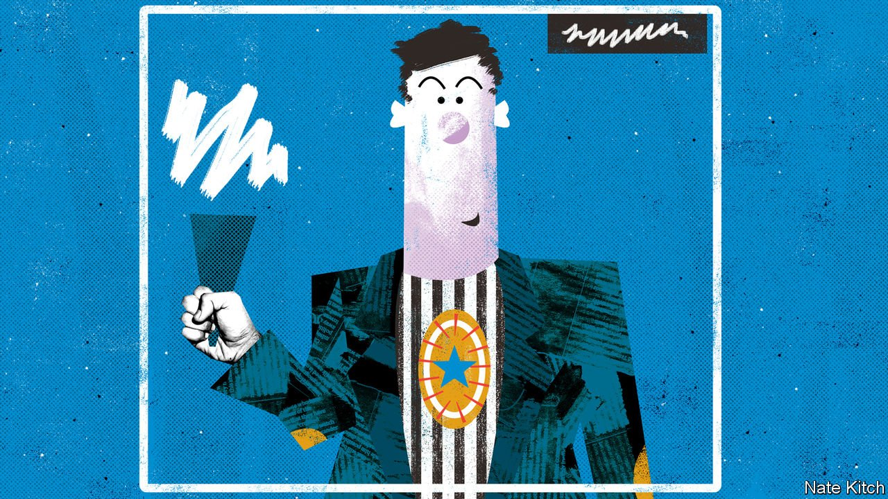

###### Bagehot

# A new version of Essex man is born in the north 

##### Meet Geordie Tory 

 

> Jun 12th 2021 

VIZ, AN IDIOSYNCRATIC combination of adult comic and satirical magazine, has been compulsory reading in all civilised households since Chris Donald started producing it, in 1979, from his bedroom at his parents’ house in Newcastle. It features characters who go to the heart of modern Britain: Millie Tant, a ranting feminist; Sid the Sexist, who gives Millie plenty to rant about; Roger Mellie, a disgusting television personality; and dozens more whose names cannot be mentioned in a respectable newspaper. This columnist would like to suggest a new subject for Viz to lampoon: Geordie Tory. It seems odd, to say the least, for the north-east’s premier publication to remain silent about a political revolution that is turning a former Labour stronghold Tory blue.

The London-based commentariat has convinced itself that Geordie Tory is a left-behind loser who voted for a Brexit and Boris spit-roast to express his rage at globalisation. This is only a small part of the story. For the hidden truth about Geordie Tory is that he is actually doing rather well for himself. He did not go to university (thus avoiding a pile of student debt), but quickly found a job at a local firm, and his money goes much further in the north than it would in the south. He lives in a four-bedroomed semi-detached, has a couple of cars in the drive and can rely on two sets of grandparents to chip in with child care. He zips to work or Asda in a few minutes, thinks the local school is doing an acceptable job and looks forward to his next holiday in Florida, providing the government can stop faffing about. He pities his school friends who went to university, moved down south and now either live in a crowded flat or (before the covid-19 pandemic) spent a couple of hours a day on a packed train.


Geordie Tory’s world has been transformed by a combination of de-massification and bourgeoisification. The Labour Party’s power was based on industries (such as coal, steel and shipbuilding) and companies (such as Swan Hunters and Vickers-Armstrong) that employed thousands of unionised workers. The new economy is built on a combination of skills and flexibility. There is a handful of (mostly de-unionised) big companies (Flymo-Electrolux in Spennymoor, Cummins Engines in Darlington and Nissan in Sunderland), but they co-exist with hundreds of smaller firms that manufacture car parts, switch gears, air-conditioners and specialist equipment for the oil-and-gas economy. Twenty years ago towns such as Amble in Northumberland did not have much upmarket entertainment. Now they are so chock-a-block with restaurants, microbars and fancy cafés that the locals complain that you can’t find anywhere to park.

Geordie Tory has long been attracted by the Tory party’s pro-business, low-tax philosophy, but continued to vote Labour out of habit. Two things gave him permission to switch: Brexit and Jeremy Corbyn. Whether he voted for Brexit or not he was unhappy with attempts to overturn “the people’s will”. And the north-east is to Britain what the south is to America. It has provided the country with soldiers, sailors and airmen in numbers far exceeding its share of the population, and its landscape is littered with stone memorials to the fallen (South Shields lost a higher proportion of its citizens in the second world war than any other town). Geordie Tory was damned if he was going to vote for a man who mistook valour for warmongering and made excuses for the IRA.

He is nevertheless far from being a defender of the government, let alone a Tory activist. He thinks about politics as little as possible, except when it impinges on his life. But something profound has changed in the past few years. The “sod you” factor that has always been such an important aspect of regional politics has found a new target. During Labour’s glory days from 1945 to the early 21st century the “sod you” factor favoured the left. The Tories were the party of the southern elite with its soft hands and namby-pamby ways. Today it favours the right. Geordie Tory doesn’t so much like Boris Johnson as loathe the Guardian-reading, Britain-bashing, virtue-signalling metropolitan establishment that holds Mr Johnson in contempt.

Feeling blue

How reliable a Tory will Geordie prove? Though he thinks Sir Keir Starmer is an improvement on his predecessor, the Labour Party is no longer relevant to his life. The local party caters to two exotic (and largely incompatible) groups of voters. It continues to draw support from the truly disadvantaged in old mining towns such as Ashington. But its biggest success is in Newcastle, particularly posh suburbs such as Tynemouth and Whitley Bay, to the east of the city, and Gosforth and Jesmond (birthplace of Viz), to the north, where the public-sector aristocracy (doctors married to lawyers, civil servants married to teachers) enjoys a life-style as plush as any in the country.

Geordie Tory certainly wants something in return for his vote. It is one of his articles of faith that the north-east is being short-changed by a southern England that simultaneously grabs an unfair share of national resources and produces nothing of value. (Geordies, regardless of their politics, are convinced that people who wear more than T-shirts and shorts in the depths of winter, as southerners tend to, are too “soft” to be productive.) But the truth is that Mr Johnson does not have to deliver all that much to be regarded as a success. The conversion of the A1 north of Morpeth into a dual carriageway, the restoration of the South-East Northumberland railway, a few high-profile projects that put cement mixers and excavators in the right places, and that should be enough. One of the greatest tricks in politics is to put yourself at the front of a victory parade and to declare yourself its leader. By a bizarre combination of circumstances, involving both Brexit and the long-term transformation of the Geordie economy, this is exactly what the quintessential southern Tory, Alexander Boris de Pfeffel Johnson, seems to have done in the north-east. ■

