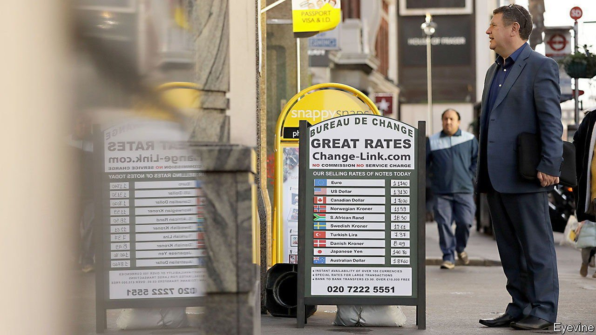
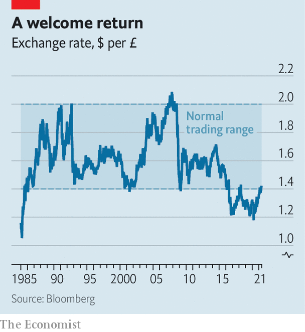

###### Gilt-y pleasure

# As political risk fades, British government debt is back in vogue 

##### The danger posed by Scottish independence is overplayed 

 

> Jun 12th 2021 

FOREIGN EXCHANGE trading is, for the most part, a youngster’s game. Find a veteran whose memory stretches further than a couple of decades, though, and they will tell you that there are really only two numbers that matter for the pound. Those are 1.40 and 2.00, the bounds of its normal trading range against the American dollar. Since 1985, whenever it has hit either one, a turning point has been due (see chart).

That was until June 2016, when Britain’s vote to leave the European Union sent sterling tumbling through the floor. The fallout has kept it there ever since. Political headlines became a consistent predictor of swings in the pound’s exchange rates, prompting comparisons to emerging markets. Foreign investors eyed British assets with distaste, fearful that they were priced in a currency that could plunge further if the most disruptive version of Brexit was realised. Those wishing to hedge against that risk found it increasingly expensive to do so, as speculators bet on the pound taking another beating.


In the event, the mauling failed to materialise. Although the trade deal signed between Britain and the EU excluded finance in favour of fishing, the transition period finished in a more orderly fashion than many had feared. As the deal hove into view, bets against the pound started to unwind, making it cheaper for foreign buyers to hedge the currency risk on sterling assets. Overseas investors flocked back into gilts (British government bonds) as never before, buying a record-breaking £89.8bn ($127.4bn) of them in the year to April 2021. The pound has even spent the past month trading above $1.40.

 


Foreign enthusiasm for gilts is not only down to a resurgent pound. A swift vaccine roll-out points to a faster recovery from the covid-19 pandemic in Britain than elsewhere in Europe. That, combined with the fact that the Bank of England is generally perceived as more hawkish than the European Central Bank, means the interest rate on British government debt is comparatively attractive. “It becomes easier to sell gilts on a 0.81% yield when people are glancing across at France’s 0.17%,” says Kit Juckes of Société Générale, a bank.

Political risk remains, particularly in the form of a looming fight over the future of Scotland. But the fiscal impact of a Scottish exit on the rest of Britain would be mild and on the upside. In the tax year of 2019-20, Scotland accounted for 9.2% of Britain’s total public spending and around 8% of its tax intake. And some of that revenue would probably be retained, as financial firms currently headquartered in Edinburgh decamped to London. “Hive Scotland off, and the rest of the UK goes from a budget deficit of about 2% of GDP to one of about 1.5%,” says Thomas Pugh of Capital Economics, a consultancy.

It will not all be plain sailing in the coming months. A row between Westminster and Brussels over the implementation of trade rules in Northern Ireland threatens to reopen the arguments that led up to the Brexit withdrawal agreement. That would harm Britain’s prospects for trade. Meanwhile, Treasury plans to award the government a veto over stock-exchange listings on national-security grounds may dim the attractiveness of the country’s financial markets to foreign firms. But for now the cash looks set to keep pouring in. “We’re still priced for permanent uselessness of the UK,” says Mr Juckes. “There’s got to be an opportunity there.” ■

