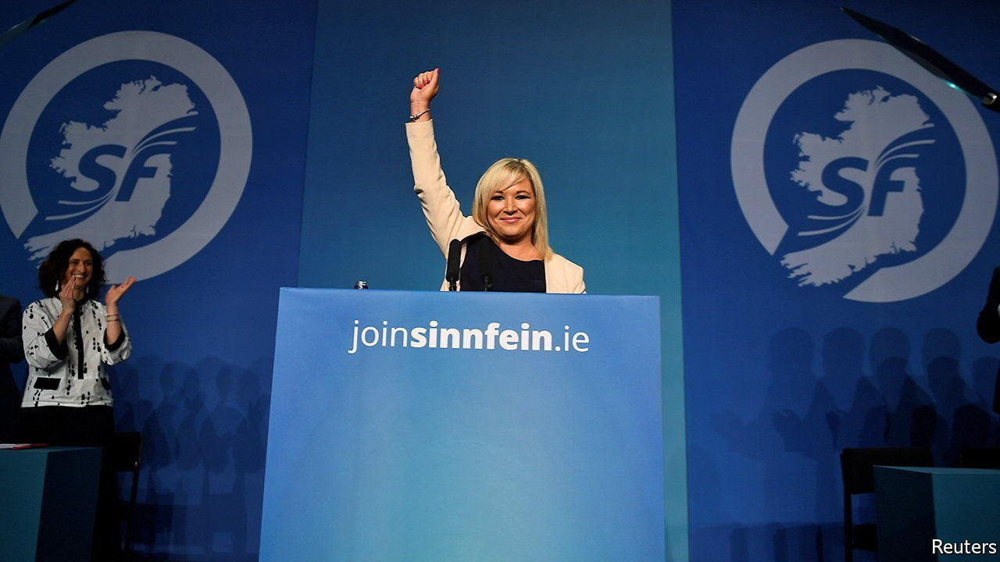

###### Green gold

# How Sinn Fein, the political successors to the IRA, became so rich 

##### A tale of deep-pocketed politicians, generous Americans and a mysterious English recluse 

 

> Jun 12th 2021 

IN 1995 PHIL GRAMM, a Republican senator for Texas, boasted he had “the most reliable friend you can have in American politics, and that is ready money”. In Northern Ireland, it is republicans of a different hue—the left-wing political successors to the Irish Republican Army (IRA)—who have that friend.

Figures released on June 3rd show that, since donations were first published in 2017, Sinn Féin’s Belfast operation has received around £4.5m ($6.4m)—more than double its main rival, the Democratic Unionist Party (DUP). Polls suggest that Sinn Féin will overtake the DUP as Northern Ireland’s largest party in next year’s elections. That reflects the DUP’s scandals, infighting and incompetence, but Sinn Féin’s financial clout also gives it an edge.


The party raises money in conventional ways, with members selling raffle tickets, but not much. Such fundraising accounts for little more than 1% of its income. More comes from the party’s own politicians, who donate a share of their salaries. Sinn Féin says these are voluntary donations, but declines to specify how much is handed over. Records show that last year Northern Ireland’s deputy first minister, Michelle O’Neill, donated a sixth of her salary.

A second source of funding is America, where money once raised for the IRA now benefits Sinn Féin. While violence raged, the Irish Northern Aid Committee collected money at dinners, dances and in bars in cities like Boston and New York. One circular began: “Dear friend, Congratulations! You have been selected to help end 800 years of British misrule in Ireland”. It has been surpassed by the US Friends of Sinn Féin, which has raised more than £11m since 1994.

The newest income stream is the most intriguing. Two years ago the party revealed it had received £1.5m from the will of an English recluse, William E Hampton—by far the biggest donation in the history of Ulster politics. Cash from that source has continued to flow to the party, as Hampton’s assets are liquidated, with the total now at £2.9m. Hampton was a retired mechanic with mental-health problems, who reportedly cut off his penis with a kitchen knife. When he travelled to Ireland to make his will, he registered no fixed abode. Yet he referred to assets in Ireland, England, Singapore and New Zealand. His will was made a month before the IRA ceasefire in 1997; its executors were Sinn Féin’s treasurers.

It is only the border which Sinn Féin exists to destroy that allows it to keep the vast donation: gifts to parties in the Republic are capped at €2,500 ($3,000). The money buys a slick social-media presence, a substantial press operation and paid party organisers across the country. It also, as an observer notes, “buys you the freedom not to have to worry so much about what other people think...It buys you the ability to ignore the will of the electorate.”

