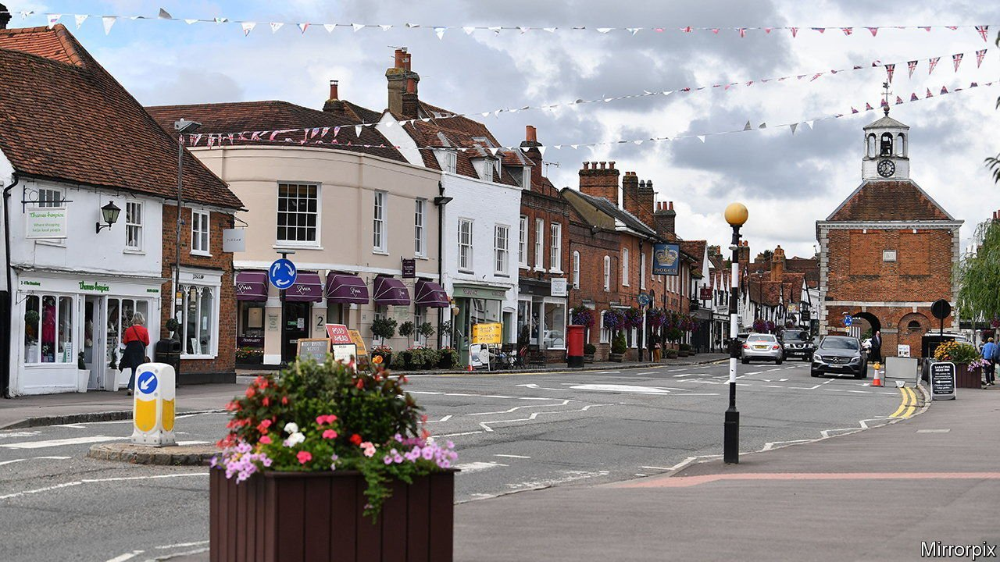

###### Trouble in Tory town?

# Liberal Democrats hope for a revival in England’s commuter belt 

##### Young graduates are making Tory shires more liberal 

 

> Jun 12th 2021 

“WE’RE THE cockroaches of British politics,” says Sarah Green, the Liberal Democrat candidate in Chesham and Amersham, as she sips an iced oat-milk latte. “You just can’t wipe us out.” Languishing at 7% in national polls and with just 11 MPs, the Liberal Democrats hope to start their revival at the by-election on June 17th. The seat has been held by the Conservatives since its creation in 1974, and was won by 16,223 votes at the last election.

The challenge is not just the Tories’ deep roots in the area. Covid-19 vaccine success has given the government a boost. Northern and Midlands gains have been consolidated with Conservative victories in local elections and at the Hartlepool by-election last month. The party is sitting at 43% in the national polls. But as the Tories tweak their policies to the tastes of their new electorate, opponents hope they may become vulnerable in old heartlands: affluent towns and suburbs across the south.


The Liberal Democrats ought to be well placed to exploit this. At the general election in 2019 they came second in 91 constituencies, including many prosperous commuter towns. Last month’s local elections appeared to confirm the opportunity, with victories in Tory areas like Oxfordshire and Surrey. In Amersham they seized the town council, going from no councillors to eight, surprising even themselves.

Graduate voters with young families flock to places like Chesham and Amersham, attracted by the large houses, beautiful countryside, excellent rail links and top-notch schools. Socially liberal and squeezed by high house prices, this group has been drifting away from the Conservatives. Brexit reinforced the trend. The Liberal Democrats must now ensure these voters plump for them over Labour or the Greens. The party’s pamphlets stress that tactical voting is the only way to defeat the Conservatives.

They must also win over disaffected Tories. The Liberal Democrats bet big on attracting anti-Brexit Conservatives in 2019, to little avail. Ms Green even campaigned for Dominic Grieve, a former Tory MP running as an independent after his expulsion from the party for opposing Brexit.

The Liberal Democrats will keep banging the anti-Brexit drum, but they also hope to prise apart the new Tory coalition in other ways. HS2, a high-speed railway running through the constituency, is a headache for the government. The project will benefit constituencies in the Midlands and the north; it is less welcome in Chesham and Amersham. As well as the disruption caused by construction, the bucolic splendour of its route through the constituency means the railway has attracted fierce resistance. Locals also worry that planning reform will make it easier for developers to build on green spaces. According to Mark Roberts, the new Liberal Democrat mayor of Amersham, “residents feel ignored and taken for granted,” echoing a claim once heard across the north.

Ms Green has vowed to “protect the Chilterns” from these intrusions. The fact that her party officially supports HS2 and that her younger supporters are desperate for housing is a mere wrinkle. Even modest gains would suggest that commuter towns in other parts of the country—many with narrower Tory majorities—might be vulnerable at the next election. Ms Green grew up in Wales before moving to London and then Amersham. Now it seems her party may be following her, moving from old strongholds in the Celtic fringe to new ones in the metropolitan fringe. ■

