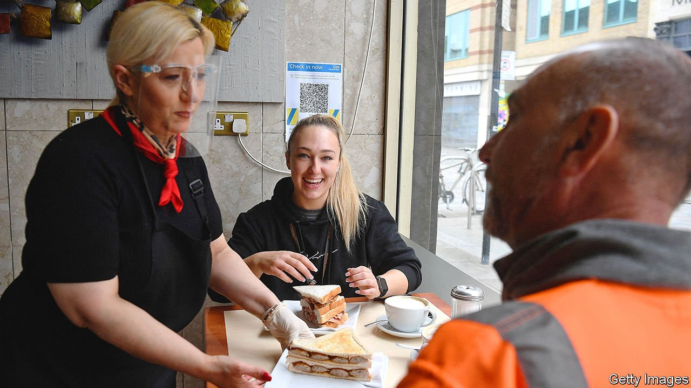
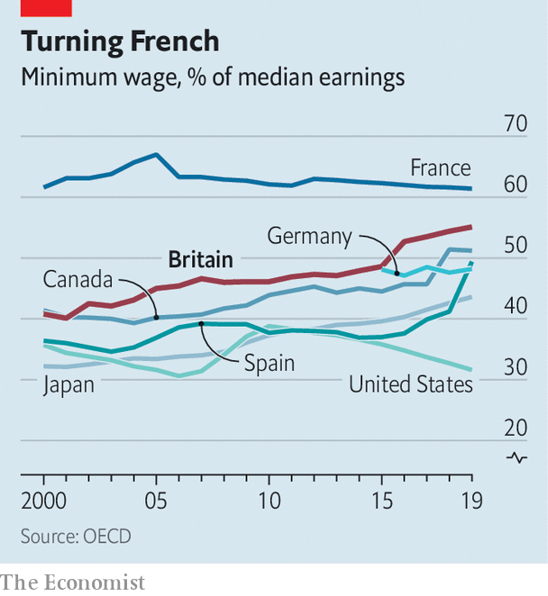

###### The job market

# Low-paid Britons are at the heart of the post-pandemic recovery 

##### For the first time in decades, bargaining power shifts from firms to poor workers 

 

> Jun 12th 2021 

PETERBOROUGH, A MID-SIZED city 100 miles north of London, is at the forefront of Britain’s recovery. It has a lot going for it: a pretty town centre built around an imposing medieval cathedral, reasonably priced housing and a council that is keen on development. But best of all, it offers easy access to the motorway network.

That was important before the covid-19 pandemic. It is even more important now. Amazon, an online retailer, built a 500,000-square-foot distribution centre in the city in 2010, and has become the biggest local employer. The firm is now looking to add another 110,000 square feet. In recent years IKEA, a Swedish furniture purveyor, and Tesco, Britain’s largest supermarket chain, have also moved distribution depots to the outskirts of the town. All of this means it is a good time to be looking for warehouse work in Peterborough.


But it is not just warehouse workers who find themselves in demand. In Peterborough, and across the country, the reopening of bricks-and-mortar retail and hospitality businesses has triggered a surge in hiring. Bosses complain of labour shortages. For the first time in decades, bargaining power is shifting from firms to low-paid workers.

It is an unusual situation for Britain. After the global financial crisis, the country experienced a job-rich, pay-poor recovery—thanks to a flexible labour market created by deregulation in the 1980s and 1990s. Employment rates reached record highs, but wages did not regain their pre-crisis levels until 2020. Economists were repeatedly forced to revise estimates of how far unemployment could fall before generating sustained wage pressure. It was only a year or so ago that “we were starting to see what a tight but flexible jobs market would look like,” says Gavin Kelly of the Resolution Foundation, a think-tank. Then the pandemic hit and recession followed.


Peterborough’s economy, which began its recovery early, offers a glimpse of the future. An analysis of labour markets in 63 urban areas by the Centre for Cities, another think-tank, found that in April distribution hubs were seeing the fastest growth in vacancies. Online advertisements for positions in Peterborough were already 4% above pre-pandemic levels before retail and hospitality reopened (at a time when they were still down by 15% in the capital). As more firms have reopened, demand for workers has stepped up. Bars and cafés in central Peterborough are littered with “help wanted” posters. A local pub owner says he has stopped serving lunch because he is unable to find a chef.

Rising vacancies have not yet been accompanied by rising wages. But that may change. Pawel Adrjan, an economist at Indeed, an online-recruitment company, notes that advertised pay in food preparation and service has nudged up from £9.25 ($13.11) at the start of the year to £9.40 now. Asked if he might have to raise wages in order to attract a chef, the Peterborough pub owner pauses for a moment, before admitting “it might come to that”. For employers accustomed to being able to hire at will, at a price that suits them, the past few weeks have come as a shock.

It is not just the post-pandemic recovery that is causing shortages. Although the exact number is unknown, lots of migrants appear to have left the country—something that is proving especially difficult for firms that rely on seasonal workers and in sectors with low pay and long, anti-social hours. Unless tweaked by the government, the post-Brexit immigration regime will continue to reduce the number of low-paid workers who are able to make it to Britain.

Participation rates have also dipped among older workers, suggesting the recession prompted 60-somethings to bring forward their retirement. Some younger folk are reluctant to work, too. Covid-19 vaccine bookings in England only opened for 25-to-29-year-olds on June 8th, meaning most 20-somethings remain at a higher risk of infection. Bosses note that many are reluctant to work in crowded rooms.

Some of these disruptions will ease over the coming months. Youngsters will receive their jabs. Martin Beck of Oxford Economics, a consultancy, notes that 5m EU workers have applied for settled status in Britain since Brexit. “Even if a lot did go home during the pandemic, the obstacles to coming back won’t be particularly onerous,” he points out. Most forecasters expect unemployment to rise later in the year, as support is pulled back. Tom Clougherty of the Centre for Policy Studies, a think-tank, suggests that the end of the furlough scheme, due to be tapered away by September, “will be a real test of just how strong the labour market is”.

 


Yet even if some bargaining power shifts back to employers, workers in these industries will benefit from a rising wage floor. The bite of Britain’s minimum wage, the ratio of that wage to median earnings, has increased markedly in recent years relative to other rich countries (see chart). The government is aiming to increase it further, to 65%, by 2024. The hope is this will force firms to train staff, invest in technology and thus raise productivity.

Poor Britons had a miserable time of it last year. They were the most likely to see their incomes fall from either job losses or from being furloughed. But after being at the centre of the storm, they now find themselves at the heart of the recovery. Unlike in America, Britain’s government has not committed to “running the economy hot”. A rise in unemployment could put an end to wage pressure. But for the moment, at least, low-paid workers are enjoying their first taste of bargaining power in almost 20 years. ■

