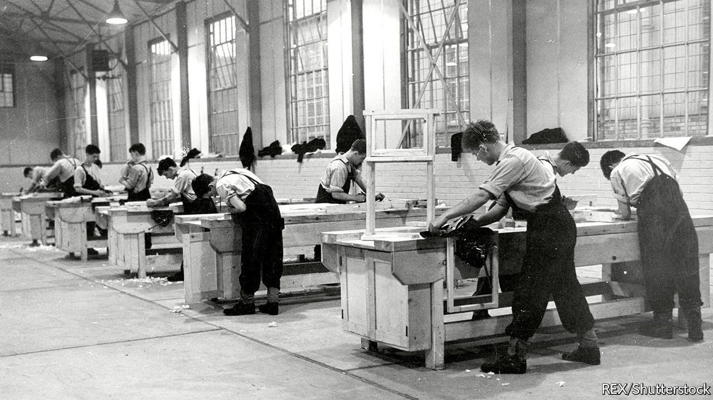
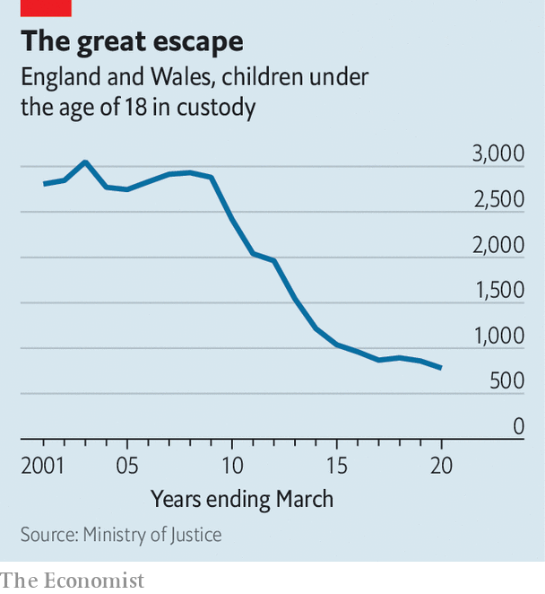

###### Chained to the desk

# The British government is turning children’s prisons into schools 

##### Reformers insist the new facilities will not be detention centres by another name 

 

> Jun 12th 2021 

MORE THAN a century ago a prison in Borstal, Kent, set aside a wing for its youngest inmates. The teenagers had bunked with older lags, but officials hoped special treatment would help set them right. As Evelyn Ruggles-Brise of the Prison Commision put it, education and exercise would save “young ruffians” from a “career of habitual crime”.

Today, reformers are having another go. Next year, at a site down the road from the Borstal prison, the first “Secure School” will open. The aim is to dismantle the violent detention centres most children end up in, and thus to reduce reoffending. The government vows the new facilities will have “education and health” at their heart.


In the past decade the number of under-18s behind bars in England and Wales has fallen by two-thirds (see chart). But since prisons now hold only the most troubled youngsters, conditions have deteriorated. Incidents in which inmates had to be restrained rose by 54% in the five years before the pandemic. Self-harm doubled.

 


A government report in 2016 noted that half of 15- to 17-year-olds in jail have reading skills no better than an average 11-year-old. It recommended moving youngsters to new institutions run by the charities that now manage most of England’s secondary schools. In time, the aim is to create enough of such secure schools to house the majority of child prisoners.

Oasis, a charity that runs 53 schools, has been chosen to establish the first one. Steve Chalke, the outfit’s founder, insists it will “not just be a detention centre by another name”. The school will employ youth workers rather than guards, and have “bedrooms” not cells. Volunteers will lay on activities during downtime, such as art and sessions in a recording studio. The institution will hold no more than 49 children.

Smaller facilities should make it easier to house youngsters close to their families, and to set up local programmes that reintegrate them upon release. In recent years the government has closed a lot of detention centres that no longer held many prisoners, meaning children are often sent to facilities far from home. Two-thirds break the law within a year of release.

Not everyone is optimistic. The school will use premises vacated by a prison which was dogged by allegations of staff assault. Frances Crook of the Howard League, a charity, doubts a kinder form of custody can be created in such a building.

The government is having to change the law on charitable status, to make it explicit charities are allowed to operate prisons—one reason why the school’s opening, scheduled for last autumn, is running late. In February a House of Commons committee said the slow progress did not inspire confidence that more will arrive soon.

The number of child prisoners may fall further. More than 30% are being held on remand, and two-thirds do not end up with custodial sentences when their cases go to trial. But John Drew of the Prison Reform Trust, a lobby group, thinks it is nonetheless worth finding out if educational charities can bring a “different ethos” to youth detention in cases where it is unavoidable. As Ruggles-Brise might have put it, the young ruffians deserve better. ■

