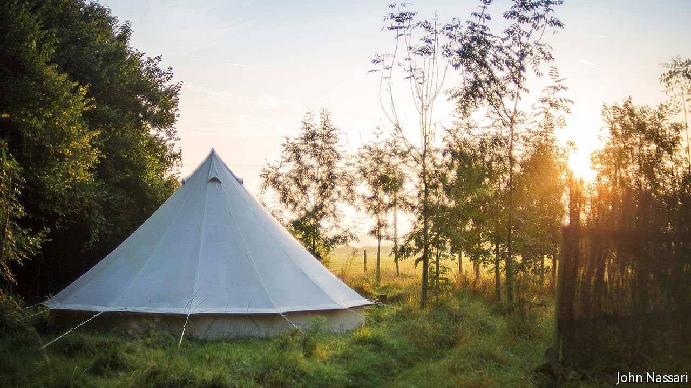

###### A rural transformation

# Why farms are moving into solar energy, campsites and natural burials 

##### A new generation takes charge 

 

> Jun 12th 2021 

“I’M A FIFTH-GENERATION farmer, although I don’t do much farming now,” admits Tim Bowles. Instead, he runs Campwell, a trendy campsite on the family farm outside Bradford-on-Avon, a town in Wiltshire. Young professionals flock to stay in log cabins, yurts and bell tents—with compost loos—and to enjoy activities like yoga, wild swimming and sheep herding. “It’d probably blow my great-grandfather’s mind,” Mr Bowles says.

In the past decade, the number of holdings in England has fallen by a fifth, reflecting dwindling incomes, consolidation and also definitional changes. To survive, farmers are turning to new ways of making money. According to official figures, 65% of English farms now do more than just grow crops or raise livestock, up from 58% in 2013. The phasing out of the common agricultural policy—an EU subsidy scheme—provides an extra incentive to find new sources of cash. Green subsidies provide a reason to build solar farms, as many are.


Yet farmers are not just diversifying, they are doing so in increasingly diverse ways, too. The covid-19 pandemic has seen them branch out into home deliveries, milk-vending machines and holiday accommodation. One farmer is creating a natural burial site. A shorthorn-cattle farm in Scotland now offers speedboat trips on its loch. Another in Norfolk is opening an outdoor theatre.

Farms are also taking inspiration from their urban neighbours. Many are now opening places to work, after the success of a farm in Leicestershire, called Burrough Court. It opened a 22-acre office park in 2000, complete with a yoga studio. “The local agents said my father was barking mad,” recalls Becky Wilson, the marketing manager. Now it is expanding.

The average farmer is 60 years old, and resistant to change. But that is less true of their children. Matt Lobley of the University of Exeter says that many avoid traditional agricultural training by going to university, often to study business or marketing, before starting an independent career. “They then come back with a whole load of different ideas...and are often really quite innovative,” he notes. Richard Bower is one such example. His parents discouraged him from farming, so he went off to work in food marketing. He has now returned, and has spent £1.8m ($2.5m) setting up a café, adventure playground and soft-play centre. “Historically farmers said ‘Get off my land’,” says Mr Bower. “Nowadays we are saying ‘Get on my land’.”

The government wants to encourage this new breed. On May 19th George Eustice, the environment secretary, launched a consultation about the idea of paying older farmers a lump sum (of up to £100,000) to retire. Farms would then become more innovative places, or so the theory goes. Outside Bradford-on-Avon, Mr Bowles’s father shows no lack of entrepreneurial zeal, running self-catering cottages. There is, however, a clash in styles. Mr Bowles says his father can often be seen wheelbarrowing dead sheep through the farm while guests arrive. “He’ll just say, ‘Oh, it’s a farm, isn’t it?’” ■

