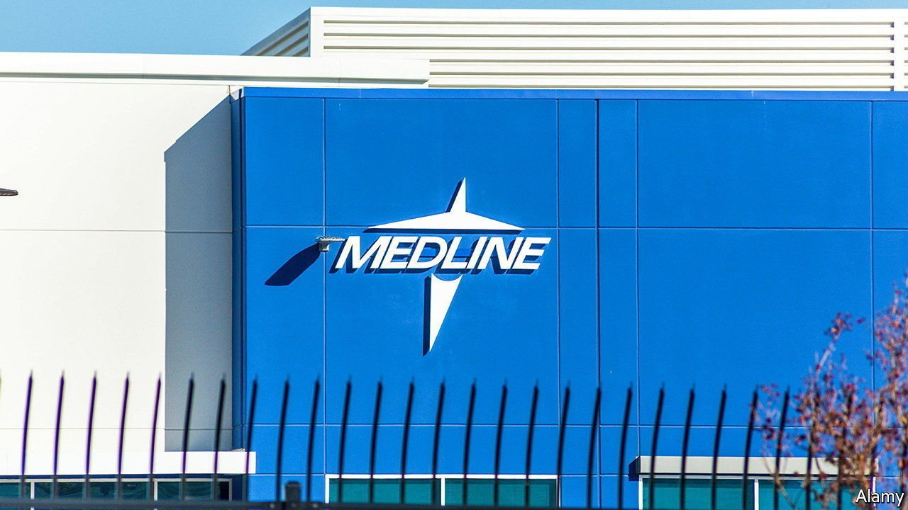
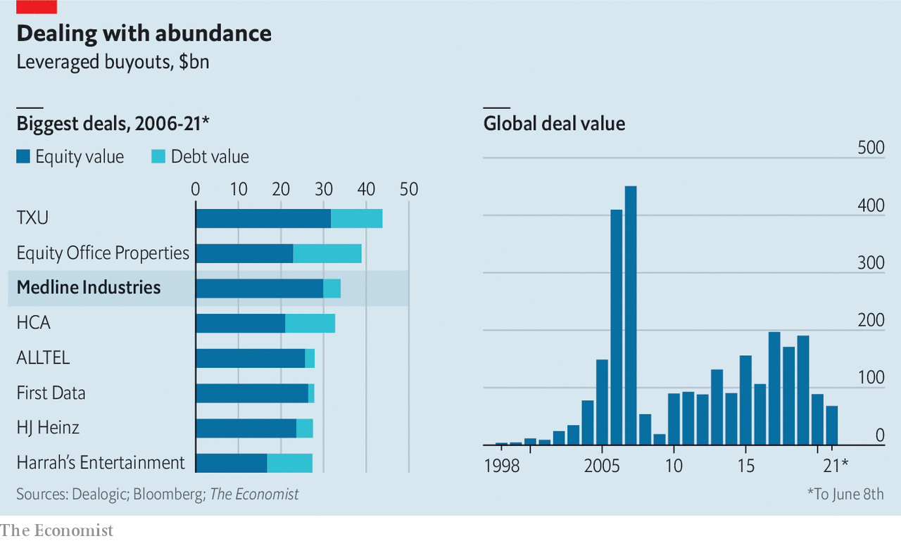

###### Dealing with abundance

# Does the Medline mega-deal herald the return of giant buyouts? 

##### Private-equity firms are neck-deep in dry powder 

 

> Jun 12th 2021 


 


BUYOUT SHOPS are neck-deep in dry powder. Earlier this year the world’s private-equity firms were sitting on $1.9trn in unspent capital. This month three of the biggest, Blackstone, Carlyle and Hellman &amp; Friedman, reportedly agreed to pay $34bn for control of Medline, a supplier of medical equipment. It will be the biggest leveraged buyout since the global financial crisis of 2007-09 put paid to most such debt-fuelled acquisitions.■

