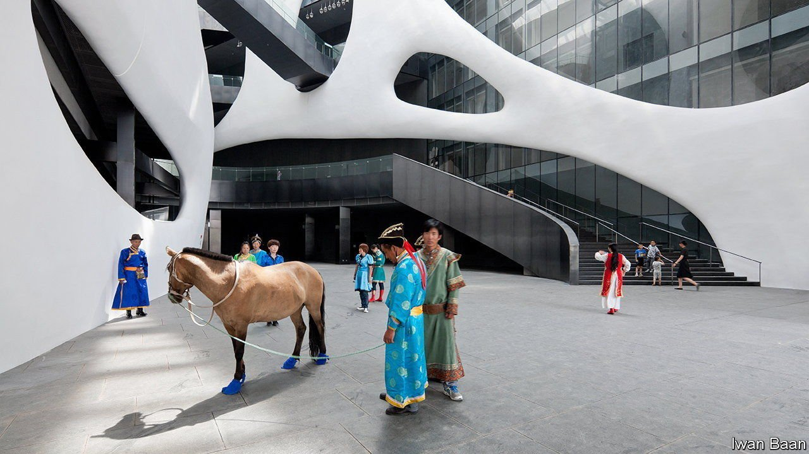

###### Build big, show little

# China says it will be a “museum power” by 2035 

##### It is opening five of them a week, with the Communist Party’s needs in mind 

 

> Jun 12th 2021 

CHINA HAS big plans for the year 2035, if somewhat lacking in clarity. It will “basically achieve socialist modernisation” by then, whatever that means. Its army will be modernised, too. Late in 2020 it also said it would become a cultural and sporting power (isn’t it both already?), and an “education power” to boot. Last month it declared a new goal: to become a “museum power”. It even gave some detail. Between ten and 15 of its museums, it said, would become “world-class”.

China is building museums at a frenetic pace. In 2000 it had fewer than 1,200 of them. By the end of last year there were nearly five times as many. Helped by a decision in 2008 to allow free entry to most government-run ones, visits have also soared. By the end of 2019 the annual number had increased more than fourfold, to 1.2bn. There was a huge drop last year because of the pandemic, but new museums still opened at a rate of nearly five a week (officials admit that obtaining enough good stuff to put in them is difficult).


The new plan does not name any museums in the running for world-class status. But architecturally, several stand out. One is the Ordos Museum of local history, which opened in 2011 in the city of that name in Inner Mongolia. The huge amorphous blob, covered in polished metal tiles (pictured), is intended to evoke the dunes of the nearby Gobi desert. In Beijing the privately owned X Museum of contemporary art, which opened last year, is another that boasts a striking new building.

But Chinese museums must be mindful of the Communist Party’s wishes. The plan for 2035 says the party must exercise “all-round leadership of museum development”. The document’s list of worthy themes for exhibits includes the Belt and Road Initiative—a global infrastructure-building project launched by China’s leader, Xi Jinping—as well as more universally acknowledged engineering marvels such as the Great Wall and the Grand Canal.

Officials hope that museums will boost national pride and thereby support for the party. Two new museums have opened since 2018 dedicated to China’s claims to contested islands in the South and East China Seas. Last year the National Museum of China put on an exhibition about Taiwan, aimed at backing China’s assertion to sovereignty over that island as well. The same museum was the destination of Mr Xi’s first public excursion after he took over as leader in 2012. It was there he first used what was to become his most famous catchphrase, saying there was a “Chinese dream” of renewed national greatness.

Occasionally, private citizens dare to open museums that explore sensitive topics. In late April feminists launched what they described as one on the theme of “internet violence”. It was really a work of protest art: a hillside dotted with 700 violent online messages that had been sent to Chinese women, displayed on red banners across a distance of three kilometres. Pictures of this were posted online, but the organisers kept quiet about where it was.

Only in Hong Kong have museums been allowed that truly challenge the party line. But on June 2nd officials there closed a tiny museum dedicated to the crushing of the Tiananmen Square protests on June 4th 1989. They cited a licensing problem. However, the move coincided with a ban on an annual vigil commemorating the bloodshed. In this case the pandemic was given as the reason, but many activists fear the massacre is becoming taboo in Hong Kong, just as it is on the mainland. The party’s all-round leadership of museums may be spreading into new territory. ■

