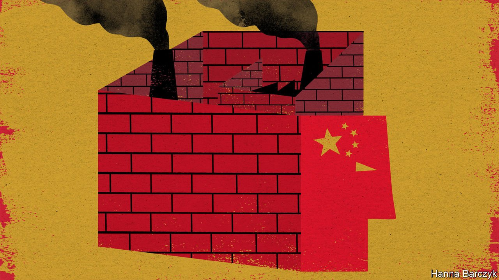

###### Chaguan

# Foreigners rush inside the Great Wall 

##### Globalisation was meant to change China. Instead, China is changing globalisation 

 

> Jun 10th 2021 

EARLY LAST year, as covid-19 brought China to a near-halt for several weeks, multinational corporations caught a glimpse of a different kind of globalisation: one without a dynamic Chinese economy at its heart. Panic ensued.

Foreign businesses confessed that they had grown too dependent on China as the easiest and best place to make and sell their wares, whether for export or in domestic markets. The new virus, coming on top of a trade war with America, was declared a salutary shock that would drive big changes. Foreign firms pledged to build more resilient supply chains by diversifying into other countries, while noting that they would keep production sites “in China, for China”, to serve Chinese demand when it returned.


A year on, the mood is very different. Nearly 600 companies responded to an annual survey of business confidence conducted by the European Union Chamber of Commerce in China, which was published on June 8th. They described surging optimism about China, with economic growth having resumed far more quickly than expected. Three-quarters of European firms said that they were profitable in China in 2020, allowing them to send revenues back to headquarters suffering from dismal results elsewhere.

Optimism varies by industry. In particular, makers of cars and luxury goods enjoyed bumper sales as affluent Chinese, denied holidays abroad by pandemic controls, went shopping instead. Fully 91% of the firms said they would maintain their investments in China, rather than move them elsewhere. Over a quarter of manufacturers are bringing supply chains more completely into China, five times as many as are moving them offshore.

Strikingly, however, the same companies remain as sceptical as before that China will open markets or enforce regulations in the same way for local and foreign firms. The same share as ever, one-sixth, report being compelled to transfer technologies in order to maintain market access. Two-fifths say that the business environment in China is more politicised than before. That share would surely have been higher had the survey been conducted after recent Chinese sanctions on European politicians and the whipping up by state media of consumer boycotts against H&amp;M and other clothing brands, in response to European criticism of abuses in the far-western region of Xinjiang.

European companies report losing business opportunities because of laws that demand that sensitive technologies used in China must be secure and controllable by Chinese authorities. Those laws are buttressed by rules banning many data transfers across China’s borders. That is forcing multinationals to build duplicate databases, cloud services and software systems just for China, and to hire all-Chinese research and development teams. Increasingly, says the EU chamber’s president, Joerg Wuttke, firms must build one operation for China and another for the rest of the world.

A cynical Chinese official might listen to these businessfolk grumbling about how tough it is in China, and wonder why, exactly, China needs to heed foreign calls to reform, when the same people turn round and make new investments. Such an official might even observe that some important European businesses are responding to American export controls on sensitive technologies by moving factories out of America so that they can continue to cater to Chinese customers.

In private, European bosses concede that they have less and less leverage when trying to persuade China that it is in the country’s self-interest to open up. Some are growing keener to use sticks against Chinese business in Europe, such as investment-screening mechanisms or rules that would impose new costs on carbon-intensive projects or firms that are heavily subsidised by the Chinese state.

The China led by Xi Jinping is selective in its welcome to foreign firms. The most favoured sell things that China cannot make for itself, such as high-tech chemicals and industrial machinery, and whose presence attracts specialist suppliers. Such firms enjoy red-carpet treatment: they are allowed to create Chinese subsidiaries which they own fully, helping them to protect trade secrets, and are spared red tape that entangles lesser rivals. A lower tier of foreign firms makes products that Chinese consumers like, such as fancy European cars. The state tolerates their presence as long as they make those things in China, using Chinese workers and components, and pay local taxes. That can be profitable: some multinationals earn almost half their revenues in China. But that is because they are operating entirely within the Chinese wall. China is not especially important as a market for Western–made exports: the EU sells more to Britain than to China, for instance.

It is getting harder to bring foreign staff into China, particularly during the pandemic. Localising many jobs is a good idea: mediocre expatriates enjoyed unearned privileges for too long. But in a China steeped in angry nationalism, localisation also carries risks. Some Chinese executives take their government’s side over stalled reforms, or over political issues like repression in Hong Kong and Xinjiang. Others have a tin ear for politics in the West.

Putting the nation into multinational

Boards in the West used to worry about things like market feasibility studies. Now they must wrestle with a new, philosophical question: do their firms really want to operate in China as Chinese businesses, employing fewer and fewer foreigners, to generate revenues shared with global shareholders? If such outfits ask their home governments in the West for help, will it be forthcoming? Experienced executives describe bleak choices. “It is about the weighing of risks,” says one. “The risks of not being here, with the risks of being here.” Meanwhile, public opinion in the West is turning more hostile to a China seen as grimly dictatorial. Diversification does not make economic sense, it turns out. But politically the world is decoupling. That shock will have lasting effects. ■

