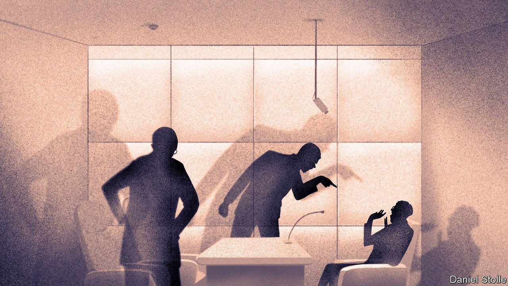

###### Who watches the watchmen?

# The anti-graft unit of China’s Communist Party has grown in power 

##### Its agents can now seize people who are not party members 

 

> Jun 12th 2021 

AT MIDNIGHT ON June 1st Shi Zhaoqing, a local boss in China’s new anti-graft super-ministry, was working late on a case in the central city of Qianjiang. It was coming to a head; his team was exhausted. But before leaving the office he told the duty officers that investigators had to play by the rules, according to an admiring official account. “We must use the correct procedures to collect evidence and handle the case in a civilised manner,” he said.

The Communist Party is trying to polish the image of its feared internal-investigation arm, the Central Commission for Discipline Inspection (CCDI), which handles cases of corruption and political disloyalty. In 2018 the CCDI—though keeping its separate identity—became the core of a new super-agency called the National Supervisory Commission. For the first time the CCDI would operate within a legally constituted organisation and therefore be subject to law. This followed an announcement by China’s leader, Xi Jinping, that the party would abolish its secret interrogation system for party members. It was called shuanggui, meaning “double designation”, because suspects had to present themselves at a designated place and time for questioning. They were then held incommunicado, without access to lawyers.


But it is becoming clear that rather than curbing its power, the party has given itself more. The new body is just as unaccountable and secretive as the CCDI itself (indeed, the National Supervisory Commission is, in effect, just a different name for the CCDI). The new commission is drafting rules to supplement the law that created it. Taken together, these legal documents dramatically expand the jurisdiction of the party’s graft-busters and contain loopholes that allow them to behave much as before. Not surprisingly, there is no mechanism for public scrutiny of the new commission’s activities: no one watches the watchmen. One concession the new body has made is to gather public comments on the draft rules. The deadline for submitting these is June 15th, but it is unlikely that the commission will make them public, let alone revise the regulations in response.

The rules allow the commission to investigate anyone who exercises “public power”. That includes civil servants, head teachers, hospital managers and bosses of state-owned firms. The remit is so broadly worded that it could apply to staff of foreign firms that have government contracts or joint ventures with state-owned businesses, says Jeremy Daum of the Paul Tsai China Centre at Yale Law School.

By giving the commission such vast powers, outside the normal justice system, the party can keep a wide range of misconduct and abuses of power from public view and continue to work with minimal legal restraint, says Mr Daum. But the party insists otherwise. It says it is making its procedures fairer by tightening the rules. The shuanggui interrogation system has been replaced by one with a more obvious meaning: liuzhi, or detention.

Unlike its predecessor, liuzhi comes with legal stipulations: audio and video recordings must be made of interviews, and any death in custody must be reported to the commission’s headquarters within 24 hours. There has been a push to build “standardised” interrogation rooms with padded fittings. Rules say detainees should be held no longer than six months, their “ethnic customs” should be respected and they should be provided with proper food, rest and medical care (there must be a first-aid kit to hand). At a glance it sounds, as Mr Shi might put it, very civilised.

But suspects still have no right to a lawyer and no way of complaining about any abuse except to the new commission. In May 2018, two months after the organisation was established, a 45-year-old man who had worked as a government driver died while in liuzhi. His sister told Caixin, a news publication, that when she arrived to get his body, she found his face had been “disfigured”. The family asked in vain to see the interrogation video. Internet censors swiftly blocked Caixin’s report from circulating on Chinese-language forums.

The way the CCDI has gained more power fits a pattern under Mr Xi. Since he took over as party leader in 2012, he has been trying to put the party more firmly in control of all aspects of state and society, while insisting that the party is also becoming more accountable. He has stressed the importance of law (in party documents, rule of law and rule by law are often used interchangeably), while using his investigators to target political enemies. Some of those detained by the CCDI have been accused of disobeying the party line as well as of graft.

In 2018 Mr Xi launched a three-year campaign called “sweep away black and eliminate evil”. The targets were said to be organised crime syndicates and their accomplices in the party and government. But the dragnet swept up thousands of other people seen as threatening, including religious figures, leaders of rural clans and wealthy businessmen.

Mr Xi’s purges have sown fear within the bureaucracy. That is their aim. Regulations issued in 2016 state that when being criticised or questioned, officials should be “red-faced and sweating”. Mr Xi says he wants them “not to dare to be corrupt”, “not to be able to be corrupt” and ultimately “not to want to be corrupt”. But making sure of that is the party’s task alone. “The party must manage the party,” he insists, repeating a dictum of its founders.

The party shows no sign of relinquishing its power to toss those it finds threatening into “black jails”, as critics often call them. These facilities lack the trappings of the formal prison system, such as the need for a trial before incarceration and provision for visits from family members. The party’s “political and legal” committees, which oversee law and order, are particularly fond of using such lock-ups to detain people who petition against local injustices, as well as members of Falun Gong, a banned spiritual movement. In the far-western region of Xinjiang, these committees have led the creation of a new gulag to which the party has sent more than 1m ethnic-Uyghurs without trial, purportedly for vocational training to help with their “deradicalisation”. (Most are Muslims who have shown no radical tendencies.) Some experts believe the authorities have begun to take some of the camps’ inmates and send them for formal trial, leaning on the courts to give them harsh sentences on dubious charges of extremism.

The glowing account of the exploits of Mr Shi, the anti-graft boss in Qianjiang, describes how he instructed investigators to deal with a detainee in 2019. “Continue to increase the intensity of interrogation,” he says firmly. “And don’t let him lead you by the nose!” The suspect soon decided to co-operate and the case was cracked. The party always gets its man. ■

