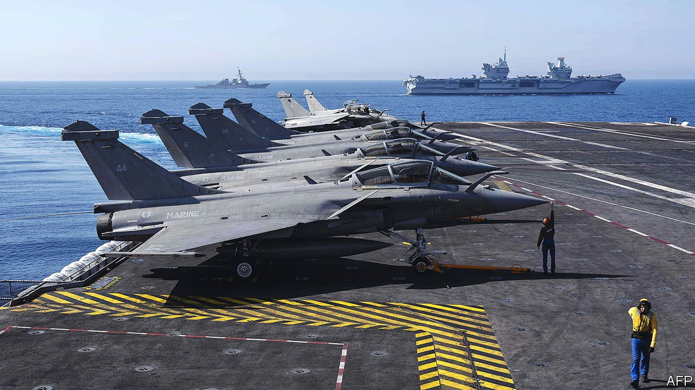

###### Found at sea

# Britain and France send their aircraft-carriers out together 

##### A glimpse of Anglo-French co-operation in the Med 

 

> Jun 12th 2021 

UNDER AN AZURE sky in the western Mediterranean, two aircraft-carriers sail eastwards in tandem. One, the Charles de Gaulle, a French nuclear-powered vessel, has 20 years of service behind it. The other, HMS Queen Elizabeth, Britain’s new flagship, is on its maiden operational tour. For the first time the two carriers are taking part in three days of joint exercises. Code-named “Gallic Strike”, this involves war games and simulated sea-to-land strikes by 15 vessels and 57 combat aircraft, including ten American fighter planes and two destroyers.

Far from the recent political posturing off Jersey, the French and British navies are busy with the unfashionable business of working together. Aboard the Charles de Gaulle, which that day is serving hamburger frites to its 1,200 sailors, Rear-Admiral Marc Aussedat points to the “historic dimension” to the exercises. Britain’s Admiral Tony Radakin, the head of the Royal Navy, speaks of “bold steps towards ever greater interoperability” after meeting his French and American counterparts. The three naval bosses declare a “shared commitment to this great partnership of navies”.


An aircraft-carrier is not just about warfare. Florence Parly, France’s defence minister, described the Charles de Gaulle’s successor, due in 2038, as “75,000 tonnes of diplomacy”. The huge ship, she said, is “an instrument of power and sovereignty”. Britain would agree. The HMS Queen Elizabeth is off to the Indian and Pacific oceans as a maritime demonstration of “global Britain”. The French, for whom “global France” requires no sloganising, regularly patrol in the South China Sea. This year they sent a nuclear submarine there.

An unaffordable vanity project? Or a bid by two mid-sized powers to stay relevant? Big aircraft-carriers, of which only 18 are in service worldwide, remain controversial. But for three days in June rivalry and gesture politics are set aside. Training over, Britain’s carrier continues eastwards. The Charles de Gaulle, after a four-month tour off Syria and the Persian Gulf, circles back and heads home.

