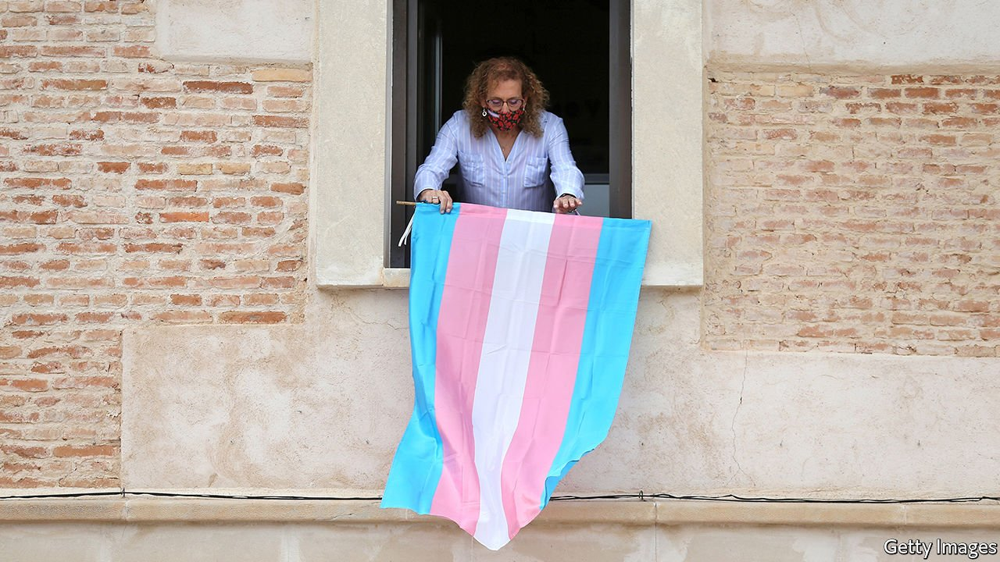

###### Transgender rights

# Continental Europe enters the gender wars 

##### Germany and Spain reject laws on gender self-identification 

 

> Jun 12th 2021 

DEBATES ABOUT transgender rights have raged most angrily in the Anglophone world, but they are now intensifying across Europe. Last month the Spanish parliament voted against a bill that would allow people to determine their own gender. A day later Germany’s voted down two such bills. Few newspapers took any notice.

Self-ID, as it is known, is the idea that people be allowed to change the legal markers of their sex simply by saying so, without jumping through any medical hoops. Trans-rights groups say this is crucial for trans people, who face daily prejudice. In Germany one of the bills, put forward by the Green Party, proposed that children be allowed to have gender-reassignment surgery from the age of 14, even if parents oppose it. It would also have introduced a fine of €2,500 ($3,045) for referring to a trans person based on their natal sex.


As elsewhere, the debate has split the LGBT community. “It is intolerable that trans people continue to be subjected to lengthy and expensive court proceedings with assessments that are degrading,” said LSVD, one of Germany’s largest groups, in response to the defeat. Some feminist and gay-rights groups, however, say that such a law could endanger women and lead to more gay teenagers being told they might be trans and steered towards hormones and surgery. The proposals are “an authoritarian move dressed up as a liberal one”, says Melli Beinhorn of LGB Alliance Deutschland, a gay-rights group.

The bill in Spain was proposed by Podemos, a left-wing party. It would have set no age restriction for self-ID, allowed puberty blockers and hormones for minors and let males who identify as women play in women’s sports. France allowed self-ID in 2016 with little public debate. Ireland did so in 2015. Italy does not yet allow it.

In Scandinavia doctors are leading a pushback. In May the Karolinska University hospital in Stockholm, which contains Sweden’s largest adolescent gender clinic, released new guidelines saying it would no longer prescribe blockers and hormones to children under 18. This challenges protocols proposed by the World Professional Association for Transgender Health (WPATH), a body that says only “affirmation” of a child’s proclaimed gender is the “standard of care”.

Research has had an impact. In a paper in 2015, a Finnish psychiatrist, Riittakerttu Kaltiala-Heino, found that more than 75% of adolescents applying for sex-reassignment surgery needed help for psychiatric problems other than gender dysphoria. (Another paper, published this year, found 88% needed such help.) Finland last year adopted strict guidelines prioritising therapy over hormones and surgery.

Defeat of the bills was more because of domestic politics than because people understood the issues and rejected them, says Amparo Domingo of Women’s Human Rights Campaign in Valencia. “Most Spanish people don’t know what it is all about.” Four new bills on “gender identity” (two proposing self-ID) have been drafted. If the Greens do well in German elections in September, they may re-introduce their bill, too. The debate is far from over. ■

