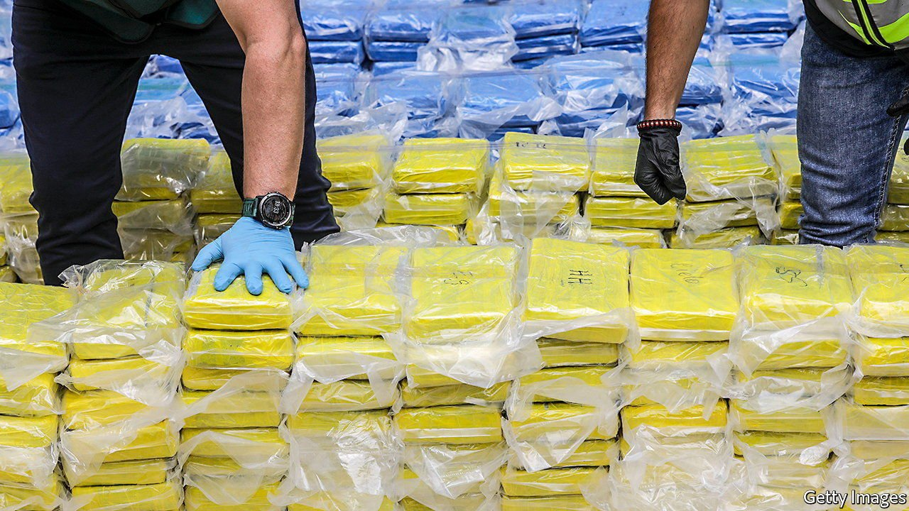

###### Party lines

# Europe’s drug habit proves immune to covid-19 

##### And the narcotics are getting stronger 

 

> Jun 10th 2021 

ONE MIGHT have expected that a pandemic that put a stop to parties would also reduce the use of party drugs. Indeed, wastewater samples in some European cities showed that residues of cocaine and MDMA (also known as ecstasy) fell during the covid-19 lockdowns of early 2020. But by last summer Europeans were riding high again. In many cases, consumption simply moved from club to living room.

Thus concludes this year’s report by the EU’s European Monitoring Centre for Drugs and Drug Addiction (EMCDDA). Police, aided by surveillance of messaging apps (such as the Trojan Shield sting announced this week), are confiscating more cannabis, cocaine, ecstasy and crystal meth than ever. In 2020 inspectors at the port of Rotterdam seized almost 41 tonnes of cocaine, seven more than in 2019. In one week this spring they discovered 2.7 tonnes hidden among Ecuadorian bananas and Malaysian computer parts. In the port of Vlissingen divers found a crate chained underwater to a freighter.


Yet the supply of drugs is ample. Retail prices are constant, and the potency goes up every year. On average, cocaine in Europe was 57% purer in 2019 than ten years earlier. An ecstasy pill contained almost 2.5 times as much MDMA, and cannabis had 56% more THC (the narcotic bit).

Those with a laissez-faire attitude may not find this worrying. The most-used recreational drug by far remains cannabis, which has relatively few harmful effects. But number two, and growing, is cocaine. After opioids it is the drug most likely to send users to hospital, present in 22% of overdoses. And whereas ecstasy and amphetamines are typically manufactured in Europe, cocaine must be imported.

That has fuelled the growth of powerful crime syndicates. In the 2000s, networks that initially imported hashish from North Africa began bringing in cocaine. They set up distribution operations stretching from Spain to Scandinavia.

Such groups, including the so-called Mocro Mafia in the Netherlands and gangs such as Death Patrol in Sweden, are the source of much of the most lurid violence in Europe these days. Ridouan Taghi, a Moroccan-Dutch man arrested in 2019 in Dubai, is on trial in Amsterdam, suspected of ordering hits on informants and on a lawyer. (He denies the charges.) Swedish gangs have taken to using hand-grenades as a gesture of intimidation. In Dijon last summer, there were street battles between drug-dealers of North African descent and hundreds of Chechen immigrants.

The total number of drug-related killings is small. But because they are often gory and linked to immigrant communities, they create the impression of a crime wave. Although overall murders in Europe have declined sharply in the past two decades, killings linked to the drug economy have not, according to Marieke Liem of the Violence Research Initiative, a project based at Leiden University. “There are no written contracts and no court of settlement, so if there is a dispute, either people reach an agreement or you get violence,” says Jan Meeus, a Dutch crime reporter.

Criminality spills over into other industries, too. At the port of Rotterdam, couriers used to sneak in to collect drugs from shipping containers. Today they are likely to infiltrate a big transport company, acquire certification and drive out with the entire container. Covid-19 has accelerated the shift to larger scales. “You can’t have people swallowing packages of drugs and flying in from Latin America any more. That’s why we see so much coming in with the banana shipments,” says Andrew Cunningham of the EMCDDA.

Europe has been spared two of this century’s grimmest drug problems. Although the overuse of prescription painkillers led to an opioid epidemic in America, in Europe they are still mainly used by ageing addicts. Sensible policies on methadone and other substitution therapies have helped. Methamphetamines are relatively rare in Europe, too. But recently crystal meth has made some inroads, particularly a cheap variety made in Afghanistan directly from the ephedra plant. And while many American states have decriminalised cannabis over the past decade, few European countries have done so. That may have perverse consequences. As the cocaine industry shows, illegal networks that spring up to supply one drug are likely to end up being used for others. ■

