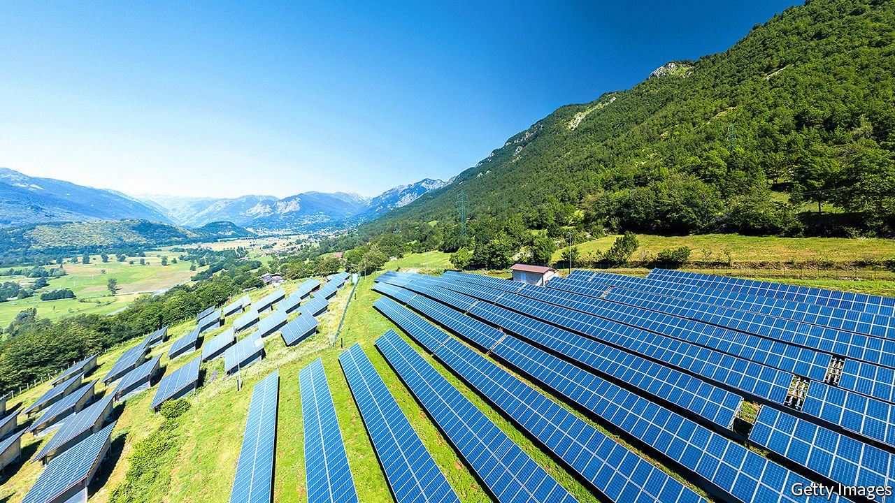
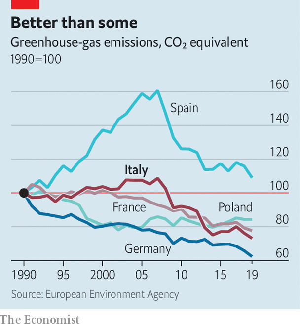

###### How green is my Draghi?

# Italy has a tough task ahead on climate change 

##### But it is getting a lot of EU money to help 

 

> Jun 12th 2021 

OF ALL THE appointments to Mario Draghi’s cabinet, arguably the least expected was that of Roberto Cingolani, his minister for ecological transition. A physicist and former science director of the Italian Institute of Technology, Mr Cingolani came into government from a senior job in the defence industry, an odd background for an eco-warrior.

Mr Cingolani counters that he has taught courses on sustainability but that, anyhow, his new brief touches on so many different aspects of science that no one could be an expert in them all. His ministry’s remit is certainly vast: it is charged with overseeing the allocation and spending of the biggest chunk of the €235bn ($285bn) that Mr Draghi plans to devote to post-pandemic recovery, mostly comprising grants and loans from the EU, but with a sizeable top-up from Italy’s own resources. The ministry for ecological transition is responsible for handling some €70bn, or almost 30% of it. And since Italy will get more than any other EU country from the European Commission, there should be scope for it to play a decisive part in helping the EU reach its target of cutting greenhouse-gas emissions to 55% below the level of 1990 by 2030.


So how do its plans for eco-transition shape up? The commission will take at least another month to pronounce. But the environmentalists’ verdict is in—and it is damning. Green Recovery Tracker, a project launched by two German NGOs to assess EU members’ plans, estimates that only 16% of the overall amount that Italy expects from the commission will help slow climate change—the lowest share of any big recipient (though at least, unlike France and Germany, Italy is not proposing schemes that the German NGOs think will actually make things worse).

On June 4th a group of more than 200 Italian individuals and associations, including some notably moderate ones such as the Italian Meteorological Society, announced legal proceedings against the government, claiming it was failing in its duty to future generations. Further pressure may come from within the governing coalition, from the ecology-minded Five Star Movement, now that it has settled an internal dispute that had prevented a former prime minister, Giuseppe Conte, from assuming the party leadership.

 


Mr Draghi’s ministers had just 11 weeks in which to revise the previous government’s recovery scheme. Mr Cingolani says his strategy has been to use the new plan to pluck “the low-hanging fruit of decarbonisation”. By far the biggest element in his programme is the extension of a “superbonus” introduced by the previous government that allows 110% of the cost of works to boost domestic energy efficiency to be set against tax. Letting the programme run to the end of 2022 for private householders and until mid-2023 for social-housing associations will cost almost €14bn, nearly a fifth of Italy’s allocation to green projects.

Mr Cingolani says he would personally have favoured a less generous tax break. But, he adds, “Italy has a lot of old buildings, so it makes a lot of sense to [augment the] energy-efficiency of homes.” In a statement on April 30th a group of Italy’s leading environmental organisations decried the fact that the government’s proposals would do nothing to make factories more energy-efficient. In 2018 houses and offices accounted for almost a fifth of Italy’s greenhouse-gas emissions, but industry accounted for more.

On the supply side, Mr Cingolani says his approach is to “electrify all that can be electrified”. Much of that falls beyond his remit. Other ministers will oversee the spending of a projected €13.2bn on new high-speed rail links, for instance. But Mr Cingolani is largely responsible for changing driving habits in a country with proportionately more cars than anywhere else in the EU bar Luxembourg (663 per 1,000 inhabitants, against 574 in Germany and 482 in France). In Italy only one journey in ten is by public transport. Mr Cingolani wants to spend more than €7bn on new, cleaner mass-transit systems and to retire old diesel buses and trains. But he has been criticised for allocating barely a tenth of that sum to creating a network of charging points for electric cars. “More will be needed,” he agrees. “But we have to make supply and demand grow together.”

If Italy is to meet its 2030 target it will need by then to have around 70 gigawatts of renewable power-generating capacity. That implies adding 8GW a year. The current rate is a tenth of that. Mr Draghi’s government has introduced legislation to simplify the bureaucracy that has ensnared previous energy projects. But in so doing it has raised other concerns.

One is that simplification will remove checks needed to prevent corruption and infiltration by the mafia. Another is that without detailed scrutiny projects could be approved that would scar Italy’s magnificent landscape, puncturing its horizons with wind farms and smothering its valley floors with solar panels. Mr Cingolani says he is determined to move what he can offshore. But he adds: “There’s no such thing as a free lunch. We have to find compromises. You can’t say ‘no’ to everything.” ■

For more coverage of climate change, register for The Climate Issue, our fortnightly , or visit our 

