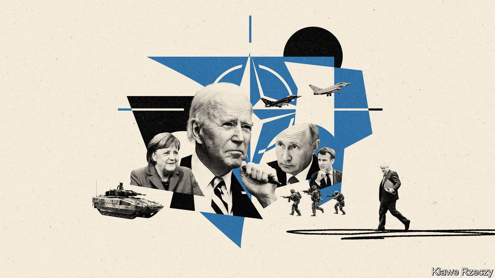
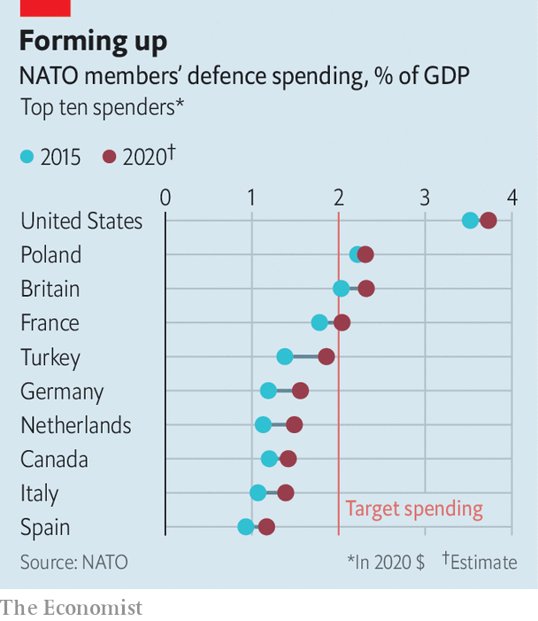

###### Summit season

# With Donald Trump gone, NATO is plotting its future 

##### As usual, Europe wants more attention and America more action 

 

> Jun 12th 2021 

“OVER THE last four years we had some challenges in the transatlantic relationship,” says Jens Stoltenberg, NATO’s secretary-general, drily alluding to the diplomatic pandemonium of the Trump years. Now, he says, “We have a unique opportunity to open a new chapter in the relationship between North America and Europe.” But will NATO’s leaders take it?

On June 14th the leaders of all 30 NATO members will convene for a meeting in Brussels, sandwiched between the G7 summit in Britain and an EU-US summit. They will discuss the future of the alliance. The mood will be lighter than at past gatherings, when Mr Trump physically jostled one prime minister, threatened to withdraw from the alliance and stormed out early after being mocked by fellow leaders. Yet the challenges facing NATO have not dissipated with the arrival of Mr Biden.


In recent months Russia has massed troops around Ukraine, Belarus has forced down a European airliner to seize a dissident and America has announced the withdrawal of its troops from Afghanistan—a process more than half-complete by June 8th—forcing NATO to follow suit. Yet the point of the summit is to reorient the alliance in more fundamental ways.

NATO’s strategic concept, a document spelling out its raison d’être, was last updated over a decade ago, at a time when Russia was assumed to be a potential partner and China an irrelevance. In Brussels leaders will enjoin Mr Stoltenberg to produce a new version, a process that may take a year or so. It will reflect a broadening of NATO’s aperture, embracing new challenges such as climate change, technological threats and the rise of China.

 


Things are already changing. Mr Stoltenberg points to rising European defence spending (see chart) and more exercises. The alliance is also busily rethinking the basics of military power. It is writing a new strategy for artificial intelligence and has finalised its first new cyber-defence policy in seven years. At the summit, leaders will establish a “transatlantic technology accelerator” to connect suppliers of cutting-edge military technology to investors.

One of NATO’s motivations for this technological rejuvenation, says Mr Stoltenberg, is a fear that China—“a country that doesn’t share our values”—is pulling ahead in key areas like artificial intelligence. “It’s not obvious that we will maintain the technological edge…that was never the case with the Soviet Union during the cold war,” he adds. The discussion of China is a pivotal moment, says Tim Sayle, author of “Enduring Alliance”, a history of NATO, marking “a fundamental break with what the alliance has done in its first 70 years”.

Yet the biggest question of all is whether the transatlantic rift under Mr Trump was a passing ruction or something more lasting. Mr Biden has made the right noises, speaking warmly of NATO and reversing Mr Trump’s troop cuts in Germany. His eight-day trip to Europe will culminate in a summit with Vladimir Putin, Russia’s president, in Geneva on June 16th. In theory that allows Mr Biden to form a common front with allies before facing Mr Putin, who on June 9th upped the ante by banning groups linked to his main political rival, the jailed Alexei Navalny.

Mr Biden cannot, however, placate all his friends at once. Take the example of Nord Stream 2 (NS2), a nearly finished gas pipeline from Russia to Germany that will bypass Ukraine and increase European dependence on Mr Putin. The Biden administration had opposed the project, but on May 19th said it would nonetheless waive sanctions. That pleased the German government, but alarmed those who favour a tougher approach to Russia. “The mood across Central Europe is souring after the NS2 decision,” notes Michal Baranowski, an expert at the Warsaw office of the German Marshall Fund, an American think-tank. “The feeling is one of betrayal.”

Then there is the fact that the landscape of European defence has shifted irrevocably in recent years. The shock of Mr Trump’s election and the departure of Britain from the EU catalysed a surge of activity by the bloc, from joint defence projects to a common fund for the defence industry.

Many European officials, mindful of the radical turn in America’s Republican Party and the prospect of populist successors to Mr Biden, are eager that such schemes should preserve the momentum they acquired in the Trump years. Many are complementary to NATO, such as an EU effort to make it easier for military forces to move across the continent. In practice, an element of competition is inevitable. In response to Mr Stoltenberg’s push for an increase in the pool of common funding for NATO—unchanged since 2014—Florence Parly, France’s defence minister, shot back: “All this money is money that won’t go towards increasing national budgets and a European defence effort.”

What is more, European officials know that all American presidents, Mr Biden included, have lots to worry about. America’s military presence in Europe remains substantial, but its newest weapons are now typically sent to the Pacific first. So are officials. The first overseas trips of Anthony Blinken, America’s secretary of state, and Lloyd Austin, its defence secretary, were to Asia. “There is considerable scepticism in Washington that a divided, self-interested Europe will ever manage much support for US efforts against China,” argues Jeremy Shapiro of the European Council on Foreign Relations, another think-tank.

Even so, the geopolitics of Europe and Asia are unavoidably entwined, not least because America’s national defence strategy in 2018 explicitly discarded the requirement for the country to be able to fight two wars at the same time. “We urgently need European NATO to be able to handle more of the conventional deterrence burden in Europe,” says Wess Mitchell, a former American official who co-chaired a panel of experts for Mr Stoltenberg last year, “so that in the event of a major crisis the United States can focus on China without calling into question the stability of the European theatre.” Having seen off Mr Trump, NATO has no time to rest on its laurels. ■

