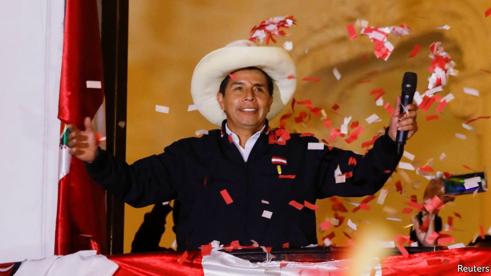

###### Latin America

# A failure to reform Peru is poised to produce a lurch to the far left 

##### A presidential run-off election is set to deliver a weak, populist government 

 

> Jun 12th 2021 

FOR MUCH of this century Peru stood out in Latin America as a success. The economy grew at an annual average rate of 5.6% between 2001 and 2016, while the share of those living below the national poverty line fell from above 60% to 21% over the same period. Inequality fell, too, as the incomes of people living in the Andes, long the poorest area, grew faster than the national average. Like Chile and Colombia, which also did well economically, Peru pursued free-market economic policies and export-led growth, eschewing the statist protectionism that has held back Argentina and Brazil.

Progress has largely halted, first because of political conflicts that produced four presidents (and eight finance ministers) in five years. Then came the pandemic, which has killed 190,000 Peruvians and pushed 3m into poverty. Now Peru’s future has been held hostage by a divisive presidential run-off election. With nearly all the votes counted, Pedro Castillo, a rural schoolteacher, subsistence farmer and union leader,  against Keiko Fujimori, the daughter of Alberto Fujimori, the conservative who ruled the country as an autocrat in the 1990s. Neither candidate is a paragon of democracy.


Mr Castillo represents a cry for social justice from the Peru that has felt left behind, particularly during the pandemic. He is an admirer of Evo Morales, Bolivia’s former socialist strongman; his party is led by an apologist for Cuban communism and Venezuela’s dictatorship. He has little previous political experience, has given few interviews and scant indication of how and with whom he would govern. Ms Fujimori has plenty of baggage herself: when her party held a majority in Peru’s Congress in 2016-19 it sought to sabotage an elected government, to destroy valuable education reforms and to capture independent institutions. But she attracted the support of many who fear a leftist adventure.

Peru now faces several perils. The first is of a fight over the result, which may not be declared for several days. Ms Fujimori has unwisely claimed electoral fraud, with no serious evidence. Mr Castillo’s victory, assuming it is confirmed, poses two further risks. One is that he follows the leftist-populist script on which he campaigned: nationalisation of mines and the convening of a constituent assembly to write a new constitution which might allow him to seize near-absolute power, as Mr Morales did. Since his mandate will be flimsy (he won only 15% of the total vote in the first round) and he can count on only 42 of the 130 members of the new Congress, which would have to authorise an assembly, that might be hard. But if he buys popularity by, for example, seizing a mine or the central bank’s reserves, it is possible. The other, more likely, risk is of a weak, incompetent government that chips away at the foundations of economic stability and prompts a prolonged crisis of confidence. The sol, long one of the region’s most stable currencies, has already lost 8% of its value against the dollar this year.

The hope is that Mr Castillo realises that to govern the country successfully he needs to appeal to the half of it that rejected him. To achieve the improvement that he wants in the lives of poorer Peruvians in the interior requires a growing and sustainable economy. There is a precedent. In 2011 Peruvians elected Ollanta Humala, a former army officer who had campaigned against the economic “model”. His government introduced some useful reforms while keeping the economy going. But Mr Castillo has less knowledge of the world and less time to adjust than Mr Humala had.

How Peru got here is a lesson in how to squander progress. It was long clear that the country needed to complement its market economy with a more effective state to provide much better public services, not least health care. To diversify the economy away from mining requires investing more in people, innovation and infrastructure. Instead, the conservative establishment set its face against change. The same failure to create more inclusive societies has plunged Chile and Colombia into unrest. As we have stressed in these pages in recent weeks, polarisation, fragmentation and populism are also afflicting Latin America’s giants, Brazil and Mexico. But Peru’s case, with 18 candidates in the first round, and then a choice between two extremes in the second, is especially severe. There may still be a moderate majority in Peru. It will need to make its voice heard. ■

