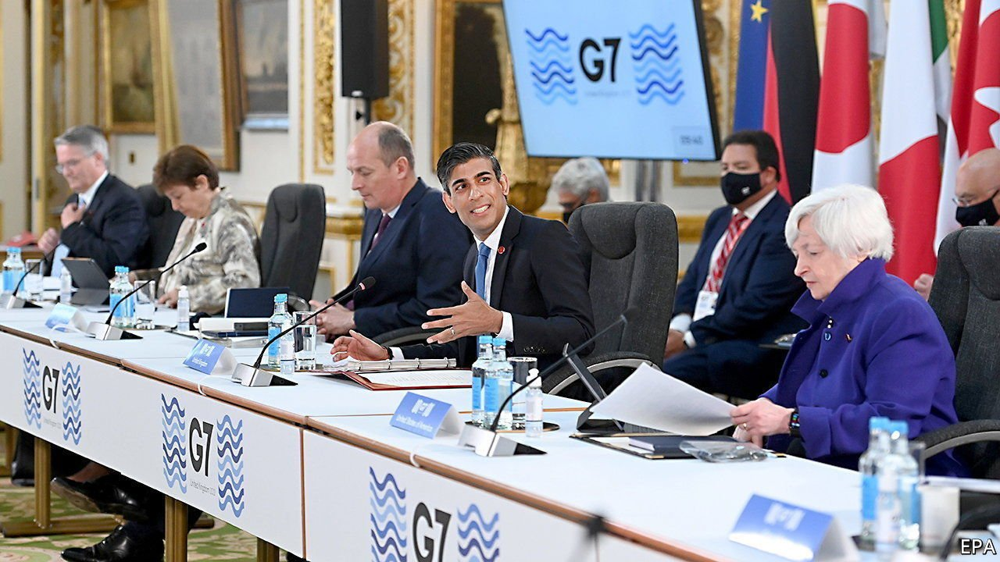
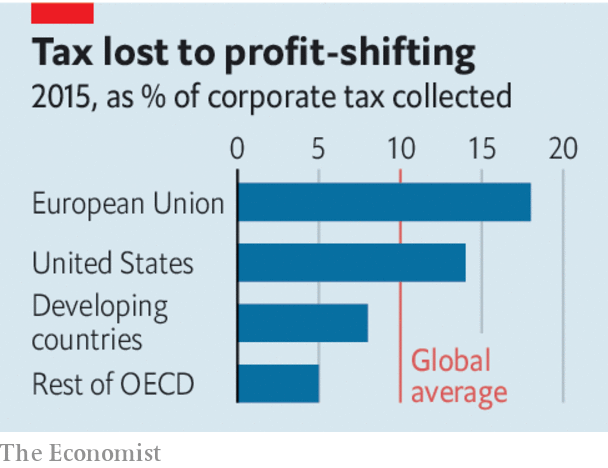

###### A new architecture

# A less loophole-riddled system for taxing companies is within reach 

##### But governments should not expect a gusher of extra revenue 

 

> Jun 12th 2021 

WHEN PEOPLE come to look back on Joe Biden’s presidency, they may, depending on events in the coming months, conclude that one of his most consequential economic achievements was to reverse a decades-long global boom in corporate tax-dodging. His administration’s call for an end to the “race to the bottom” has reinvigorated multilateral talks on rewriting international rules that encourage multinationals to funnel vast profits to tax havens. Two months after that call, America and other rich countries have agreed on a road map for reform. The deal paves the way for the biggest corporate-tax overhaul in a century.

Mr Biden’s motives are not pure: he is driven less by principle than a desire to squeeze more out of American firms to finance his post-pandemic spending priorities. Nevertheless, the G7 countries’ proposals, which their finance ministers approved on June 5th, are welcome. The international tax system sits on foundations laid in the 1920s. For much of the following century policymakers’ concern was to avoid double taxation, not curb abuse. The result has been a steady rise in avoidance, further fuelled by the growth of tech firms and intangible assets, to the point where 40% of multinationals’ overseas profits are shifted to havens. The OECD estimates this costs exchequers up to $240bn a year—a tiny fraction of global economic output, but still a lot of unbuilt hospitals and unfixed roads.


Past attempts to plug this hole have been piecemeal. The G7 wants a more comprehensive fix. It has backed a global minimum corporate-tax rate of at least 15%, combined with a reallocation of taxing rights to give more to countries where firms have sales. Rishi Sunak, Britain’s chancellor, who chaired the G7 talks, called its accord “seismic”.

In fact it is only a first step. Reaching a global deal involves finding terms that 132 other countries, including China and India, can accept. Poor countries fear a rich-country stitch-up: the G7 could reap over 60% of the revenue gains from a minimum tax. Some havens will resist, including Ireland, which jealously guards its 12.5% corporate-tax rate—and has a veto on tax matters in the EU.

 


If these obstacles can be overcome, the reforms will still need to be passed into law. Many in America’s Congress worry that they may hurt its companies’ competitiveness. European countries want America to move first. America wants France, Britain and other countries that have introduced “digital-services taxes”, targeting the sales of Silicon Valley firms, to scrap them immediately. Agreeing to put them on hold would help move the delicate diplomacy forward. Europe’s levies have provoked retaliatory tariffs from America, which are currently suspended. The OECD reckons a tax-induced trade war would wipe more than 1% off global GDP.

Expectations also need tempering on how much of the revenue lost to avoidance will be clawed back. Most would come from the minimum tax. But a floor of 15% would raise global corporate-tax revenues by as little as 2.7%. The $50bn-80bn that the combined reforms might raise is meagre beside multinationals’ $6trn of global annual profits. The profit-reallocation part of the proposals looks like a lot of work for not much gain. Countries where an as-yet-undefined group of multinationals have sales would get to share taxing rights over at least 20% of any global profits those firms made above a 10% margin. The net gain from this fiddly exercise may not amount to much more than $10bn.

No going back

Nonetheless, a Rubicon has been crossed. The tenor of the debate on tax began to change after the global financial crisis and has now shifted fundamentally. Governments around the world agree that corporate-tax arbitrage has got out of hand and taxing rights must be better aligned with economic activity. Twenty years ago champions of tax competition had the upper hand. Now the dominant line of thinking is that tax sovereignty cuts both ways: countries have the right to set their own rates, but those undercut by low-tax jurisdictions also have the right to stop the plunder. Before the year is out, a majority of the world’s governments may have agreed on changes that could obliterate the business models of zero-tax havens in the Caribbean.

Any deal emerging from the global talks would be far from perfect. It would raise only modest sums relative to covid-induced holes in budgets. It would curb, but not end, the use of loopholes; corporate tax departments are too clever for that. It is likely to give more to advanced economies than developing ones, meaning there will be pressure to revisit the deal. But it promises to reveal a route to a more rational, equitable tax system that is fit for an economy based on things you tap on a keyboard rather than drop on your foot. That is the destination negotiators need to keep in mind in the taxing months ahead. ■

