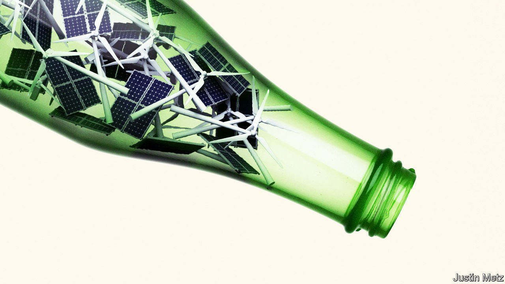

###### Bunged up

# How green bottlenecks threaten the clean energy business 

##### A great green investment boom is under way, but supply-side problems are underappreciated 

 

> Jun 12th 2021 

AS THE WORLD economy wakes back up, shortages and price spikes are affecting everything from the supply of Taiwanese chips to the cost of a French breakfast. , one kind of bottleneck deserves special attention: the supply-side problems, such as scarce metals and land constraints, that threaten to slow the green-energy boom. Far from being transitory, these bottlenecks risk becoming a recurring feature of the world economy for years to come because the shift to a cleaner energy system is still only in its infancy. Governments must respond to these market signals, facilitating a huge private-sector investment boom over the next decade that increases capacity. If they don’t, they stand little chance of keeping their promises to reach “net-zero” emissions.

Scientists and activists have worried about climate change for decades. Recently politicians have shown signs of more commitment: countries accounting for over 70% of world GDP and greenhouse gases now have targets for net-zero emissions, typically by 2050. And there has been a dramatic shift in the attitude of business. Investors are demanding that firms change tack, spurred by the new reality that clean technologies are more cost-competitive. The giants of the fossil-fuel age, such as Volkswagen and ExxonMobil, are having to shift their investment plans, while clean-energy pioneers are cranking up capital spending fast. Orsted, a wind-farm champion, plans a rise of 30% this year; Tesla, an electric-car maker, a jump of 62%. Meanwhile a cool $178bn flowed into green-tinged investment funds in the first quarter of 2021.


This sudden shift in how resources are allocated is causing stresses and strains as demand surges for raw materials and a scramble occurs for the few projects with regulatory approval. We calculate that the price of a basket of five minerals used in electric cars and power grids has soared by 139% in the past year. Timber mafias are roaming Ecuadorean forests to find balsa wood used in wind-turbine blades. In February a British auction of sea-bed rights for offshore wind farms brought in up to $12bn because energy firms rushed to get exposure whatever the cost. The shortages extend to finance: as a mass of money chases a few renewable-energy firms, valuations have been stretched into bubbly territory. Although the weight of the renewable-energy industry in consumer-price indices is still small, some financiers fear that supply shortages over years could eventually fuel higher inflation.

What makes these signs of overstretch so striking is that they are materialising even as the energy transition is less than 10% complete (measured by the share of cumulative energy-investment needed by 2050 that has already taken place). It is true that some of the technologies which will be required barely exist yet and so are not available for investment. That is why so much research and development is needed. But in other areas the brain work has largely been done—so the 2020s must be the decade of brawn, ramping up established technologies with massive capital spending.


The figures for the coming decade are mind-concentrating. To stay on track for net zero, by 2030 annual production of electric vehicles needs to be ten times higher than it was last year and the number of roadside charging stations 31 times bigger. The installed base of renewable-power generation needs to rise three-fold. Global mining firms may have to raise the annual production of critical minerals by 500%. Perhaps 2% of America’s land will have to be blanketed in turbines and solar panels.

All this will require vast investment: some $35trn over the next decade, equivalent to a third of the global fund-management industry’s assets today. The system best equipped to deliver this is the network of cross-border supply chains and capital markets that has revolutionised the world since the 1990s. Yet even this system is underdelivering, with energy investment running at about half the level required, and skewed towards a few rich countries and China. Despite soaring metals prices, for example, mining firms are wary of boosting supply.

The main reason for the investment shortfall is that it takes too long to get projects approved and their expected risk and returns are still too opaque. Governments are making things worse by using climate policy as a vehicle for other political objectives. The European Union aspires to strategic autonomy in batteries and its green agenda directs a chunk of its budget to deprived areas. China is considering domestic price caps on commodities in its next five-year plan. Similarly, President Joe Biden’s nascent green plan prior itises union jobs and local manufacturers. This mix of blurred goals and soft protectionism hobbles the necessary investment.

Governments need to be more hardheaded. There is a crucial role for an activist state in supporting the construction of key infrastructure, such as transmission lines, and in research and development. But the overwhelming priority must be to catalyse a bigger surge in private investment, in two ways.

First, by easing planning rules. The average global mining project takes 16 years to get approval; the typical wind project in America over a decade to get lease approvals and permits, which is one reason why its offshore-wind capacity is less than 1% of Europe’s. Speed requires centralised decision-making, and will often mean disappointing local NIMBYs and conservationists.

Perfect is the enemy of good

Second, governments can help companies and investors deal with risks. They can provide certainty in some areas: for example, by guaranteeing minimum prices for power generation. Western governments also have a duty to provide cheap financing to lift investment in poorer countries. But the key is the introduction of carbon prices which embed market signals into millions of everyday commercial decisions and give entrepreneurs and investors more visibility over a long-term horizon. Today only 22% of the world’s greenhouse-gas emissions are covered by pricing schemes, and those schemes are not joined up. Green bottlenecks are a sign that decarbonisation is at last shifting from being a theoretical idea to a reality. A powerful push is now needed to help make the revolution happen.■

For more coverage of climate change, register for The Climate Issue, our fortnightly , or visit our 

