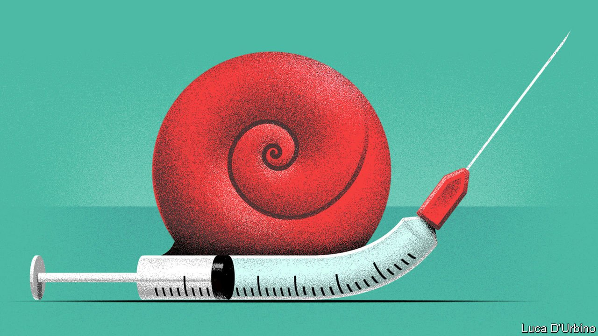

###### Inoculation, inoculation, inoculation

# The West is passing up the opportunity of the century 

##### There could be no better advertisement for democracy and free markets than a rapid global vaccination drive 

 

> Jun 9th 2021 

IMAGINE AN INVESTMENT that would earn a return of 17,900% in four years. Better yet, the initial outlay would be easily affordable. Who on Earth would pass up such an opportunity?

The answer, it seems, is the leaders of the  (G7), a club of rich democracies which holds its annual summit this week. By failing to act fast enough to , they are passing up the deal of the century. That is not just economically foolish, it is a moral failure and a diplomatic disaster, too.


On the face of things, the G7 is the very picture of concern. Boris Johnson, Britain’s prime minister and the host of the summit, wants it to come up with 1bn doses of vaccine to donate. America alone plans to give away 500m doses. Joe Biden, America’s president, says his visit to Europe, the first trip abroad of his presidency, is intended to prove that America and its allies have more to offer the world than China and Russia. His priority, he wrote in an article in the Washington Post, is “ending this pandemic”.

As generous as the talk of donations sounds, in fact it is miserly. Britain, which has ordered five times the doses it needs, is only now giving any away. , the international effort to provide vaccines to ill-supplied countries, is billions of jabs short. For the G7 to do anything less than fund it in full, with a clear schedule for handing over cash and vials, would be a travesty.

To get roughly 70% of the planet’s population inoculated by April, the IMF calculates, would cost just $50bn. The cumulative economic benefit by 2025, in terms of increased global output, would be $9trn, to say nothing of the many lives that would be saved. The cost amounts to just 0.13% of the G7’s GDP—a fifth of the amount its members have pledged to spend each year helping other countries. If a group formed to wrestle with big international threats cannot resolve to make such a no-brainer of an investment on humanity’s behalf, what can it do?

In his article in the Post Mr Biden acknowledged that America’s reputation for solving global problems has taken a beating in the past few years, and that authoritarian states like China and Russia pose a grave challenge to the Western order. Yet America and its allies have struggled to present a united front to the world’s autocrats . The EU signed an investment deal with China just before Mr Biden took office, to the new president’s dismay. Germany seems determined to bankroll Russia by expanding a  through which it imports Russian gas.

Mr Biden likes to stress that “America is back”. Despite the refreshing rhetoric, some of his administration’s actions—in particular its Buy American edict that tightens rules obliging the federal government to favour domestic suppliers over foreign ones—look more like America First protectionism than a new internationalism. The world awaits more practical evidence of American re-engagement, and its ability to rally its allies behind it. The credibility of American leadership is vital not just for the struggle against the pandemic. It will be essential for the even greater global test on the horizon: grappling with climate change.

After four years when America often seemed more interested in kicking sand in the world’s face than helping it to its feet, vaccines provide it with the ideal means to rehabilitate its image. The United States and its allies displayed great technological mettle by developing several highly effective vaccines and scaling up their production in record time. They therefore have something tangible and urgently needed to offer the rest of the world. Mr Biden is unlikely to get a better chance to demonstrate the benefits of American leadership, and the power of democracy and free markets to boot. Making sure that the rest of the world is inoculated as quickly as possible would be a shot in the arm for America and its allies, too. ■

A version of this article was published online on June 9th 2021

Dig deeper

All our stories relating to the pandemic and the vaccines can be found on our . You can also listen to , our podcast on the race between injections and infections, and find trackers showing ,  and the virus’s spread across  and .

