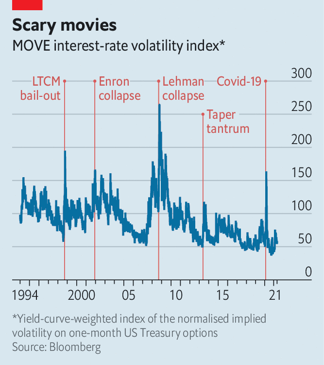

###### On Israel and Palestine, the MOVE, European startups, evictions, Argentina, Yuan Longping, Chinese

# Letters to the editor 

##### A selection of correspondence 

> Jun 12th 2021 


An insoluble problem?

The ambiguities in your leader on Israel and Palestine showed how difficult it is to explain the conflict through the lens of Western liberal reason-based logic (“Two states or one?”, May 29th). This is a confrontation of religion, ideology and culture that simply does not have a “solution”. History has many related examples, such as the co-existence of Muslims, Christians and Jews in medieval Spain, which was productive for all until the Christian takeover in the 15th century. In the end, ideas determine political results, not the other way round.


Nevertheless, sensible political steps may at least moderate the differences. A two-state arrangement might be helpful, if it were based on present realities (as The Economist recognises), and not on accounts of the past or aspirations for the future. A two-states deal might establish rules for matters that are essential for Palestinians and Israelis, such as boundaries, security, health, water, climate and economic activity, and yet leave each side relatively free. It would restrain the hot-heads on both sides. In a two-state reality, it is imaginable that there would be Jewish enclaves in Palestinian territory, in the way that there are Arab communities in Israel.

Regarding Jerusalem, I cannot think of better arrangements for the city than those that have developed over the past decades. In spite of fake information, Jerusalem is a relatively peaceful place, with many open possibilities for all and much daily-life interaction between Arabs and Jews. To divide the city again, something neither Jews nor Arabs propose (each side wants it all), would make things worse. Be under no illusion, however. Political steps may alleviate the strains, but they will not solve the ideological and religious tensions separating the communities.

PROFESSOR EVYATAR FRIESEL

Hebrew University of Jerusalem

 


On the MOVE

I agree with Buttonwood that the MOVE is now the true fear index, a better indicator of market volatility than the VIX (May 22nd). But do not let its current low level fool you. The MOVE carries a lot more lethal punch for government-bond portfolios today than its much higher levels of the past. That is because the portfolios are now so much more sensitive to even small changes in long-term interest rates, which are at or near all-time lows. Long-term rates are around 2%, up from 0.7% in the middle of the covid pandemic last August.

Setting aside the mathematical complexity of the non-linearity of the price moves to adjustments in interest rates, a half-a-percentage-point change will wreak more havoc to those portfolios today than 1-1.5% would have done in the past. So on a rate-adjusted basis, the MOVE is flashing red.

PADMESH SHUKLA

Head of investments

Transport for London Pension Fund

London

 


European optimism

You raised excellent points about European dynamism (“The land that ambition forgot”, June 5th). As a citizen of the European Union, I share those concerns. However, I think you understated the case for optimism. Europe’s tech sector is worth four times what it was just five years ago. Europe now attracts 15% of global venture capital, up from 4% in 2004. Europe’s talent base remains extraordinarily strong. Companies like Klarna, Lilium, N26, Revolut, Spotify, UiPath and Wise are showing what is possible.

Stripe works with more than 100,000 of Europe’s most innovative firms. There are many ways for policymakers to help these businesses become the next generation of global leaders. These companies want such things as a more streamlined common market, fewer impractical and ineffective regulations (like website cookie banners), better legal treatment of stock options and easier access to visas for highly skilled individuals.

That is to say, there is a lot of low-hanging fruit. If governments across the region focus on unlocking the unparalleled ingenuity of European innovators, I believe that there is no limit to what we can achieve.

PATRICK COLLISON

Founder and CEO

Stripe

San Francisco and Dublin

 


Avoiding evictions

I was glad to see you make the link between laws curtailing tenant evictions in America and public rent-relief (“Shelter in place”, May 15th). Moratoriums on evictions and rent-control laws without public rent-relief lead to government control without government support. That is the kiss of death for any business, and will make housing more scarce and more expensive. As the owner of a mobile-home park, I hate the fact that, under current law, my only remedy if things do not work out with a tenant is eviction, which is life-shattering for them (and no fun for owners, either).

There are ways to square this circle. A publicly administered rental-insurance scheme, into which both landlords and tenants pay each month, coupled with an alternative dispute-resolution procedure for cases other than non-payment, would do a lot to ease the housing crisis.

JOHN KAUFMANN

Dobbs Ferry, New York

Roca star

“Rushing for the exit” (June 5th) described Julio Argentino Roca, a former president of Argentina, as a “dictator”. Roca was a general and involved in military campaigns. But after his electoral victory in 1880, with a fair 69% of the electoral-college vote, he promoted a programme of deep economic, social and political reforms that laid the foundations of the modern Argentine state as we know it today. Roca’s legacy includes Argentina’s public-education system, public-registry offices, civil-matrimony laws, the modernisation of the armed forces and, most notably, the consolidation of Argentina as an agricultural powerhouse. He ran for a second time in 1898, this time winning 86% of the electoral college.

Remembered mostly for being a “conservative”, Roca’s avant-garde thinking made Argentina one of the world’s most prosperous countries.

JUAN MANUEL RUIZ BALLESTER

Buenos Aires

 


Feeding the hungry

The obituary on Yuan Longping (May 29th), a Chinese agronomist who revolutionised rice production, brought to mind a quote from Jonathan Swift’s “Gulliver’s Travels”:


JOHN MACDERMOTT

Cork, Ireland

 


Shabby conduct

You piqued my curiosity as to the meaning of sha bi, chanted by Chinese football fans and a “phrase not translatable in a family newspaper” (“Own goal”, May 15th). Was it “foolish finish” (shǎbì), “closing remarks” (shābǐ), “a short-term detriment” (shàbì), or, heaven forfend, “shark thighs” (shābì)?

PROFESSOR DANIEL HARBOUR

Department of Linguistics

Queen Mary University of London

