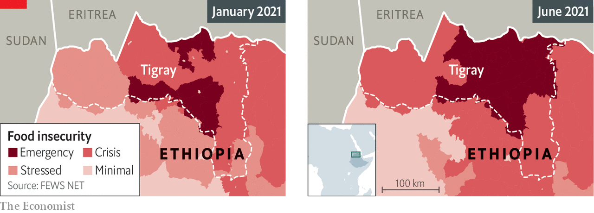

###### Hunger as a weapon

# Facing famine in Tigray 

##### The UN warns that hundreds of thousands could starve in Ethiopia’s civil war 

 

> Jun 12th 2021 


 


A CIVIL WAR between Ethiopia’s federal government and the ousted ruling party of the northern region of Tigray has caused widespread hunger. The UN’s humanitarian chief, Mark Lowcock, has warned it could spark the world’s worst famine in a decade amid evidence that forces allied to the government are using “starvation as a weapon”.■

