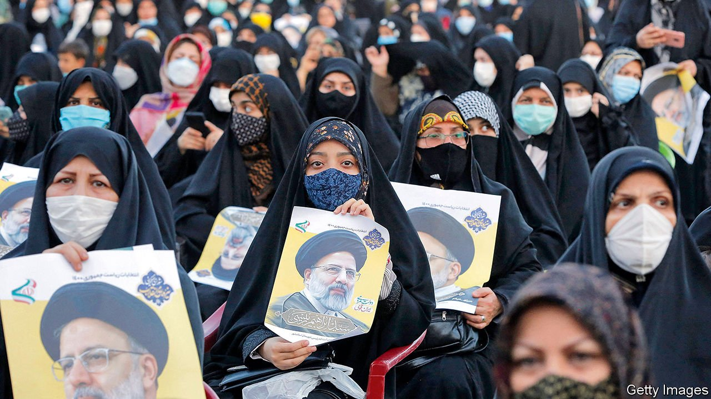
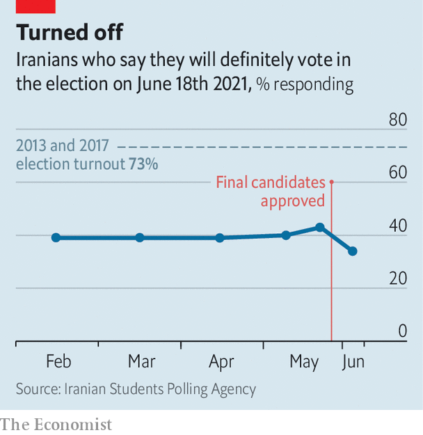

###### The rise of Raisi

# Iran has rigged its election to favour Ebrahim Raisi, a hardliner 

##### Voters may favour staying home 

 

> Jun 10th 2021 

IT IS PROBABLY a bad sign when one of the few memorable moments in a presidential debate is an admission that the ballot is rigged. The candidates in Iran’s spent much of the televised event, held on June 8th, criticising an incumbent who is not even on the ballot. Perhaps they felt there was little to discuss: most are hand-picked conservatives put there to lose. It fell to Mohsen Mehralizadeh, a former provincial governor of little note, to point out the obvious. The regime, he said, had aligned “sun, moon and the heavens to make one particular person the president”.

There are no free elections in Iran, where clerics wield ultimate authority and candidates may be disqualified for the flimsiest of reasons. Even by these standards, though, the presidential election scheduled for June 18th is shaping up as a farce. Nearly 600 candidates applied to replace Hassan Rouhani, who took office in 2013 and is barred by term limits from running again. The Guardian Council, a group of clerics and lawyers who vet candidates, allowed only seven on the ballot.


The cull removed any serious challengers who favour better economic and political ties with the West. Among them was Ali Larijani, a former speaker of parliament whose brother sits on the Guardian Council. Eshaq Jahangiri, the current vice-president, did not make the cut, nor did Mostafa Tajzadeh, a former deputy interior minister who spent six years in prison for fomenting anti-regime protests. Mahmoud Ahmadinejad, the only layman to have served as president, was also disqualified, for the second time.

This is not meant to be an election, in other words. Rather it is meant as a coronation of Ebrahim Raisi, the head of the judiciary and a staunch hardliner who helped orchestrate the mass execution of political prisoners in the 1980s. Even he seems a bit embarrassed by the brazenness of the rigging. “We should make a more competitive election scene,” he said last month. Mr Rouhani was more direct, calling the election “a corpse”.

Apart from Mr Raisi, the meagre choices include Saeed Jalili, a former secretary of the national security council, and Mohsen Rezaei, a former head of the Islamic Revolutionary Guard Corps (IRGC). Both are conservatives who made unsuccessful bids for the presidency in 2013. The only non-hardliners are Mr Mehralizadeh and Abdolnasser Hemmati, who led the central bank until last month. On his watch the rial crashed, losing two-thirds of its value in three years, largely owing to American sanctions reimposed in 2018 when Donald Trump disavowed the nuclear deal between Iran and world powers.

Hardly an alluring CV, that. But some Iranians have settled on Mr Hemmati as a protest candidate. The others have reacted accordingly. In the first two debates the lower-ranked candidates spent much of their time ganging up on Mr Hemmati, who complained that they were providing “cover” for Mr Raisi. The front-runner, a soporific speaker, tried to float above the fray. The Guardian Council has reminded Iranians that it may disqualify candidates up until election day—a warning, perhaps, that Mr Hemmati could be banished if he seems too popular.

 


There may be little risk of that. Many Iranians seem inclined simply to stay at home. A survey published earlier this month by a semi-official agency found that 32% would not vote “under any circumstances”. Just 34% said they would definitely vote, down from 43% in mid-May, before the Guardian Council winnowed the candidates (see chart). Calls for a boycott are mounting. There are even signs of discontent inside the IRGC, some of whose officers would like to wrest more power from the clerics. The Guardian Council barred some of the IRGC’s favoured candidates, such as Saeed Mohammad, a former guardsman who runs a huge construction conglomerate. Another, Hossein Dehghan, a former defence minister, withdrew.

All of this would suggest a repeat of last year’s parliamentary election, which saw reform-minded candidates disqualified en masse. The turnout then was just 43%, down 19 points from the previous ballot and the lowest in Iran’s history. Though the regime cares little for democracy, it likes to maintain a respectable façade. Low turnout is seen as an embarrassment. Ali Khamenei, the supreme leader, declared voting a religious duty and called failing to participate a “great sin”. In a speech on June 4th he also said that some candidates had been “wronged” by the vetting process and asked the Guardian Council to “restore their honour”. It refused.

The risk of mass protests, like the ones that followed a fishy presidential election in 2009, which Mr Ahmadinejad won, seems remote. Most Iranians have lost faith in the system, reformists included. Mr Rouhani’s eight years in office brought economic decline and scant social change. Still, Mr Khamenei could have overruled the council and added more candidates to drum up enthusiasm. He chose not to.

His reasons may be partly tactical. The looming election of a hardliner has put pressure on American negotiators to conclude an agreement for re-entering the nuclear deal. The parties, sequestered in a Viennese hotel, are said to be making progress on a timetable for America to lift sanctions and for Iran to reimpose curbs on its nuclear programme. Mr Raisi, they fear, would toss a spanner in the works. His advisers would take time to get to grips with the file and might include ideologues like Mr Jalili, whose negotiating style involves hours-long lectures on theology.

The supreme leader, who is 82, may also be writing his legacy. He has consolidated power in a narrow group of clerics as he prepares the country for his eventual successor. Mr Raisi is thought to be a leading candidate, as is Mojtaba Khamenei, the supreme leader’s second son. Some Iranians wonder if Mr Raisi’s selection as president is in fact meant to undermine his chances of getting the top job. Most Iranian presidents, even those genuinely supported by voters, leave office with their popularity in tatters—and Mr Raisi, the likely winner of a sham election with a low turnout, will not have much popularity to start with. ■

