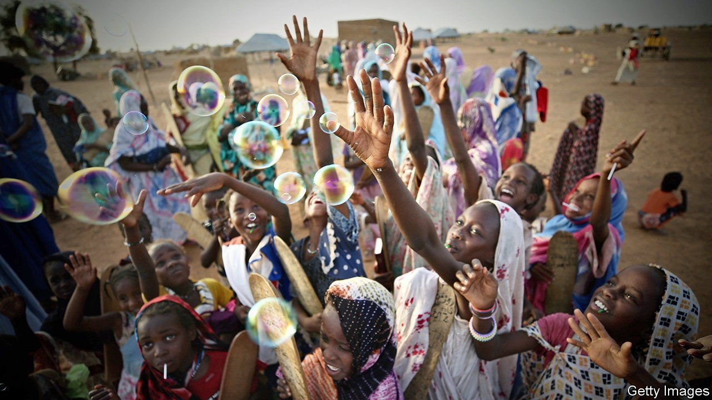

###### Turning over a new leaf

# Mauritania may be changing for the better 

##### A country known for slavery is trying to undo its legacy 

 

> Jun 10th 2021 

“FIRST I WILL buy food,” says Fatou, smiling as she receives 2,000 ouguiya ($55) in crisp notes. She needs the help. Her lodgings, a few small rooms in a seedy quarter of Nouakchott, Mauritania’s capital, are home to her elderly mother, her sister and five children. The cash is part of a government effort, backed by foreign donors, to help the poorest in the country through the pandemic. The government has other anti-poverty schemes that will outlast the pandemic, too. By the end of the year it plans to reach Mauritania’s 100,000 poorest households with payments of 1,500 ouguiya ($37) per quarter. It promises to more than double that amount soon.

Such aid is unusual in this country of about 4.7m people, where inequality often runs along old divisions between former slave-owners, most of whom are lighter skinned, and the usually darker former slaves. Slavery was officially abolished only in 1981 and criminalised only in 2007.


Black Mauritanians who are not the descendants of slaves have also been persecuted. In 1989 tens of thousands of them were deported to Senegal. Hundreds more were massacred. Of those who remain, many are still poor. Though GDP has doubled since 2000, in the same period Mauritania has fallen from 135th to 157th on the UN’s Human Development Index, a measure that includes life expectancy, schooling and average income. Frequent coups and corruption are part of the problem.

But there are encouraging signs of change, starting with the presidential election in 2019. Though deeply marred by the arrest of opposition candidates, it nonetheless marked Mauritania’s first peaceful transfer of power. Mohamed Ould Abdel Aziz, who had taken power in a coup in 2008, did not stand and was replaced by his old friend and minister of defence, Mohamed Ould Ghazouani. Many suspected the new man would be a puppet. Instead he broke decisively with his former boss and let parliament investigate corruption under the ex-president.

The resulting report alleged that the previous government had presided over a slew of dodgy deals. In March the authorities charged the former president with corruption, money-laundering and illicit enrichment. He was put under house arrest, complaining that he was the “victim of a settling of old scores”. About ten others, including two former prime ministers, have also been charged. Such arrests are “extraordinary and unheard of”, says Mohamed Ould Maouloud, an opposition leader who ran for president in 2019.

Mr Ould Ghazouani has struck a conciliatory tone with opposition groups, too, broaching the topics of race relations and electoral reform. He has also met Biram Dah Abeid, a charismatic anti-slavery leader and presidential candidate who has suffered political persecution in the past.

The government is also trying to get the economy moving. It recently launched a new investment-promotion agency headed by Aïssata Lam, a high-flying 35-year-old black Mauritanian. She hopes to encourage investment beyond the staple of mining. “We don’t even make a can of sardines,” laments Nana Mint Cheikhna, an opposition MP.

The biggest boost should come from gas, if the government avoids the twin pitfalls of corruption and reckless spending. Mauritania has bigger reserves of gas relative to its population than any other African country bar the tiny petro-state of Equatorial Guinea. The best prospect is the Greater Tortue Ahmeyim project, which Mauritania shares with Senegal. Production is expected to begin in 2023. It could boost government revenue by $14bn over the next three decades. Much of that may come in the later period, but the government is already eyeing a lift in revenue of about $60m in 2023, rising to $100m soon after. Exports should soar. Gas-fired power stations could provide cheap electricity.

Spending on the poor, engagement with the opposition and efforts to manage public finances better amount to a “grand revolution”, says Mohamed Lemine Ould Dhehby, the finance minister. Yet there is still much to do.

The government has edged towards being franker about slavery. It recently let in a delegation from the Abolition Institute, an American pressure group that had previously been kept out. Mr Ould Ghazouani’s prime minister hails from the Haratine, a dark-skinned Arabic-speaking ethnic group, many of whom are descendants of slaves. The government now admits there may be a few remaining cases of slavery, rather than flatly denying any holdouts, as it used to. Even so, says Salimata Lam of SOS Esclaves, a local anti-slavery organisation, “nothing has changed fundamentally.” The courts have overseen only a handful of convictions for slavery. Rights groups reckon Mauritania still has tens of thousands of slaves, many working as domestic servants. It is still hard for former slaves to get the identity documents needed to receive government benefits.

Progress on women’s rights has been limited. Rape is still only loosely defined in law. Sexual relations outside marriage are deemed criminal, so women who report rape are sometimes locked up themselves. The government has for years been sitting on a proposed law on violence against women. Islamist parties oppose it, but the government, which has a majority in parliament, “does not have the courage” to pass it, says Aminetou Mint El-Moctar, a veteran women’s-rights activist.

Mr Ould Ghazouani’s conciliatory approach has raised expectations of more change, but fulfilling them will be hard. With gasfields lifting economic hopes but covid-19 dampening immediate prospects, frustration is likely. Mr Ould Ghazouani has to juggle demands from the army, from influential tribal leaders and from Islamist groups. The opposition’s goodwill may run out, too. The president still has a “golden opportunity”, says Mr Ould Maouloud, but “now there must be action.” ■

