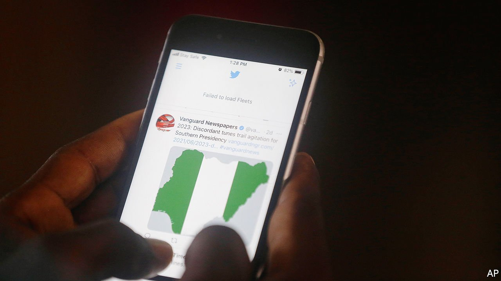

###### Do not rinse and retweet

# Nigeria’s Twitter ban prompts ridicule—and fear 

##### President Buhari reveals a thin skin and an authoritarian streak 

 

> Jun 12th 2021 

SNUFFING OUT free expression used to be pleasingly simple for autocrats. Back in 1984, when President Muhammadu Buhari of Nigeria first ran the country, as a military dictator, he simply arrested journalists and then decreed retroactively that any person who had published something that brought the government “ridicule or disrepute” was “guilty of an offence”. On June 4th the self-described “converted democrat” was at it again, suspending the local operations of Twitter, an American social-media service.

Ridicule, the great fear of the young Mr Buhari, came thick and fast. “Idiots! You announce your ban of Twitter on Twitter,” noted one Twitter user. Others were worried by the silencing of a service used to publicise the arrest of activists and journalists or to highlight police brutality. “We definitely see Nigeria sliding into authoritarianism,” warned Ayisha Osori of the Open Society Initiative For West Africa, an advocacy and philanthropy group. Several foreign embassies criticised the ban.


Regardless, the government ordered telecoms companies to block access to Twitter. The national bar association argued that there was no legal basis for the move. Yet court workers are on strike, so rights groups cannot sue to have the ban overturned. The National Broadcasting Commission has directed all radio and television stations to remove their Twitter handles and to stop using the service as a source of information, since doing so is “unpatriotic”. The government has also announced plans to require other social media and messaging services such as WhatsApp to apply for licences.

Surveys show that Nigerians are among Africa’s biggest supporters of the right to unfettered access to the internet and social media. Many of them use Twitter for work, too. NetBlocks, a British-based watchdog, reckons the ban is cutting economic output by $6m a day. The damage to Nigeria’s image among would-be foreign investors may be more costly still. Nigerians are also outraged that Mr Buhari is focused on banning Twitter while failing to solve more pressing problems, such as soaring kidnappings or killings by jihadists.

Many suspect the ban is partly petty payback. The government was annoyed in April when Twitter chose Ghana over Nigeria for its African headquarters. Just days before the ban Twitter removed a tweet by Mr Buhari which invoked Nigeria’s devastating civil war in Biafra in the 1960s and said those “misbehaving” would be dealt with in “the language they understand”. Some saw this as a threat of violence towards the same region today. The ban also reflects Mr Buhari’s desire to restrict social media, which many in his government blamed for a spate of protests against police brutality last year.

Some Nigerians are using specialist services, known as VPNs, to bypass the block on Twitter. The attorney-general has responded by threatening to prosecute people who tweet. Yet the government has refused to specify what, if any, law is being broken by people who do so. In any case, the government may soon run out of bluster. It initially said Twitter would be suspended “indefinitely” but later talked of a “temporary” hiatus. Now it says it is in talks with the firm.

Still, as The Economist went to press Twitter remained inaccessible in Nigeria without VPNs. Mr Buhari once promised to take Nigeria to the “next level”. Few imagined that he meant he would place Nigeria in the company of China, Iran, North Korea and Turkmenistan by blocking his citizens from sharing their views. ■

