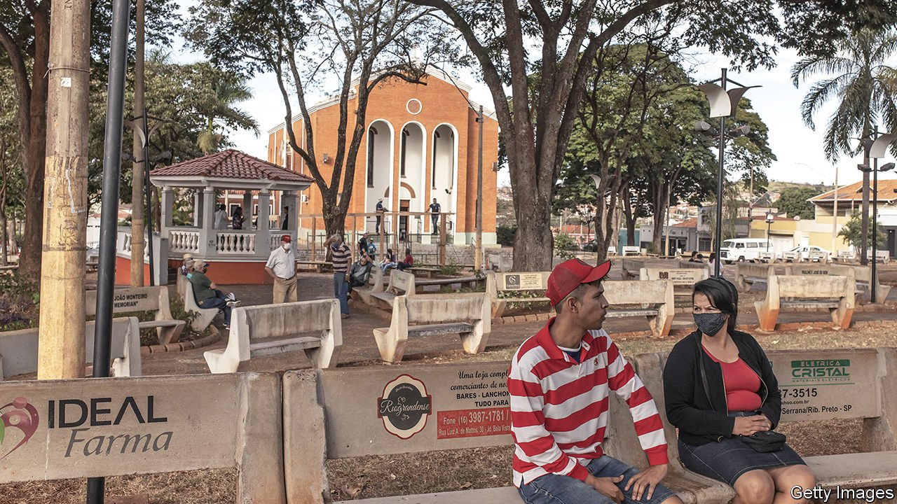

###### CoronaVac chronicles

# A town in Brazil has vaccinated nearly everyone against covid-19 

##### Its success shows what could have been in the rest of the country 

 

> Jun 12th 2021 

BEFORE THE pandemic, Celso Vigo walked for 90 minutes each day through the streets of Serrana, a town of 45,000 people surrounded by sugarcane fields in the state of São Paulo. But when covid-19 hit, the 75-year-old retired bank clerk, who played football “well into my 60s”, was reduced to doing loops around his house. It reminded him of how Brazil, too, was going in circles. After a second wave killed 87,000 people in April, cases and deaths remain high.

But Serrana was given a way out. Between February and April, all adults were offered jabs as part of a study by the Butantan Institute, which produces CoronaVac, a vaccine developed by Sinovac, a Chinese firm. More than 95% of serranenses got jabbed, despite Jair Bolsonaro, the president, claiming that it was unsafe. Preliminary results released on May 31st showed that symptomatic cases and deaths fell by 80% and 95%, respectively. Only two covid-19 patients remain hospitalised in the local clinic (both refused the vaccine). Mr Vigo is once again pounding the pavements.


Serrana is a tantalising glimpse of an alternative reality in Brazil—one in which Mr Bolsonaro did not squander his chances to mount an effective public-health campaign and, later, to buy vaccines. But the study also has global implications. In phase three trials, CoronaVac had efficacy rates as low as 50%, the minimum required by the WHO. The lower the efficacy, the higher the share of people who must be jabbed to slow contagion. The trial in Serrana sought to discover that share. The town was split into four cohorts, that got jabbed in successive weeks. Contagion dropped dramatically after three out of the four had received two doses of the vaccine, suggesting that herd immunity is attained at around 75%.

These results could boost vaccine uptake across Brazil, hopes Ethel Maciel, an epidemiologist. But 75% is a long way off. Only 11% of Brazilians are fully vaccinated, and the rate has slowed because of a shortage of ingredients for CoronaVac, which are imported from China. Chile, which has vaccinated 45% of its population, mostly with CoronaVac, is also suffering near-record cases.

But Serrana itself has become an oasis. On a recent morning, children ran round a fountain in the plaza. Across the street a fabric shop that caters to elderly women had a steady stream of customers. A gang of old men occupied their usual benches. They discussed Mr Bolsonaro’s decision to host the Copa América, a football tournament, even though a third wave seems imminent. “Stupid,” a 97-year-old said. Half of them scattered when an outsider showed up. “We’re still scared,” explained Florivaldo Leandro, a retired police officer. Serrana’s calm came at a cost, he said. “We lost friends, neighbours and relatives. Our conscientiousness was forced upon us.”

Dig deeper

All our stories relating to the pandemic and the vaccines can be found on our . You can also listen to , our podcast on the race between injections and infections, and find trackers showing ,  and the virus’s spread across  and .

